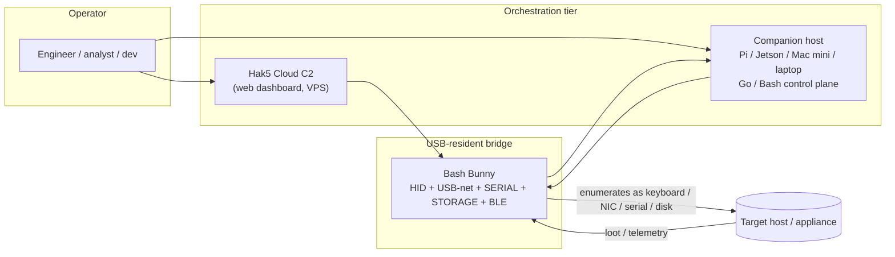
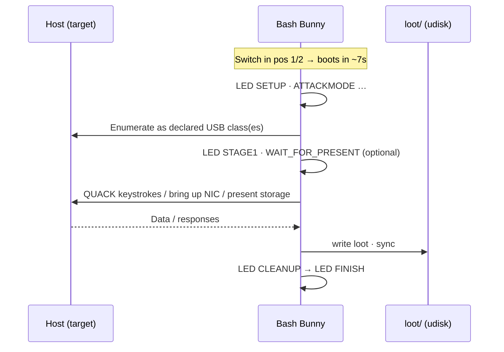

# Bash Bunny — Comprehensive General Guide

*A productive, adaptable, and modifiable USB augmentation platform for professional software engineers.*

This is the technical backbone of a five-part suite. The role-specific guides
([analyst](01-cybersecurity-analyst.md), [sysadmin](02-it-sysadmin.md),
[developer](03-app-developer.md)) and the [complementary-tools guide](04-complementary-tools.md)
all build on the reference material here. For the broader USB-HID emulation landscape this device
sits in, see the companion research note [`../custom-kvm.md`](../custom-kvm.md).

> **Authorized use only.** Everything below assumes lawful, authorized, professional work —
> administration, incident response, testing, accessibility, and lab automation — performed on
> systems you own or are explicitly permitted to operate. A Bash Bunny emulating a keyboard,
> network adapter, or storage device is not inherently improper, but the *use case* may be: pair
> every deployment with written authorization, device allowlisting, and audit logging. See
> [Governance](#11-governance--authorized-use).

---

## 1. What it is — and what it is not

The Hak5 Bash Bunny is a USB "hot-plug" attack/automation platform: a small embedded Linux computer
in a USB-A stick form factor that **enumerates as one or more trusted USB device classes** (keyboard,
serial console, network adapter, mass storage) and runs scripted payloads against whatever host it is
plugged into.

### Native capability (what the Bunny does on its own hardware)

| Capability | Mechanism |
|---|---|
| Keystroke injection | `HID` ATTACKMODE + `QUACK`/`Q` (DuckyScript) |
| USB networking | `ECM_ETHERNET` / `RNDIS_ETHERNET` / `AUTO_ETHERNET` (a real NIC to the host) |
| Serial console | `SERIAL` ATTACKMODE (ACM) |
| Mass storage / exfil | `STORAGE` / `RO_STORAGE`, loot written to `/root/udisk/loot` |
| Conditional / remote triggers | BLE `WAIT_FOR_PRESENT` / `WAIT_FOR_NOT_PRESENT` (Mark II) |
| Onboard tooling | Debian-based userland with bundled pentest tools |

### What it is **not**

The Bunny is a **small ARM SoC**, not a workstation. It **cannot** natively host an ILO/BMC-class
management plane, a full Docker + IDE development environment, or a heavyweight analytics stack. When
a role calls for those, this suite uses a **two-tier architecture**: the Bunny is the USB-resident
**bridge** (HID + network + trigger), and an **orchestrating companion host** (Raspberry Pi, Jetson,
Mac mini, or a laptop) — or Hak5's **Cloud C2** — runs the heavy services. Every role guide marks
which tier owns which capability. See [§9 Orchestration](#9-orchestration-two-paths).

> **⚠ Firmware reality (read this first).** The last official Bash Bunny firmware is **1.6-stable,
> released 2019-07-10**; firmware development effectively stalled years ago. FW 1.6 is built on
> **Debian Stretch** (with Ruby 2.3.3 and Metasploit bundled). The onboard toolchain is therefore
> **old** — another concrete reason that anything needing a modern toolchain (current Docker, Node,
> Go, browsers, IDEs) belongs on the **companion host**, not on the Bunny itself. A few features
> referenced below are version-gated (`AUTO_ETHERNET`, `ETHERNET_TIMEOUT_*`, `QUACK ALTCODE` require
> **FW ≥ 1.5**); these are flagged inline.

---

## 2. Hardware & boot

| Spec | Bash Bunny Mark II |
|---|---|
| CPU | Quad-core ARM Cortex-A7, up to 1.3 GHz |
| Internal storage | 8 GB NAND |
| Expansion | MicroSD XC reader (cards up to ~2 TB) |
| Wireless | Bluetooth Low Energy (BLE) |
| Indicator | 1× RGB status LED |
| Control | 1× 3-position slide switch |
| Cold boot → payload start | ~7 seconds |

**Mark I vs. Mark II — be accurate.** The **CPU is the same quad-core Cortex-A7** in both
generations; do not describe the quad-core as a Mark II upgrade. The genuine Mark II additions are
**BLE** and the **MicroSD XC** reader, which together enable mass exfiltration, wireless geofencing,
and remote triggers. The RGB LED and 3-position switch exist on both. All Mark I payloads run on the
Mark II.

> **MicroSD gotcha.** Under `STORAGE`, if a MicroSD card is present it is passed through to the
> target host; if absent, the internal **udisk** partition is presented instead. **To enter arming
> mode you must boot with no MicroSD installed** — otherwise the card simply passes through and you
> won't get a management session.

---

## 3. Switch positions & access

The 3-position slide switch selects which payload runs, or arming mode.

| Switch position | Mode | Behaviour |
|---|---|---|
| Position 1 (farthest from USB) | Payload slot 1 | Runs `/payloads/switch1/payload.txt` on boot |
| Position 2 (middle) | Payload slot 2 | Runs `/payloads/switch2/payload.txt` on boot |
| Position 3 (closest to USB plug) | **Arming mode** | Presents Serial **+** Mass Storage for management |

Two payload slots let you keep two ready profiles and flip between them without re-arming.

### Arming-mode access reference

| Parameter | Value |
|---|---|
| Username / password | `root` / `hak5bunny` |
| Bunny IP (USB net) | `172.16.64.1` |
| USB-net subnet | `172.16.64.0/24` (DHCP pool `172.16.64.10`–`172.16.64.12`) |
| SSH | `ssh root@172.16.64.1` |
| Serial settings | `115200` baud, 8 data bits, no parity, 1 stop bit (**115200 8N1**) |
| Serial device — Linux | `/dev/ttyACM0` (or `/dev/ttyUSB0`) → `screen /dev/ttyACM0 115200` |
| Serial device — macOS | `/dev/tty.usbmodemch000001` |
| Serial device — Windows | A COM port under *Ports (COM & LPT)* ("USB Serial Device") |

```
Switch (viewed with USB plug on the right):

   [ 1 ]   [ 2 ]   [ 3 ]──USB►   plug into host
     │       │       │
  payload  payload  ARMING (serial + mass storage)
  switch1  switch2   manage payloads / shell in here
```

---

## 4. Filesystem layout

The udisk mass-storage partition (visible in arming mode) is where you author and manage everything:

```
/payloads/
  switch1/payload.txt        # runs in switch position 1
  switch2/payload.txt        # runs in switch position 2
  library/                   # shared payloads / reusable assets
    extensions/              # bunny helper functions, sourced into payloads
loot/                        # exfiltrated data lands here (per-payload subdirs)
tools/                       # utilities/binaries; copied to /tools at boot, *.deb auto-installed
languages/                   # HID keyboard-layout files for DUCKY_LANG
config.txt                   # global device configuration
```

On the running device, exfiltrated data is typically written under `/root/udisk/loot/`. Anything in
`tools/` is copied to `/tools` during boot, and `*.deb` packages there are auto-installed — the
canonical way to add a binary dependency a payload needs.

---

## 5. `payload.txt` anatomy

A payload is a plain-text file named `payload.txt`, interpreted as **Bash with bunny helper
commands** (DuckyScript-style verbs layered on top of a real shell). Recommended structure:

```bash
#!/bin/bash
#
# Title:        Hello Engineer
# Description:  Minimal HID demo — types a line into the target.
# Author:       you
# Version:      1.0
# Category:     general
# Target:       Windows / macOS / Linux
# Attackmodes:  HID

# ---- Config (variables at top, easy to modify) ----
MESSAGE="Hello from the Bash Bunny"

# ---- SETUP ----
LED SETUP                       # magenta solid: initialising
ATTACKMODE HID                  # enumerate as a keyboard

# ---- ATTACK / STAGES ----
LED STAGE1                      # yellow: working
Q GUI r                         # (example) open Run dialog on Windows
Q DELAY 500
QUACK STRING "$MESSAGE"
Q ENTER

# ---- FINISH ----
LED FINISH                      # green: done
```

**Phase convention:** `SETUP → ATTACK | STAGE1..n → CLEANUP → FINISH`, with an optional `FAIL`
branch and `SPECIAL` waits. Put configurable values in variables at the top so the payload is easy to
adapt. Always precede a stage or `ATTACKMODE` with the matching `LED` state so the operator can read
progress off the device.

> **Bash-expansion gotcha.** The shell expands `$variables` **before** `QUACK` injects them. That is
> what makes payloads configurable — but it means a variable name that collides with one already set
> in the payload's own environment can be silently substituted. Use distinct, descriptive names
> (e.g. `BB_TARGET_URL`, not `URL`).

---

## 6. ATTACKMODE reference

`ATTACKMODE` declares which USB device class(es) the Bunny enumerates as. It may be issued **multiple
times** in one payload to change presentation mid-run (e.g. start as benign storage, then add a
keyboard).

| Keyword | Emulated device | Best for |
|---|---|---|
| `HID` | USB keyboard (DuckyScript target) | Keystroke injection / automation |
| `STORAGE` | USB mass storage (udisk or MicroSD) | Delivering or exfiltrating files |
| `RO_STORAGE` | **Read-only** mass storage | Presenting files without accepting writes |
| `SERIAL` | ACM serial console | Console/CLI bridge to a host or appliance |
| `ECM_ETHERNET` | CDC-ECM network adapter | Linux / macOS / Android hosts |
| `RNDIS_ETHERNET` | RNDIS network adapter | Windows (and some Linux) hosts |
| `AUTO_ETHERNET` | ECM, falling back to RNDIS | Cross-platform; **FW ≥ 1.5** |
| `OFF` | Disable all USB emulation | Stealth/idle or staged reveals |

**Combinations.** Multiple modes can be combined in a single `ATTACKMODE` line, but **not all
combinations are valid** — there are **16 documented valid combinations**. Each valid combination
enumerates with a distinct USB identity sharing vendor ID **`0xF000`** and a PID in the
`0xFFF0`–`0xFF21` range (this ties into the descriptor-impersonation discussion in
[`../custom-kvm.md`](../custom-kvm.md)).

- ✅ Valid example: `ATTACKMODE HID STORAGE ECM_ETHERNET`
- ❌ Invalid example: `ATTACKMODE RNDIS_ETHERNET ECM_ETHERNET STORAGE SERIAL`
- ❌ Rule of thumb: `RNDIS_ETHERNET` and `ECM_ETHERNET` cannot coexist (pick one, or use
  `AUTO_ETHERNET`).

**`AUTO_ETHERNET` timing.** It tries `ECM_ETHERNET` first and falls back to `RNDIS_ETHERNET` after a
default ~20 s timeout, tunable via `ETHERNET_TIMEOUT_XX` (seconds). Requires **FW ≥ 1.5**.

---

## 7. Bunny scripting / helper reference

| Command | Purpose | Example |
|---|---|---|
| `QUACK` / `Q` | Inject keystrokes (DuckyScript). `Q` is an alias. | `QUACK STRING "text"`, `Q ALT F4`, `QUACK switch1/keys.txt` |
| `Q STRING` | Type a literal string | `QUACK STRING "Hello"` |
| `Q DELAY <ms>` | Pause injection | `Q DELAY 500` |
| `QUACK ALTCODE <n>` | Windows alt-code input (**FW ≥ 1.5**) | `QUACK ALTCODE 168` |
| `DUCKY_LANG <xx>` | Set HID keyboard layout (2-letter code) | `DUCKY_LANG us` |
| `ATTACKMODE …` | Set/redeclare emulated USB class(es) | `ATTACKMODE HID STORAGE` |
| `LED <state\|color [pattern]>` | Drive the RGB status LED | `LED STAGE1`, `LED Y SINGLE`, `LED M 500` |
| `GET <VAR>` | Read a runtime variable | `GET SWITCH_POSITION`, `GET HOST_IP` |
| `RUN <OS> <cmd>` | Inject an OS-appropriate command shortcut | `RUN WIN notepad.exe` |
| `REQUIRETOOL <tool>` | Abort with `FAIL` if a tool is missing from `/tools` | `REQUIRETOOL responder` |
| `sync` | Flush writes to udisk (call inside loot loops) | `sync` |

**`GET` variables** include `TARGET_IP`, `HOST_IP`, `SWITCH_POSITION`, `TARGET_OS`, and `BB_LABEL`.

> `QUACK` (HID injection) requires `HID` to be present in the current `ATTACKMODE`. If you forget,
> keystrokes go nowhere.

### LED reference

Colors: `R` red, `G` green, `B` blue, `Y` yellow/amber, `C` cyan, `M` magenta, `W` white.

Patterns: `SOLID` (default if omitted), `SLOW` (1000 ms), `FAST` (100 ms), `VERYFAST` (10 ms),
`SINGLE`…`QUIN` (1–5 blinks then pause), inverted variants (`ISINGLE`…), `SUCCESS`, or a literal
millisecond value (e.g. `LED M 500`).

| State | Convention | Meaning |
|---|---|---|
| `SETUP` | Magenta solid | Initialising |
| `FAIL` / `FAIL1-3` | Red variants | Error / precondition not met |
| `ATTACK` / `STAGE1`–`STAGE5` | Yellow patterns | Working (per stage) |
| `SPECIAL1`–`SPECIAL5` | Cyan (inverted) | Waiting on a condition |
| `CLEANUP` | White fast | Tidying up |
| `FINISH` | Green success | Objective complete |

Prefer the **named states** over raw color/pattern so any operator can read device status at a
glance.

---

## 8. Remote triggers & geofencing (Mark II)

The Mark II's BLE radio enables **conditional execution**: pause a payload until a known BLE device
is (or is no longer) nearby. Useful for supervised, site-scoped, operator-present operation.

| Command | Effect |
|---|---|
| `WAIT_FOR_PRESENT <id>` | Block until a BLE advertisement matching `<id>` is seen |
| `WAIT_FOR_NOT_PRESENT <id>` | Block until that device is no longer seen |

**Mechanism:** the BLE module is set to observation mode (`AT+ROLE=2`); scanned advertisements are
written to `/tmp/bt_observation` on a ~5 s loop; the extension `grep`s that file for `<id>`.

**Canonical staged pattern** — present as benign storage, then reveal the keyboard only once the
operator's trigger device is present:

```bash
# Stage 1 — benign: look like a flash drive, wait for the operator's beacon
LED SETUP
ATTACKMODE STORAGE
LED STAGE1
WAIT_FOR_PRESENT myphone        # blocks until BLE id "myphone" is nearby

# Stage 2 — act: add the keyboard and do the work
ATTACKMODE STORAGE HID
LED STAGE2
QUACK STRING "triggered"
Q ENTER
LED FINISH
```

---

## 9. Orchestration: two paths

For anything beyond what the Bunny does natively, you orchestrate it. There are two complementary
paths; the role guides use both.

### Path A — Hak5 Cloud C2 (native fleet plane)

**Cloud C2** is Hak5's self-hosted, web-based command-and-control suite for centrally managing a
**fleet** of networked Hak5 devices from a browser dashboard — as if each were directly connected.

- Self-hostable on Linux, macOS, or Windows; for remote field devices it is deployed on a
  public-facing machine (e.g. a VPS).
- Devices are provisioned with a generated `device.config` and check in to the dashboard.
- This is the **native embodiment of the two-tier model** and maps directly onto the IT-admin
  "fleet / lights-out" need and the analyst's remote-triage need. It does **not** replace a true
  ILO/BMC, but it gives you a real management plane over deployed Bunnies (and Screen Crabs, etc.).

### Path B — custom companion host (Pi / Jetson / Mac mini / laptop)

When you need bespoke logic, run a control plane on a companion host and let the Bunny be the
USB-resident endpoint. A Raspberry Pi makes an excellent orchestrator because it can *itself* present
USB-gadget networking (`dwc2` + `libcomposite`, exposing **ECM + RNDIS simultaneously**, driver-free
on Linux/macOS/Windows; `g_ether` `usb0`). A Go or Bash control plane on the host decides what the
Bunny should do next, on a `cron`/systemd schedule or on demand.

This is the same separation-of-concerns described in [`../custom-kvm.md`](../custom-kvm.md): an
offboard planner (host, or even an LLM agent) generates actions, and the nearby hardware endpoint
injects them as physical HID / USB events. The target sees **local HID and a local NIC**, not an
agent installed on the target.



```
ASCII topology (single USB cable to target):

  [Operator] --net/ssh--> [Companion host] ==USB== [Bash Bunny] ==USB== [Target]
                                │                       │
                          control plane           HID + ECM/RNDIS NIC
                          (Go/Bash, cron)         + SERIAL + STORAGE
```

---

## 10. Payload lifecycle (sequence)



---

## 11. Governance & authorized-use

Capability is not authorization. Operate this device the way the broader USB-control guidance in
[`../custom-kvm.md`](../custom-kvm.md) recommends:

- **Authorization first.** Written scope/approval for every engagement; consent where user systems
  are involved.
- **Device control & allowlisting.** Expect (and, on your own fleet, enforce) USB device-control
  policies — NIST portable-media guidance and endpoint device-control (e.g. Microsoft Defender)
  classify devices by their USB descriptors, exactly the layer a composite gadget touches.
- **Logging & retention.** Log what was run, where, and by whom; handle any collected evidence with
  integrity controls (hashing, timestamps) and a retention policy.
- **Repository conventions.** The official `hak5/bashbunny-payloads` repo organizes payloads into
  categories such as `exfiltration`, `phishing`, `remote_access`, and `recon`, **prohibits purely
  destructive payloads**, and is explicitly *not* a deployment CDN. Mirror that discipline: no
  destructive logic, document binary provenance, keep examples authorized-use shaped.

---

## 12. Hello-world payload

The smallest useful, runnable payload — drop it in `/payloads/switch1/payload.txt`, set the switch to
position 1, and plug in:

```bash
#!/bin/bash
# Title: Hello World
# Attackmodes: HID
LED SETUP
ATTACKMODE HID
LED STAGE1
QUACK STRING "Hello from the Bash Bunny"
Q ENTER
LED FINISH
```

---

### Where to next

- **[01 — Cybersecurity analyst](01-cybersecurity-analyst.md):** plug-and-play / remote IR, evidence
  scraping, monitoring deployment.
- **[02 — IT systems administrator](02-it-sysadmin.md):** lights-out-style access, fleet management
  with Cloud C2, config push and telemetry.
- **[03 — App developer](03-app-developer.md):** one-touch bootstrap into a standardized, companion-
  hosted dev environment.
- **[04 — Complementary tools](04-complementary-tools.md):** Screen Crab, Flipper Zero, and an LLM
  agent — three high-leverage combinations.

*Sources: official Hak5 documentation (docs.hak5.org, documentation.hak5.org), the
`hak5/bashbunny-wiki` and `hak5/bashbunny-payloads` repositories, and the Hak5 shop spec/compare
pages. Firmware-version-dependent details (FW 1.6-stable, 2019; `AUTO_ETHERNET`/`ALTCODE` FW ≥ 1.5)
are noted inline and may change if firmware is updated.*