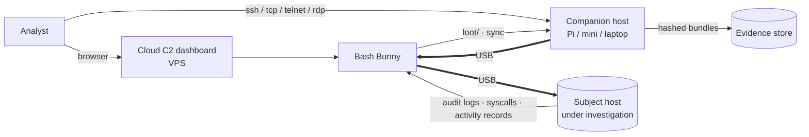

# Bash Bunny for the Cybersecurity Analyst

*Plug-and-play (and remote) incident-investigation, evidence collection, and protective-monitoring
deployment.*

Part of the Bash Bunny suite. Read [00 — General Guide](00-bash-bunny-general.md) first for the
hardware, `payload.txt`, ATTACKMODE, helper, and LED reference this guide assumes. Background on the
USB-HID landscape: [`../custom-kvm.md`](../custom-kvm.md).

> **Authorized, consented use only.** Evidence collection and endpoint monitoring touch real user
> systems and real data. Operate strictly under written authorization (IR retainer, engagement
> scope, or internal policy), with consent where applicable, and with chain-of-custody discipline.
> A device that can scrape audit logs is a device that can violate privacy law if misused — see
> [Governance](#governance).

---

## The analogy, made precise

Think of the Bash Bunny here as a **super-charged console-port / crash-cart link**. A traditional
crash cart or KVM gives you a keyboard, screen, and maybe a serial console at a machine you can
physically reach. The Bunny upgrades that link: it is a **keyboard + a network adapter + a serial
console + a storage volume + a scriptable Linux computer**, all over a single USB cable, and — via a
companion host or Cloud C2 — reachable **remotely**.

### Native Bunny vs. companion tier

| Job | Native Bunny | Companion host / Cloud C2 |
|---|---|---|
| Type commands at a locked-down or headless host | ✅ `HID` + `QUACK` | — |
| Present a NIC for live remote triage | ✅ `ECM/RNDIS_ETHERNET` | terminates SSH/TCP/RDP path |
| Serial console to an appliance | ✅ `SERIAL` | — |
| Carry/return evidence | ✅ `STORAGE` → `loot/` | long-term storage, hashing at rest |
| Heavy parsing / SIEM forwarding / dashboards | ❌ (dated onboard toolchain) | ✅ Pi/Jetson/mini or Cloud C2 |
| Manage many field devices | ❌ | ✅ **Cloud C2** dashboard |

---

## Topologies



```
Local hotplug (operator present):     Remote (operator offsite):

  [Analyst] ==USB== [Target]            [Analyst] --ssh/rdp--> [Companion host]
       │                                                            ‖ USB
   [Bash Bunny]                                              [Bash Bunny]
                                                                    ‖ USB
                                                                [Target]
```

- **Local hotplug:** insert, the Bunny runs a triage/collection payload, LED reports progress, you
  remove it and offload `loot/`.
- **Remote over SSH/TCP/telnet/RDP:** the Bunny presents itself as a USB-Ethernet NIC to the subject
  host (or attaches to a companion host) so an offsite analyst reaches a live session.
- **Fleet / staged sensors via Cloud C2:** multiple Bunnies deployed at a site check in to a central
  dashboard for management and triage.

---

## Use case 1 — Evidence scraping (audit logs, syscalls, activity records)

Collect host artifacts into `loot/` with chain-of-custody hygiene. The principles: **read-only where
possible, hash everything, timestamp everything, `sync` before exit.**

`/payloads/switch1/payload.txt`:

```bash
#!/bin/bash
#
# Title:        IR Evidence Collector (Linux target)
# Description:  Authorized collection of audit logs + activity records to loot, hashed.
# Author:       IR team
# Version:      1.0
# Category:     forensics
# Target:       Linux
# Attackmodes:  HID STORAGE
#
# AUTHORIZATION: run only with documented approval + consent. Read-only collection.

CASE="CASE-2026-0042"
LOOT=/root/udisk/loot/$CASE
HOST_TMP=/tmp/.ir_$CASE          # staging on the target

LED SETUP
ATTACKMODE HID STORAGE
mkdir -p "$LOOT"

LED STAGE1
# Open a terminal on the target and run a bounded, read-only collection script.
# (RUN abstracts the OS-appropriate "open shell" gesture.)
RUN LINUX "bash"
Q DELAY 800

# Collect: auth/audit logs, recent process/exec records, logged-in users, shell history.
QUACK STRING "mkdir -p $HOST_TMP && \
  sudo journalctl -o export > $HOST_TMP/journal.export 2>/dev/null; \
  sudo cp -a /var/log/audit/audit.log $HOST_TMP/ 2>/dev/null; \
  last -Fwx > $HOST_TMP/last.txt; who -a > $HOST_TMP/who.txt; \
  cp -a ~/.bash_history $HOST_TMP/ 2>/dev/null; \
  tar czf $HOST_TMP.tgz -C $HOST_TMP . && sha256sum $HOST_TMP.tgz"
Q ENTER

LED STAGE2
# Bunny mounts its STORAGE; operator (or a follow-on stage) copies the bundle to loot.
# Record an integrity manifest alongside the data.
{ echo "case=$CASE"; echo "collected_by=$(GET BB_LABEL)"; echo "switch=$(GET SWITCH_POSITION)"; } \
  > "$LOOT/manifest.txt"
sync

LED FINISH
```

> **Chain of custody.** Hash on the target (`sha256sum`) *and* re-hash after offload from `loot/`;
> the two must match. Keep `manifest.txt` with collector ID and timestamps. Prefer `RO_STORAGE` when
> you only need to deliver a collection script and never want the Bunny volume written to.

---

## Use case 2 — USB-Ethernet path for live remote triage

Bring up the Bunny as a network adapter so an offsite analyst gets a live foothold for interactive
triage (over the companion host's SSH/TCP/RDP relay). Cross-platform via `AUTO_ETHERNET`.

```bash
#!/bin/bash
#
# Title:        Remote Triage NIC
# Description:  Present a USB NIC for authorized live remote investigation.
# Category:     incident_response
# Target:       Windows / macOS / Linux
# Attackmodes:  AUTO_ETHERNET HID        # FW >= 1.5 for AUTO_ETHERNET

LED SETUP
# ECM first, fall back to RNDIS after ~15s for stubborn Windows hosts.
ETHERNET_TIMEOUT_15
ATTACKMODE AUTO_ETHERNET HID

LED STAGE1
# Wait for the host to assign the USB-net link, then read the negotiated addresses.
sleep 8
TARGET_IP=$(GET TARGET_IP)
HOST_IP=$(GET HOST_IP)
echo "target=$TARGET_IP host=$HOST_IP" > /root/udisk/loot/triage_link.txt
sync

LED FINISH
# From here the companion host (reachable on the USB subnet) terminates the
# analyst's ssh/tcp/telnet/rdp session to the subject host for live triage.
```

> The Bunny's USB subnet is `172.16.64.0/24` with the Bunny at `172.16.64.1`
> (see [§3 of the general guide](00-bash-bunny-general.md#3-switch-positions--access)). Route the
> analyst's session through the companion host; never expose the management interface to untrusted
> networks.

---

## Use case 3 — Deploy a protective monitoring agent (BLE-gated)

Deploy an authorized endpoint-monitoring agent, but only while the analyst's trigger beacon is
present — keeping deployment supervised and on-site. Uses the staged
[remote-trigger pattern](00-bash-bunny-general.md#8-remote-triggers--geofencing-mark-ii).

```bash
#!/bin/bash
#
# Title:        Supervised Monitoring Deployer
# Description:  Stage agent from STORAGE; only act while analyst beacon present.
# Category:     remote_access
# Target:       Windows
# Attackmodes:  STORAGE -> STORAGE HID

LED SETUP
ATTACKMODE STORAGE               # benign: just a flash drive carrying the installer

LED STAGE1
WAIT_FOR_PRESENT analyst-beacon  # block until the analyst's BLE device is nearby

LED STAGE2
ATTACKMODE STORAGE HID           # reveal keyboard only now, under supervision
RUN WIN "powershell -ExecutionPolicy Bypass"
Q DELAY 1000
# Launch the signed, authorized monitoring installer staged on the Bunny volume.
QUACK STRING 'Start-Process -Wait -FilePath D:\agent\install-monitor.exe -ArgumentList "/quiet"'
Q ENTER

LED CLEANUP
WAIT_FOR_NOT_PRESENT analyst-beacon   # optional: stand down when analyst leaves
LED FINISH
```

---

## Governance

- **Scope & consent.** Collection and monitoring on user/endpoint systems require documented
  authorization and, where applicable, user consent. Define exactly which artifacts are in scope.
- **Integrity.** Hash at collection and after offload; preserve timestamps; record collector
  identity. Treat `loot/` as evidence, not scratch space.
- **Minimization & retention.** Collect only what the case needs; apply a retention/disposal policy
  to anything personal.
- **No destructive actions.** Per `hak5/bashbunny-payloads` conventions, nothing destructive; this
  is read-biased, supervised collection — not tampering.
- **Expect device control.** Endpoint USB allowlisting (Defender device control, NIST media
  guidance) may block the Bunny; coordinate with the system owner rather than circumventing controls.

See the [general governance section](00-bash-bunny-general.md#11-governance--authorized-use) for the
fleet-wide picture, and [04 — Complementary tools](04-complementary-tools.md) for pairing with the
Screen Crab (independent video evidence) and an LLM agent (assisted triage).
