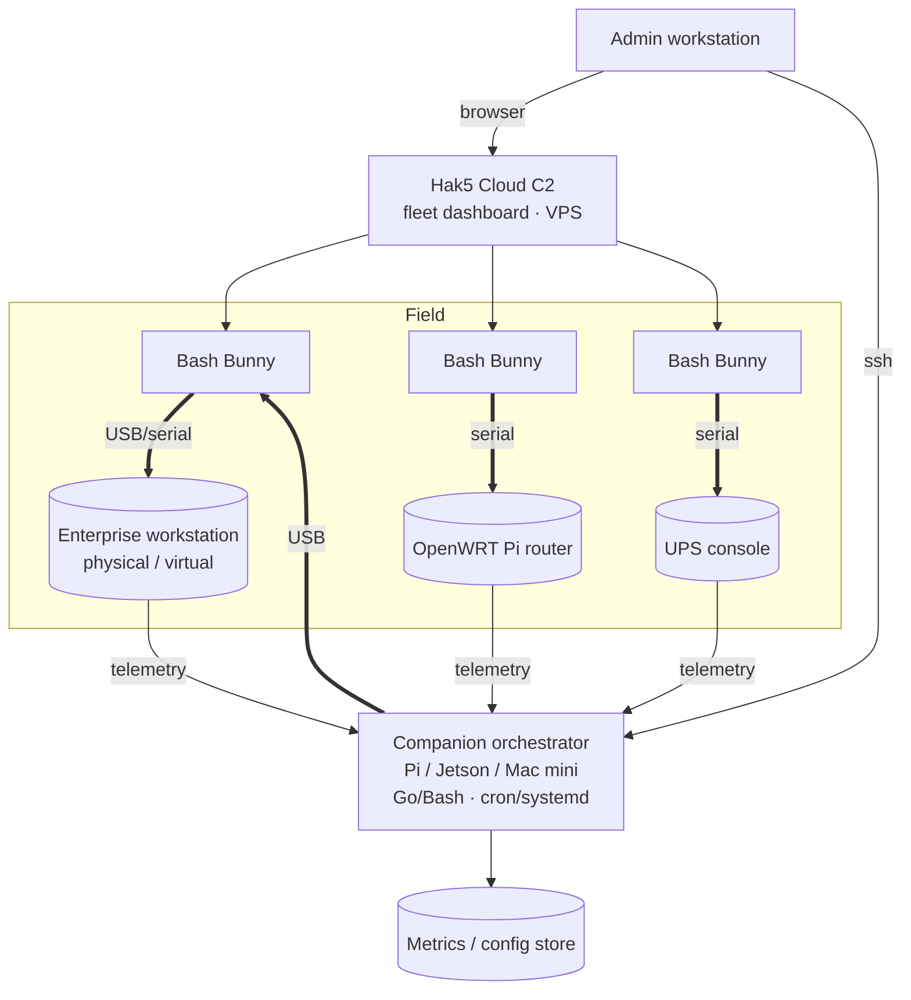

# Bash Bunny for the IT Systems Administrator

*A network-accessible, locally-connected admin path for deployments, config push, device management,
and telemetry — across workstations and custom infrastructure.*

Part of the Bash Bunny suite. Read [00 — General Guide](00-bash-bunny-general.md) first for the
hardware, `payload.txt`, ATTACKMODE, helper, and LED reference. Orchestration concepts (Cloud C2 +
companion host) are introduced in
[§9 of the general guide](00-bash-bunny-general.md#9-orchestration-two-paths).

> **Authorized use only.** Out-of-band admin access is powerful. Operate under change control, with
> device allowlisting and audit logging, on infrastructure you administer. See
> [Governance](#governance).

---

## The ILO analogy, honestly scoped

A server's **ILO/iDRAC/BMC** gives lights-out access to hardware, firmware/BIOS, and the OS console
independent of the running OS. Cluster managers (Borg, Consul + Nomad, Mesos, Rancher, VMware) give
*fleet-level* control over many machines.

The Bash Bunny is **not** a BMC and does not replace a cluster manager. What it *is*: a portable,
out-of-OS **access bridge** — keyboard, serial console, and network adapter over one USB cable — that
you can attach to a workstation, an OpenWRT Pi router, a UPS console port, or any device with a USB
or serial input. Paired with **Hak5 Cloud C2** (the native fleet plane) or a **companion orchestrator**
(Pi/Jetson/Mac mini), it becomes a *manageable, network-reachable* admin endpoint.

| Capability | True ILO/BMC | Cluster mgr | Bunny + Cloud C2 / companion |
|---|---|---|---|
| Power on/off, sensor telemetry, virtual media | ✅ | partial | ❌ (no power rail control) |
| BIOS/firmware console pre-OS | ✅ | ❌ | ⚠ only via HID/serial if the device exposes it |
| OS-level config push / automation | ⚠ | ✅ | ✅ (`HID`, `SERIAL`, USB-net) |
| Serial console to network/appliance gear | ⚠ | ❌ | ✅ `SERIAL` (115200) |
| Manage **many** field devices from one pane | ❌ | ✅ | ✅ **Cloud C2** dashboard |
| Works where no agent/BMC exists | ❌ | ❌ | ✅ (looks like local HID/NIC) |

Use the Bunny where you need **agentless, out-of-OS reach** to a specific box — and Cloud C2 to
manage a fleet of those reach-points.

---

## Reference architecture



```
ASCII: one orchestrator, many reach-points

   [Admin] --ssh--> [Pi orchestrator] ==USB== [Bunny] ==USB/serial== [managed device]
                          │                                              ^
                     cron/systemd ----------- pulls telemetry ----------+
```

- **switch1 vs switch2** = two distinct operational profiles on the same device (e.g. *deploy* vs
  *collect-telemetry*) selectable without re-arming.
- **Geofencing** (`WAIT_FOR_PRESENT`) scopes sensitive ops to a physical site/operator.

---

## Use case 1 — Zero-touch config push to a workstation

Type a bootstrap that pulls and applies a config from a staged bundle. Works on a freshly imaged or
headless-ish workstation with no management agent yet installed.

`/payloads/switch1/payload.txt`:

```bash
#!/bin/bash
#
# Title:        Workstation Config Push (Windows)
# Description:  HID-driven bootstrap that applies a staged baseline config.
# Category:     deployment
# Target:       Windows
# Attackmodes:  HID STORAGE

LED SETUP
ATTACKMODE HID STORAGE
LED STAGE1

# Open an elevated PowerShell.
RUN WIN "powershell -ExecutionPolicy Bypass -NoProfile"
Q DELAY 1200

# Apply a baseline from the Bunny's STORAGE volume (drive letter resolved at runtime).
QUACK STRING '$d = (Get-Volume -FileSystemLabel "BashBunny").DriveLetter; '
QUACK STRING 'Start-Process -Wait -FilePath "$($d):\deploy\apply-baseline.ps1"'
Q ENTER

LED STAGE2
# Optional: drop a result marker back to loot for the orchestrator to collect.
Q DELAY 3000
QUACK STRING 'Copy-Item C:\Windows\Temp\baseline-result.log "$($d):\..\loot\"'
Q ENTER

LED FINISH
```

> Keep the actual logic (`apply-baseline.ps1`) in the staged bundle and idempotent. The payload is
> just the *delivery gesture*; the bundle is the *content* you version and review.

---

## Use case 2 — Serial console management of an OpenWRT Pi router / UPS

`SERIAL` ATTACKMODE turns the Bunny into an ACM serial console. Combined with the onboard Linux shell,
the companion orchestrator can drive a router or UPS console programmatically.

```bash
#!/bin/bash
#
# Title:        Serial Console Bridge (OpenWRT / UPS)
# Description:  Present a serial console and run an authorized config routine.
# Category:     deployment
# Target:       Network appliance (serial)
# Attackmodes:  SERIAL ECM_ETHERNET

LED SETUP
# SERIAL for the appliance console; ECM so the orchestrator can reach this Bunny.
ATTACKMODE SERIAL ECM_ETHERNET
LED STAGE1

# On-device: talk to the appliance over the Bunny's serial line at 115200 8N1.
# (The orchestrator can also SSH into the Bunny and drive this interactively.)
DEV=/dev/ttyGS0                  # gadget serial endpoint
stty -F $DEV 115200 cs8 -cstopb -parenb
{
  echo ""                       # wake console
  sleep 1
  echo "uci show network | head" # example read-only OpenWRT query
  sleep 1
} > "$DEV"
timeout 5 cat "$DEV" > /root/udisk/loot/router_console.txt
sync

LED FINISH
```

> Serial settings are **115200 8N1** (same as the Bunny's own arming console). For UPS gear, swap the
> OpenWRT `uci` query for the vendor's console command set. Keep first runs **read-only** to confirm
> you're on the right console before issuing changes.

---

## Use case 3 — Scheduled telemetry collection (companion-orchestrated)

The Bunny presents as a NIC; the **companion orchestrator** pulls metrics on a `cron`/systemd
schedule and forwards them to your metrics/config store. This is the pattern that scales to a fleet —
and the orchestrator, not the Bunny, does the heavy lifting (the Bunny's FW-1.6/Debian-Stretch
userland is too dated for modern agents).

Bunny side (`/payloads/switch2/payload.txt` — the "telemetry" profile):

```bash
#!/bin/bash
# Title: Telemetry NIC
# Attackmodes: ECM_ETHERNET
LED SETUP
ATTACKMODE ECM_ETHERNET
LED STAGE1
# Bunny just provides the link; the orchestrator scrapes over the USB subnet.
LED FINISH
```

Companion orchestrator — a systemd timer that scrapes the managed device via the Bunny link:

```ini
# /etc/systemd/system/bunny-telemetry.timer
[Unit]
Description=Scrape managed-device telemetry via Bash Bunny link
[Timer]
OnBootSec=2min
OnUnitActiveSec=5min
[Install]
WantedBy=timers.target
```

```bash
#!/usr/bin/env bash
# /usr/local/bin/bunny-telemetry.sh   (invoked by bunny-telemetry.service)
set -euo pipefail
BUNNY_NET=172.16.64.1            # Bunny management IP on the USB subnet
TARGET=172.16.64.20             # managed device behind the Bunny NIC (example)
OUT=/var/lib/bunny-telemetry
ts=$(date -u +%Y%m%dT%H%M%SZ)
mkdir -p "$OUT"
# Example: pull SNMP/console metrics; push to your TSDB or config store.
if ping -c1 -W2 "$TARGET" >/dev/null; then
  snmpget -v2c -c public "$TARGET" 1.3.6.1.2.1.1.3.0 > "$OUT/uptime-$ts.txt" || true
fi
# ... forward $OUT/* to Prometheus pushgateway / your store ...
```

> For many devices, register each Bunny in **Cloud C2** and use its dashboard as the single pane of
> glass; use the companion orchestrator for the custom scrape/forward logic C2 doesn't cover.

---

## Fleet & deployment patterns

- **Two profiles per device:** `switch1` = deploy/config-push, `switch2` = telemetry/collect.
- **Cloud C2** for inventory, remote management, and aggregated views across deployed Hak5 gear
  (Bunnies, Screen Crabs). Host it on a public VPS; provision each device with its `device.config`.
- **Geofencing** for site-scoped sensitive operations.
- **Companion orchestrator** (Pi/Jetson/Mac mini) for bespoke automation, scheduling, and telemetry
  forwarding — and, via its own `dwc2`+`libcomposite` USB-gadget networking, as a richer bridge when
  the Bunny alone isn't enough (see [developer guide](03-app-developer.md) for the gadget config).

## Governance

- **Change control.** Treat config-push payloads and their staged bundles as change artifacts:
  reviewed, versioned, idempotent, with rollback.
- **Allowlisting & least privilege.** Your own USB device-control policy should *expect* these
  devices; scope credentials to the task.
- **Audit.** Log every run (which device, which profile, by whom) — Cloud C2 helps centralize this.
- **No destructive payloads**, per `hak5/bashbunny-payloads` conventions; first runs read-only.

See the [general governance section](00-bash-bunny-general.md#11-governance--authorized-use) and
[04 — Complementary tools](04-complementary-tools.md) for fleet-scale pairings.
