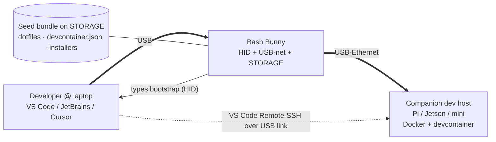

# Bash Bunny for the App Developer

*One-touch bootstrap into a standardized, refreshable, backed-up development environment.*

Part of the Bash Bunny suite. Read [00 — General Guide](00-bash-bunny-general.md) first for the
hardware, `payload.txt`, ATTACKMODE, helper, and LED reference.

> **Authorized use only.** These patterns provision *your own* dev machines and dev hosts. Don't run
> bootstrap automation against systems you don't control.

---

## The honest model: bring-up and attach, not "the environment on a stick"

The appealing pitch is "plug in a stick and you're booted into a full VSCode + Docker dev box." Be
precise about where that environment actually lives.

The Bash Bunny **cannot** host your dev environment. It is a small ARM SoC whose firmware froze at
**1.6-stable (2019, Debian Stretch)** — far too dated to run current Docker, Node, Go toolchains, or
an IDE (see [the firmware note](00-bash-bunny-general.md#1-what-it-is--and-what-it-is-not)). What the
Bunny *does* brilliantly is the **bring-up and attach**:

1. **HID** — types the bootstrap commands so you don't.
2. **USB-Ethernet** — gives you an instant network path to the dev host.
3. **STORAGE** — carries a pinned seed bundle (dotfiles, devcontainer spec, install scripts).

The **environment itself** lives on a **companion host** (a Raspberry Pi / Jetson / Mac mini, or a
target dev box) running Docker + a devcontainer, reachable over **VS Code Remote-SSH**. This is the
same idea as cloud Codespaces or a golden-image jumpbox — just with a physical, offline-capable
bridge instead of a cloud tenant.



```
ASCII:  [Laptop IDE] --Remote-SSH--> [Dev host: Docker + devcontainer]
              ‖ USB                         ‖
          [Bash Bunny] ===== USB-Ethernet ==+   (one cable; Bunny is the bridge)
```

| Layer | Lives where |
|---|---|
| IDE UI (VSCode/JetBrains/Cursor/Antigravity) | Developer's laptop |
| Toolchain: docker, git, terraform, node, go, net-tools, chromium | **Companion dev host** (devcontainer) |
| Bootstrap gesture + seed delivery + network bridge | **Bash Bunny** |

---

## The companion dev host as a USB gadget (key enabler)

A Raspberry Pi makes an ideal companion dev host because it can present **itself** to your laptop as a
USB-Ethernet device over a single cable, then serve VS Code Remote-SSH — no router, no Wi-Fi needed.
This is the concrete substitution for "the Bunny runs my environment": the *Pi* runs it, and USB
gadget mode makes the Pi feel as plug-and-play as the Bunny.

`dwc2` + `libcomposite` exposing **ECM + RNDIS simultaneously** (driver-free on Linux/macOS/Windows):

```bash
# On the Raspberry Pi (one-time): enable the USB gadget stack.
# /boot/firmware/config.txt
dtoverlay=dwc2
# /boot/firmware/cmdline.txt  (append, space-separated, after rootwait)
modules-load=dwc2
# /etc/modules
libcomposite
```

```bash
#!/bin/bash
# /usr/local/sbin/usb-gadget-net.sh  — create a composite ECM+RNDIS NIC
set -e
cd /sys/kernel/config/usb_gadget/
mkdir -p devkit && cd devkit
echo 0x1d6b > idVendor; echo 0x0104 > idProduct      # Linux Foundation / composite
mkdir -p strings/0x409
echo "devkit-pi" > strings/0x409/product
mkdir -p configs/c.1/strings/0x409
echo "ECM+RNDIS" > configs/c.1/strings/0x409/configuration
# RNDIS (Windows) first, then ECM (Linux/macOS) — host loads whichever it supports.
mkdir -p functions/rndis.usb0 && ln -s functions/rndis.usb0 configs/c.1/
mkdir -p functions/ecm.usb0   && ln -s functions/ecm.usb0   configs/c.1/
ls /sys/class/udc > UDC                                # bind → usb0 appears
```

> **Pi 5 caveat.** The Pi 5's USB-C port supports gadget mode only after a firmware/EEPROM update,
> and powering the Pi 5 over that same port needs ~3 A / 15 W (a PD/Thunderbolt-class cable and
> laptop port). Pi Zero / Zero 2 W / 3A+ / 4 and Compute Modules work over their OTG ports. The
> official Raspberry Pi USB-gadget package supports Pi Zero–5 and CM. SHARED mode can serve the host
> DHCP at `10.12.194.1/28` (pool `…2–…14`).

Once the Pi is reachable over the USB link, add your SSH key and connect VS Code **Remote-SSH** to it;
the connection persists across reboots and you develop on the Pi (or in its devcontainers) as a
remote host.

---

## Use case 1 — One-touch devcontainer bring-up

The Bunny types the commands that clone a repo and bring up its devcontainer on the dev host.

`/payloads/switch1/payload.txt`:

```bash
#!/bin/bash
#
# Title:        Dev Bring-Up
# Description:  HID-bootstrap: open terminal, SSH to dev host, start devcontainer.
# Category:     general
# Target:       Linux / macOS dev laptop
# Attackmodes:  HID

REPO="git@github.com:acme/app.git"
DEVHOST="devkit-pi.local"        # or the USB-net address of the companion host

LED SETUP
ATTACKMODE HID
LED STAGE1

# Open a terminal on the developer's laptop (macOS Spotlight example).
Q GUI SPACE
Q DELAY 400
QUACK STRING "terminal"
Q ENTER
Q DELAY 1200

# SSH to the dev host and bring the environment up (idempotent on the host side).
QUACK STRING "ssh $DEVHOST 'mkdir -p ~/src && cd ~/src && \
  ( [ -d app ] || git clone $REPO app ) && cd app && \
  devcontainer up --workspace-folder . || docker compose up -d'"
Q ENTER

LED FINISH
```

---

## Use case 2 — Reproducible toolchain seed (STORAGE)

Ship a **pinned** bundle on the Bunny's storage and let an idempotent installer provision the
standard toolset on a fresh host. Keep the heavy installs on the host; the Bunny just delivers the
bundle and kicks off the script.

```bash
#!/bin/bash
#
# Title:        Toolchain Seed
# Description:  Deliver pinned dev bundle from STORAGE; run idempotent provisioner.
# Category:     general
# Target:       Linux
# Attackmodes:  STORAGE HID

LED SETUP
ATTACKMODE STORAGE HID
LED STAGE1

RUN LINUX "bash"
Q DELAY 800
# Copy the seed off the Bunny volume and run the provisioner.
QUACK STRING 'BB=$(lsblk -o LABEL,MOUNTPOINT | awk "/BashBunny/{print \$2}"); \
  cp -r "$BB/seed" ~/devseed && bash ~/devseed/provision.sh'
Q ENTER
LED FINISH
```

`seed/provision.sh` (on the bundle) installs the **standard toolset idempotently** — e.g. docker,
git, terraform, node, go, net-tools, chromium — pinning versions and skipping anything already
present:

```bash
#!/usr/bin/env bash
set -euo pipefail
need() { command -v "$1" >/dev/null || return 1; }
need docker    || curl -fsSL https://get.docker.com | sh
need git       || sudo apt-get install -y git
need terraform || sudo apt-get install -y terraform
need node      || sudo apt-get install -y nodejs npm
need go        || sudo apt-get install -y golang
need ip        || sudo apt-get install -y net-tools iproute2
cp -n ~/devseed/dotfiles/.{bashrc,gitconfig} ~/ 2>/dev/null || true
echo "provisioned $(date -u +%FT%TZ)"
```

> Pin versions in the bundle, not the payload, so updating the toolchain is a bundle bump you can
> review and back up — the "refreshable, backed-up, standardized" property comes from versioning the
> seed and the devcontainer spec, not from the stick.

---

## Use case 3 — USB-net dev tunnel to the host's services

Expose the companion host's dev server / SSH / VS Code Remote endpoint to the laptop over the Bunny's
USB-Ethernet link — handy when there's no shared LAN.

```bash
#!/bin/bash
# Title: Dev Tunnel NIC
# Attackmodes: AUTO_ETHERNET          # FW >= 1.5 (ECM->RNDIS fallback for Windows laptops)
LED SETUP
ETHERNET_TIMEOUT_15
ATTACKMODE AUTO_ETHERNET
LED STAGE1
# Bunny provides the L2 link on 172.16.64.0/24 (Bunny = 172.16.64.1).
# The companion host's dev server / sshd is reachable across this subnet; the
# developer points VS Code Remote-SSH / a browser at the host's USB-net address.
LED FINISH
```

> Subnet details are in the
> [general guide §3](00-bash-bunny-general.md#3-switch-positions--access). For Windows laptops prefer
> `AUTO_ETHERNET`/`RNDIS_ETHERNET`; for macOS/Linux, `ECM_ETHERNET` works directly.

---

## Refresh / backup discipline

- **Source of truth** = the versioned seed bundle + `devcontainer.json`, stored in git and backed up
  — *not* the Bunny's udisk.
- **Keep on the Bunny:** the bootstrap payload and a copy of the current pinned seed.
- **Keep on the host:** the running devcontainer, caches, and work-in-progress (committed/pushed
  regularly).
- **Refresh** = re-pull the seed and `devcontainer up --build`; the Bunny just re-runs the bring-up.

See [04 — Complementary tools](04-complementary-tools.md) for pairing with an LLM agent that can
generate/adapt these bootstrap payloads from a one-line intent.
