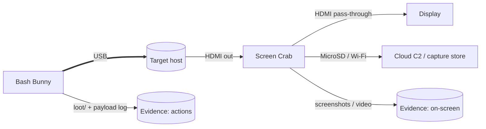
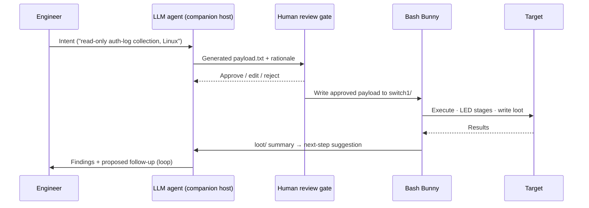

# Complementary Tools — Three High-Leverage Combinations

*Pairing the Bash Bunny with tools that cover what a single USB endpoint can't.*

Part of the Bash Bunny suite. Read [00 — General Guide](00-bash-bunny-general.md) first. The
"offboard planner + hardware endpoint" idea behind Combination 3 is developed further in
[`../custom-kvm.md`](../custom-kvm.md).

> **Authorized use only.** Multi-tool setups multiply both capability and responsibility. Every
> combination below assumes documented authorization, on-site/consented operation, and audit logging.

---

## Tool profiles

### Hak5 Screen Crab

An **inline HDMI man-in-the-middle capture** device: it sits between a video source and a display and
records what's on screen — **without a host computer**.

| Property | Detail |
|---|---|
| Interface | HDMI in/out pass-through (HDMI 1.4 / DVI 1.0), USB, MicroSD |
| Capture modes | `IMAGE` (screenshots at an interval, default 5 s), `VIDEO` (2 / 4 / 16 Mbps = low/med/high), `OFF` — set in `config.txt` |
| Resolutions | Most resolutions below 1920×1080, 16:9 |
| Storage | MicroSD (FAT32 or ExFAT), `ROTATE` or `FILL` modes |
| Wireless / remote | 2.4 GHz Wi-Fi (802.11 b/g/n); integrates with **Cloud C2** (needs `device.config` + `WIFI_SSID`/`WIFI_PASS`; fails on band-steering APs) |
| Power / size | USB-C 5 V/1 A (5 W); 105×51×21 mm; narrow 35–45 °C operating range |

Value: an **independent visual record** of a session that owes nothing to the target's own logging.

### Flipper Zero

A multi-protocol hardware field tool (Sub-GHz, NFC, RFID, IR, GPIO) whose **BadUSB** app makes it a
USB HID device.

| Property | Detail |
|---|---|
| BadUSB transport | **USB *and* Bluetooth Low Energy** (after pairing) |
| Scripting | Extended DuckyScript, backward-compatible with Rubber Ducky 1.0 (adds alt+numpad, `SYSRQ`, etc.) |
| Payloads | Plain `.txt` files in the SD card `badusb/` folder, uploaded via qFlipper or the mobile app |
| Layout | Configurable keyboard layout (US English default) |
| Breadth | BadUSB is one app among many RF/NFC/GPIO capabilities |

Value: a **portable, battery-powered second HID vector** (especially **over BLE**) plus RF/NFC/GPIO
the Bunny lacks. See also the Flipper coverage in [`../custom-kvm.md`](../custom-kvm.md).

### Accessible LLM chat / agent

A reachable LLM (chat UI or tool-using agent on the companion host) that acts as an **offboard
planner**: it turns a high-level intent into concrete `payload.txt` / DuckyScript and orchestrator
commands, with a human approval gate before anything executes.

Value: faster authoring and adaptation of payloads; the Bunny remains the deterministic physical
endpoint while the planning is flexible.

---

## Combination 1 — Bunny + Screen Crab: action with independent visual evidence

**Idea:** the Bunny drives HID/automation while the Screen Crab independently records the target's
video output. You get *what was done* (Bunny `loot/` + payload log) **and** *what was shown on screen*
(Screen Crab capture) from two independent sources — valuable for the
[analyst's](01-cybersecurity-analyst.md) evidence integrity and the
[developer's](03-app-developer.md) QA/repro records.



```
[Target] --HDMI--> [Screen Crab] --HDMI--> [Monitor]
    ‖ USB                 │ MicroSD/Wi-Fi
[Bash Bunny]         capture store / Cloud C2
```

**Effective because:** the visual record doesn't depend on the target's own logging (which may be
absent, tampered, or out of scope), and the two timelines corroborate each other. Set the Screen Crab
to `VIDEO` for interactive sessions or `IMAGE` (5 s) for long unattended runs; align its clock with
the Bunny payload's LED-stage timeline for easy correlation.

---

## Combination 2 — Bunny + Flipper Zero: staged, multi-vector, wireless trigger

**Idea:** use the Flipper's **BLE BadUSB** as a wireless secondary HID vector or physical trigger,
while the Bunny carries the heavyweight HID-plus-networking stage. The Bunny can even gate its reveal
on the operator's presence via its own
[BLE remote trigger](00-bash-bunny-general.md#8-remote-triggers--geofencing-mark-ii).

```mermaid
sequenceDiagram
    participant OP as Operator (Flipper)
    participant BB as Bash Bunny
    participant T as Target
    OP->>BB: BLE beacon present (WAIT_FOR_PRESENT)
    BB->>T: Stage 2 — ATTACKMODE STORAGE HID + payload
    OP-->>T: Flipper BLE BadUSB — quick secondary keystrokes
    Note over BB,T: Bunny handles networking/exfil; Flipper adds RF/NFC/wireless HID
```

Bunny side — present benign storage until the Flipper beacon is near, then act:

```bash
LED SETUP
ATTACKMODE STORAGE                 # benign until triggered
LED STAGE1
WAIT_FOR_PRESENT flipper-beacon    # operator's Flipper advertises this id
LED STAGE2
ATTACKMODE STORAGE HID ECM_ETHERNET
QUACK STRING "staged"
Q ENTER
LED FINISH
```

**Effective because:** you split roles by strength — Flipper = wireless/portable/RF + a quick BLE HID
burst; Bunny = sustained HID + real USB networking + exfil. The wireless trigger keeps sensitive
stages **supervised and on-site**.

> **Note:** US-English layout is the Flipper default; set the matching `DUCKY_LANG` on the Bunny so
> both vectors type consistently.

---

## Combination 3 — Bunny + LLM agent: intent-to-payload with a human gate

**Idea:** an LLM agent on the [companion host](00-bash-bunny-general.md#9-orchestration-two-paths)
turns a one-line intent ("collect auth logs from this Linux host into loot, read-only") into a
concrete `payload.txt`, **a human reviews and approves it**, and only then is it written to the
Bunny's `switch1/` and executed. The Bunny stays the deterministic physical endpoint; planning is
flexible. This is the
"[offboard planner + hardware endpoint](../custom-kvm.md)" split made concrete.



Minimal guard-railed orchestrator sketch (companion host):

```bash
#!/usr/bin/env bash
# llm-to-bunny.sh — intent -> draft payload -> HUMAN GATE -> deploy
set -euo pipefail
INTENT="$1"
DRAFT=/tmp/payload.draft.txt

llm_generate "$INTENT" > "$DRAFT"      # your LLM call; returns a payload.txt

echo "----- proposed payload -----"; cat "$DRAFT"; echo "----------------------------"
read -rp "Deploy this to the Bash Bunny? (yes/NO) " ok
[ "$ok" = "yes" ] || { echo "aborted"; exit 1; }   # <-- mandatory human gate

# Bunny in arming mode (switch pos 3) exposes its udisk over the USB net.
scp "$DRAFT" root@172.16.64.1:/root/udisk/payloads/switch1/payload.txt
echo "Deployed. Flip switch to position 1 and re-insert to run."
```

**Effective because:** it compresses authoring/iteration time while keeping a **mandatory human
approval gate** — the agent proposes, a person disposes, and the physical device only ever runs
reviewed code. Never wire an LLM straight through to execution on a target.

---

## Choosing a combination

| You need… | Reach for |
|---|---|
| An independent, tamper-resistant visual record of a session | **Bunny + Screen Crab** |
| A wireless trigger and/or RF/NFC + a second HID vector | **Bunny + Flipper Zero** |
| Fast, adaptable payload authoring with a safety gate | **Bunny + LLM agent** |

All three compose: e.g. an LLM-authored payload (3) that the Bunny runs while a Screen Crab records
(1), triggered by a Flipper beacon (2). Keep the
[governance practices](00-bash-bunny-general.md#11-governance--authorized-use) from the general guide
in force across every tool in the chain.
