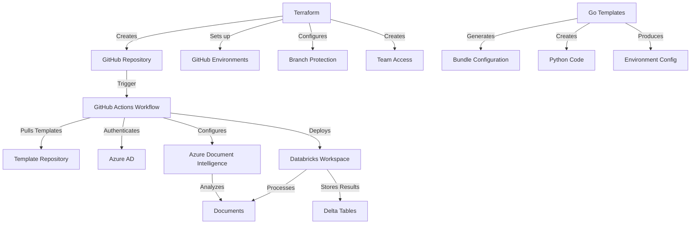

# Databricks Asset Bundle Deployment with Azure Document Intelligence

This repository provides a complete DevOps solution for deploying Databricks Asset Bundles with Azure Document Intelligence integration using GitHub Actions, Terraform, and parameterized templates.

## 🏗️ Architecture Overview



## 🚀 Quick Start

### Prerequisites

1. **Required Tools:**
   ```bash
   # Install required CLI tools
   curl -fsSL https://apt.releases.hashicorp.com/gpg | sudo apt-key add -
   sudo apt-add-repository "deb [arch=amd64] https://apt.releases.hashicorp.com $(lsb_release -cs) main"
   sudo apt-get update && sudo apt-get install terraform
   
   # Install Azure CLI
   curl -sL https://aka.ms/InstallAzureCLIDeb | sudo bash
   
   # Install Databricks CLI
   pip install databricks-cli
   
   # Install Go (for template processing)
   sudo snap install go --classic
   ```

2. **Required Environment Variables:**
   ```bash
   export GITHUB_TOKEN="your-github-pat-token"
   export GITHUB_ORGANIZATION="your-github-organization"
   export AZURE_SUBSCRIPTION_ID="your-azure-subscription-id"
   export AZURE_TENANT_ID="your-azure-tenant-id"
   export DATABRICKS_WORKSPACE_URL="https://your-workspace.databricks.com"
   export DATABRICKS_TOKEN="your-databricks-token"
   ```

3. **Azure Service Principal:**
   ```bash
   # Create service principal for GitHub Actions
   az ad sp create-for-rbac \
     --name "github-actions-databricks" \
     --role contributor \
     --scopes /subscriptions/$AZURE_SUBSCRIPTION_ID \
     --sdk-auth
   ```

### Installation

1. **Clone and Setup:**
   ```bash
   git clone <this-repository>
   cd databricks-document-intelligence-deploy
   chmod +x setup-infrastructure.sh
   ./setup-infrastructure.sh
   ```

2. **Deploy Infrastructure:**
   ```bash
   # The setup script will:
   # - Validate prerequisites
   # - Deploy Terraform infrastructure
   # - Set up Azure resources
   # - Configure Databricks
   # - Generate template files
   ```

## 📁 Repository Structure

```
.
├── terraform/                          # Terraform configuration
│   ├── main.tf                        # GitHub repository setup
│   ├── variables.tf                   # Variable definitions
│   └── outputs.tf                     # Output values
├── .github/workflows/                  # GitHub Actions workflows
│   └── deploy-databricks.yml          # Main deployment workflow
├── config/                            # Configuration files
│   ├── deployment-config.json         # Main deployment configuration
│   ├── nonprod.json                   # Non-production environment config
│   └── prod.json                      # Production environment config
├── databricks/                        # Databricks Asset Bundle files
│   ├── databricks.yml                # Bundle configuration
│   ├── src/                          # Source code
│   ├── resources/                    # Resource definitions
│   └── notebooks/                    # Databricks notebooks
├── templates/                         # Go template files
│   ├── databricks.yml.tmpl          # Bundle configuration template
│   ├── src/                          # Source code templates
│   └── config/                       # Config templates
├── scripts/                           # Utility scripts
│   ├── setup-infrastructure.sh       # Main setup script
│   ├── validate-deployment.sh        # Validation script
│   └── cleanup.sh                    # Cleanup script
├── process-templates.go               # Go template processor
└── README.md                          # This file
```

## ⚙️ Configuration

### Deployment Configuration (`config/deployment-config.json`)

```json
{
  "default_source_repo": "organization/databricks-templates",
  "default_source_ref": "main",
  "default_bundle_name": "document-intelligence-bundle",
  "environments": {
    "nonprod": {
      "databricks_profile": "nonprod",
      "azure_resource_group": "rg-databricks-nonprod",
      "cluster_config": {
        "node_type_id": "Standard_DS3_v2",
        "num_workers": 2
      }
    },
    "prod": {
      "databricks_profile": "prod",
      "azure_resource_group": "rg-databricks-prod",
      "cluster_config": {
        "node_type_id": "Standard_DS4_v2",
        "num_workers": 4
      }
    }
  }
}
```

### GitHub Environments

The Terraform configuration creates two environments with the following variables:

**NonProd Environment:**
- `AZURE_SUBSCRIPTION_ID`
- `AZURE_TENANT_ID`
- `DATABRICKS_WORKSPACE_URL`
- `ENVIRONMENT=nonprod`
- `AZURE_RESOURCE_GROUP=rg-databricks-nonprod`
- `DOCUMENT_INTELLIGENCE_ENDPOINT`

**Prod Environment:**
- Same variables with production values
- Requires 2 reviewers for deployment
- Protected branch deployment only

## 🎯 Workflow Triggers

### 1. Manual Dispatch
```yaml
# Trigger manually from GitHub Actions UI
workflow_dispatch:
  inputs:
    environment: [nonprod, prod]
    source_repo: "organization/databricks-templates"
    source_ref: "main"
    bundle_name: "document-intelligence-bundle"
```

### 2. Repository Dispatch (PR Trigger)
```bash
# Trigger from another repository
curl -X POST \
  -H "Authorization: token $GITHUB_TOKEN" \
  -H "Accept: application/vnd.github.v3+json" \
  https://api.github.com/repos/YOUR_ORG/YOUR_REPO/dispatches \
  -d '{
    "event_type": "deploy-pr-trigger",
    "client_payload": {
      "environment": "nonprod",
      "source_repo": "organization/databricks-templates",
      "source_ref": "feature-branch"
    }
  }'
```

### 3. Pull Request
```yaml
# Automatic trigger on PR to main
pull_request:
  branches: [main]
  paths:
    - 'databricks/**'
    - 'config/**'
    - '.github/workflows/**'
```

## 🛠️ Template Processing

### Go Template Processor

The `process-templates.go` file provides powerful template processing capabilities:

```bash
# Generate sample templates
./process-templates --generate-samples

# Process templates with custom configuration
./process-templates \
  --bundle-name "my-custom-bundle" \
  --environment "prod" \
  --output-dir "output/" \
  --config "config.json"
```

### Template Functions

Available template functions:
- `{{ .BundleName }}` - Bundle name
- `{{ .Environment }}` - Target environment
- `{{ .Variables.VAR_NAME }}` - Environment variables
- `{{ env "VAR_NAME" }}` - Environment variable with fallback
- `{{ toUpper .Environment }}` - String manipulation
- `{{ if eq .Environment "prod" }}...{{ end }}` - Conditional logic

### Example Template

```yaml
# databricks.yml.tmpl
bundle:
  name: {{ .BundleName }}

targets:
  {{ .Environment }}:
    mode: {{ if eq .Environment "prod" }}production{{ else }}development{{ end }}
    variables:
      cluster_size: {{ if eq .Environment "prod" }}4{{ else }}2{{ end }}
```

## 🔐 Security and Access Control

### GitHub Repository Security

- **Branch Protection:** Requires 2 reviewers for main branch
- **Secret Scanning:** Enabled for credential detection
- **Team Access:** `team-alpha-blue-i` has admin access
- **Custom Role:** `super-special-role-type-1` for specialized permissions

### Azure Security

- **Service Principal Authentication:** Secure Azure CLI access
- **Managed Identity:** For Databricks-to-Azure communication
- **Key Vault Integration:** For secret management
- **RBAC:** Role-based access control for resources

### Databricks Security

- **Token-based Authentication:** Secure API access
- **Secret Scopes:** Encrypted secret storage
- **Cluster Policies:** Controlled cluster configurations
- **Access Control:** Environment-specific permissions

## 📊 Monitoring and Observability

### Built-in Monitoring

The workflow includes monitoring for:
- Deployment success/failure rates
- Document processing metrics
- Azure Document Intelligence usage
- Databricks job execution status

### Alerting

Configure alerts in your deployment configuration:
```json
{
  "monitoring": {
    "alert_channels": ["#data-engineering", "#alerts"],
    "metrics": [
      "job_success_rate",
      "document_processing_latency",
      "error_rate"
    ]
  }
}
```

## 🧪 Testing

### Validation Steps

The workflow includes comprehensive validation:
1. **Configuration Validation:** JSON schema validation
2. **Databricks Bundle Validation:** `databricks bundle validate`
3. **Azure Connectivity:** Service availability checks
4. **Integration Testing:** End-to-end workflow testing

### Local Testing

```bash
# Validate bundle locally
databricks bundle validate --profile nonprod

# Test Document Intelligence connection
python scripts/test-document-intelligence.py

# Run integration tests
python -m pytest tests/integration/
```

## 🔄 Deployment Process

### Workflow Steps

1. **Configuration Validation**
   - Load and validate deployment configuration
   - Determine target environment
   - Set up parameterized values

2. **Template Code Fetching**
   - Checkout specified template repository
   - Merge template code with main repository
   - Process Go templates with environment-specific values

3. **Databricks Validation**
   - Validate asset bundle configuration
   - Check Databricks connectivity
   - Verify resource definitions

4. **Azure Setup**
   - Authenticate with Azure
   - Verify Document Intelligence service
   - Configure integration settings

5. **Deployment**
   - Deploy Databricks Asset Bundle
   - Set up Document Intelligence integration
   - Configure secret scopes and permissions

6. **Post-Deployment**
   - Run integration tests
   - Generate deployment summary
   - Clean up on failure

## 🛠️ Maintenance

### Regular Maintenance Tasks

```bash
# Update dependencies
./scripts/update-dependencies.sh

# Validate current deployment
./scripts/validate-deployment.sh

# Clean up old resources
./scripts/cleanup.sh
```

### Troubleshooting

Common issues and solutions:

1. **Databricks Token Expiration:**
   ```bash
   # Update token in GitHub secrets
   databricks auth token
   ```

2. **Azure Service Principal Issues:**
   ```bash
   # Verify service principal permissions
   az role assignment list --assignee $CLIENT_ID
   ```

3. **Template Processing Errors:**
   ```bash
   # Debug template processing
   ./process-templates --bundle-name test --environment nonprod
   ```

## 🤝 Contributing

1. **Fork the repository**
2. **Create a feature branch**
3. **Make your changes**
4. **Add tests**
5. **Update documentation**
6. **Submit a pull request**

### Development Setup

```bash
# Set up development environment
git clone <your-fork>
cd databricks-document-intelligence-deploy
./scripts/setup-dev-environment.sh
```

## 📚 Additional Resources

- [Databricks Asset Bundles Documentation](https://docs.databricks.com/dev-tools/bundles/)
- [Azure Document Intelligence Documentation](https://docs.microsoft.com/azure/cognitive-services/form-recognizer/)
- [GitHub Actions Documentation](https://docs.github.com/actions)
- [Terraform GitHub Provider](https://registry.terraform.io/providers/integrations/github/latest/docs)

## 📄 License

This project is licensed under the MIT License - see the [LICENSE](LICENSE) file for details.

## 🆘 Support

For support and questions:
- Create an issue in this repository
- Contact the `team-alpha-blue-i` team
- Check the [troubleshooting guide](docs/troubleshooting.md)

## 🔄 Changelog

### v1.0.0
- Initial release
- Terraform GitHub repository setup
- GitHub Actions workflow for Databricks deployment
- Go template processor
- Azure Document Intelligence integration
- Comprehensive documentation

---

**Happy Deploying! 🚀**