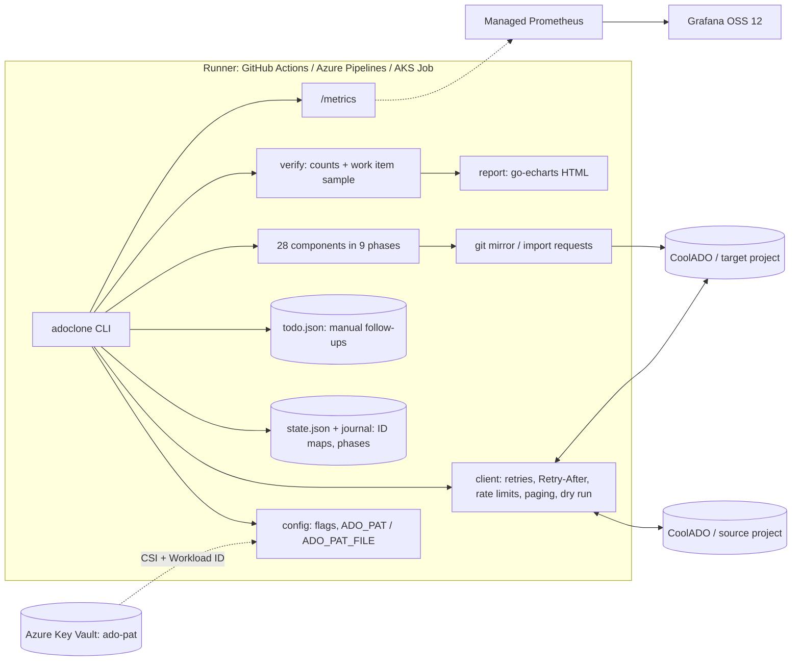
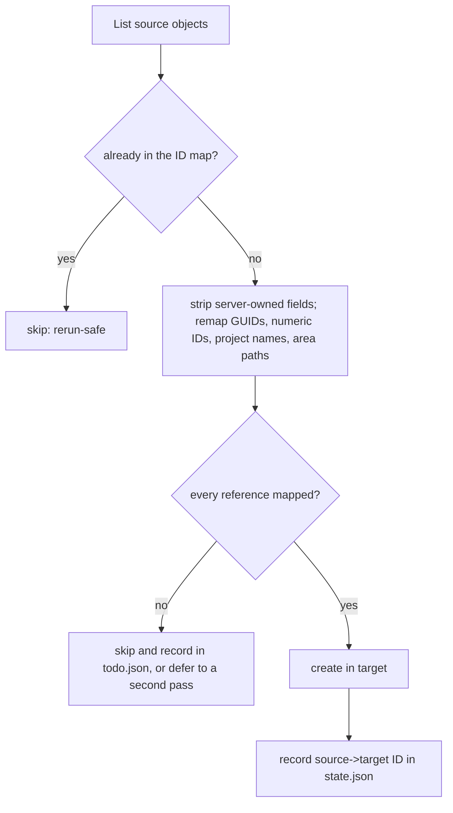
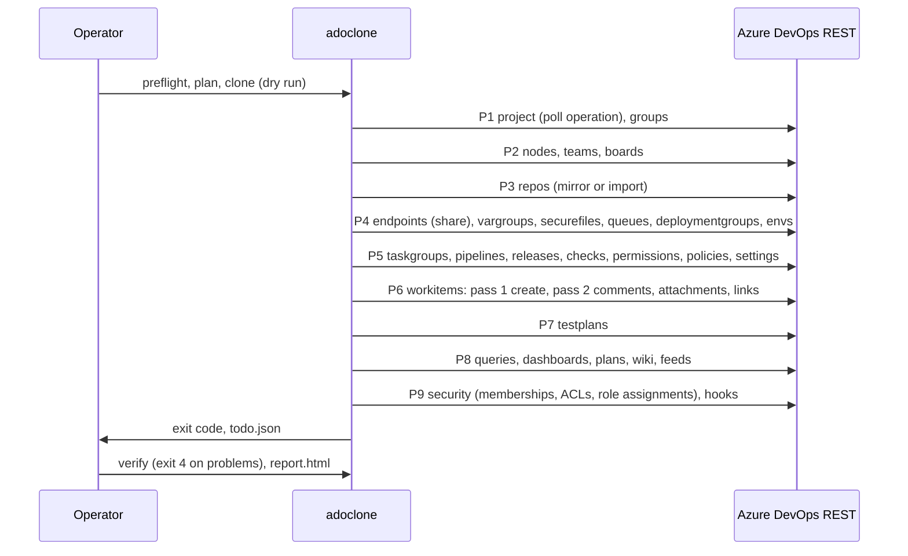
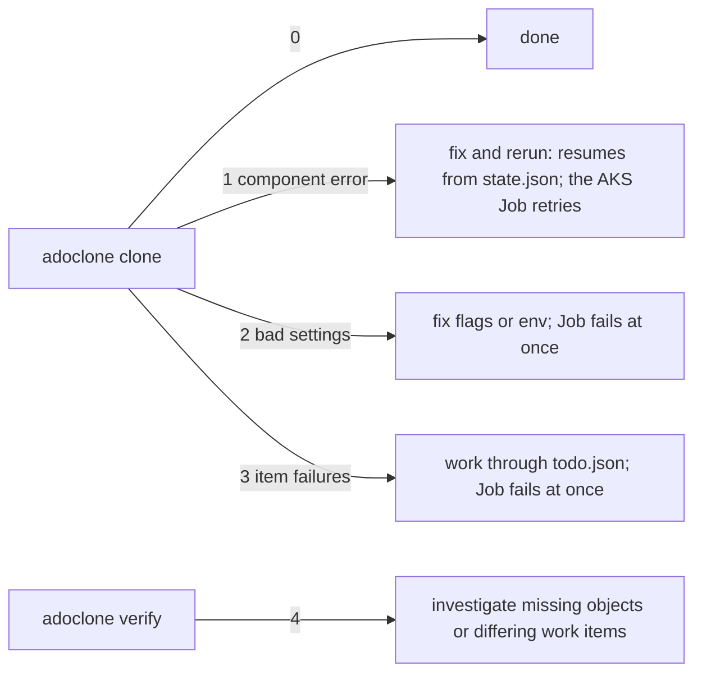

# adoclone diagrams

GitHub and Azure DevOps both render the Mermaid blocks.

## Architecture



## Data flow and ID mapping



Checkpoint shape:

```
state.json
{ "sourceProjectId": "...", "targetProjectId": "...",
  "maps": { "workitem": {"123":"4567"}, "repo": {"<src guid>":"<tgt guid>"}, "repoName": {}, "repoContent": {},
            "team": {}, "teamSubject": {}, "subject": {}, "identity": {}, "identityDescriptor": {},
            "classNode": {}, "classNodeId": {}, "query": {}, "dashboard": {}, "deliveryPlan": {},
            "buildDef": {}, "releaseDef": {}, "releaseEnv": {}, "taskGroup": {}, "queue": {},
            "vargroup": {}, "vargroupShared": {}, "endpoint": {}, "endpointShared": {}, "secureFile": {},
            "environment": {}, "deploymentGroup": {}, "policy": {}, "testPlan": {}, "testSuite": {},
            "testConfig": {}, "testVariable": {}, "suiteCases": {}, "wiki": {}, "wikiContent": {},
            "feed": {}, "feedView": {}, "hook": {}, "wicomments": {}, "wilinks": {} },
  "phases": { "workitems": {"status":"done"} } }
state.json.journal   one {"k","s","t"} line per mapping since the last fold
todo.json            [{"component","item","action"}]
```

## Phase sequence



## Exit codes and retries


