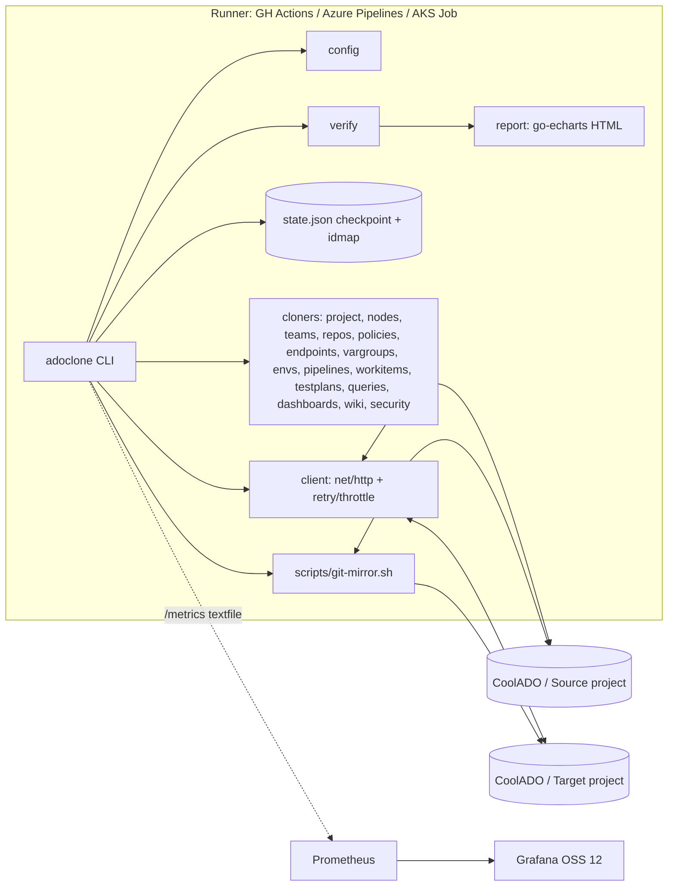
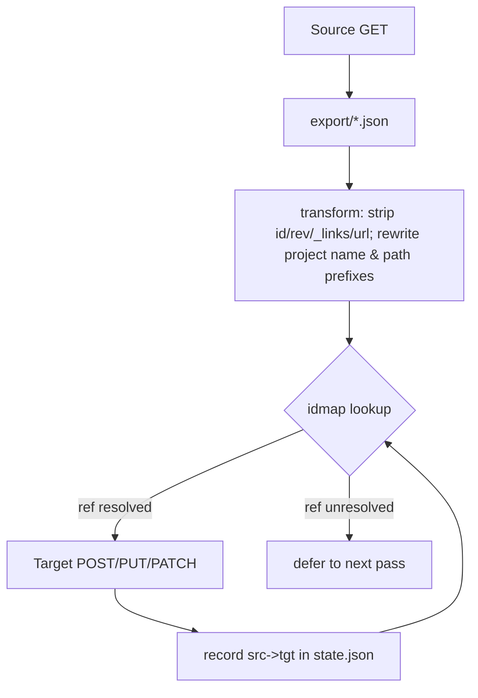
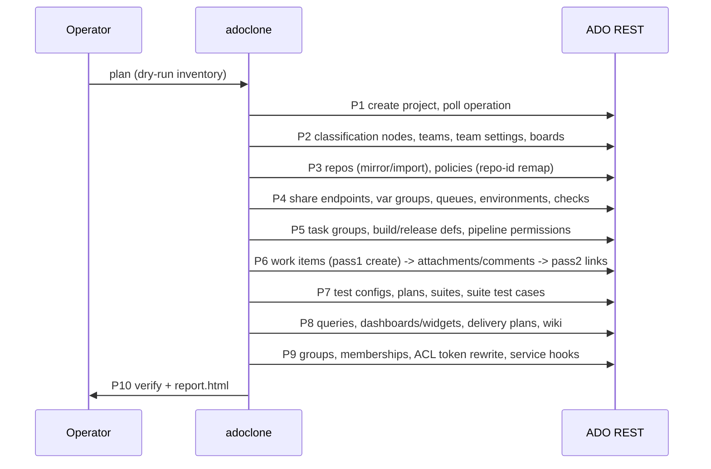

# Plan for Duplicating an Azure DevOps Project Within One Organization (CoolADO) — Implementation Guide for the `adoclone` Tool

> **Delivery note:** I didn't get to run the `enrich_draft` pass; the tool errored every time I called it. Treat any claim below without a named source as not yet checked. The full Go, bash, workflow and manifest code runs to thousands of lines, so this report gives a working core plus the pattern each cloner follows. Build the remaining cloners from that pattern. None of the code has been compiled or run against a live organization.

You can duplicate most of an ADO project inside one organization, but not all of it. Project shell, classification nodes, teams, repositories, branch policies, pipelines, work items with links, attachments and comments, test plans, queries, dashboards, wiki and ACLs can all be rebuilt through the REST API with an ID-remapping layer. Some things can only be approximated or have to be re-created by hand:
- secrets
- pull requests
- test runs and results
- build and release history
- original comment timestamps
- some extension data

Because both projects are in the same org, identities, agent pools, organization-scoped feeds and service connections are shared rather than copied. That removes the hardest part of a cross-org migration.

## TL;DR
- **What works:** a Go 1.21 CLI, `adoclone`, using only the standard library plus go-echarts, runs `plan → export → clone → verify → report → cleanup` against ADO REST api-version 7.1(-preview). It keeps a JSON checkpoint of source→target ID maps so runs can resume and re-running is safe. Work items are read in batches of up to 200 IDs. WIQL is chunked by ID range to stay under the 20,000-result cap. The client backs off whenever it sees `Retry-After`.
- **What only partly works:** work item history. Current state, links, attachments and comments come across, but revisions and original comment dates don't. `CreatedDate` and `ChangedDate` can be kept only with `bypassRules=true`, which needs the "Bypass rules on work item updates" permission.\[1\]\[2\] Secret variables come back as `null` from the API and have to be re-entered or taken from Key Vault.\[3\] PRs, runs and test results can't be moved; use a read-only source project as the archive.
- **What to do:** run the phases in order (0 prerequisites → 10 verification and cutover) from GitHub Actions for small projects, or from an AKS Job for long ones. Share service connections with the target instead of re-creating them. Keep the source project read-only as the historical archive.

## Key Findings

### Component capability matrix

| Component | Result | Method / endpoint (7.1 unless noted) |
|---|---|---|
| Project shell | ✅ | `POST _apis/projects` (async) → poll `GET _apis/operations/{id}`\[4\]\[5\] |
| Process (inherited) | ✅ | Set `capabilities.processTemplate.templateTypeId` to the source's process ID. Custom fields and WITs are org-level, so they carry over automatically |
| Area and iteration paths | ✅ | `POST {project}/_apis/wit/classificationnodes/{Areas\|Iterations}/{path}` with `attributes.startDate` and `finishDate`\[6\] |
| Teams and settings | ✅ | `_apis/projects/{id}/teams`; `work/teamsettings`, `teamfieldvalues`, `iterations` |
| Board columns, swimlanes, cards | ⚠️ | `work/boards/{board}/columns`, `rows` and `cardsettings` via PUT. Column IDs change, so match columns by name |
| Work items (current state) | ✅ | WIQL → `POST wit/workitemsbatch` (≤200 IDs) → `POST wit/workitems/${type}` (JSON Patch) |
| Work item revision history | ❌/⚠️ | Can't replay faithfully. Options: create at the final state, or replay revisions (slow) |
| CreatedDate / ChangedBy | ⚠️ | `bypassRules=true` plus the BYPASS_RULES permission |
| Comments | ⚠️ | `POST wit/workItems/{id}/comments?api-version=7.1-preview.4`. The body takes `text` only, so the original author and date go into the text\[7\] |
| Attachments | ✅ | Download → `POST wit/attachments` (octet-stream; >130 MB needs chunked upload) → add an `AttachedFile` relation\[8\] |
| Links (hierarchy, related, predecessor) | ✅ | A second pass after every work item exists, with ID remapping |
| Tags | ✅ | `System.Tags` field |
| Shared queries and folders | ✅ | `wit/queries` tree; rewrite `[System.TeamProject]` and paths |
| Dashboards and widgets | ⚠️ | `{team}/_apis/dashboard/dashboards?api-version=7.1-preview.3`. Widget `settings` JSON needs query, team and definition IDs rewritten\[9\] |
| Delivery plans | ⚠️ | `work/plans`; remap team IDs and backlog levels |
| Git repos | ✅ | `git clone --mirror` / `git push --mirror`, or `importRequests` with a service endpoint |
| Branch policies | ✅ | `GET/POST _apis/policy/configurations`; remap `scope[].repositoryId` and build definition IDs\[10\] |
| Pull requests | ❌ | No create-with-history API. Archive them as JSON or a wiki page |
| TFVC | ⚠️ | Tip-only import into Git (`importRequests` `tfvcSource`), or keep the source |
| YAML pipelines | ✅ | `POST build/definitions`, pointing `repository.id` and `process.yamlFilename` at the new repo\[11\]\[12\] |
| Classic build and release | ⚠️ | Export JSON → strip IDs → remap queue, variable group, endpoint and repo IDs → POST (release uses `vsrm.dev.azure.com`)\[13\] |
| Build and release history, logs, artifacts | ❌ | Can't be moved |
| Variable groups | ⚠️ | `distributedtask/variablegroups`. Secrets come back `null`, so re-supply them or link to Key Vault. A group can be *shared* with the target via `variableGroupProjectReferences` |
| Service connections | ✅ (share) | `PATCH _apis/serviceendpoint/endpoints/{id}` with project references. No secrets are copied |
| Agent queues | ✅ | Project queues point at org pools; create a queue with the same `pool.id` |
| Environments + Kubernetes/AKS | ⚠️ | `POST distributedtask/environments` (7.1); `.../providers/kubernetes` (documented as 7.0). Needs a target-project Kubernetes service connection |
| Approvals and checks | ✅ | `GET/POST pipelines/checks/configurations?api-version=7.1-preview.1` (`$expand=settings`)\[14\]\[15\] |
| Pipeline authorizations | ✅ | `PATCH pipelines/pipelinepermissions/{type}/{id}?api-version=7.1-preview.1`\[16\] |
| Deployment groups | ⚠️ | Create the group, then re-register agents (they run a script on each machine)\[17\] |
| Task groups | ✅ | `distributedtask/taskgroups`; remap nested task group IDs |
| Secure files | ⚠️ | Contents can't be downloaded through the REST API. Re-upload from the original files |
| Artifacts feeds | ⚠️ | Org-scoped feeds need nothing. Project-scoped feeds: create the feed, views and upstreams again, then re-publish packages with the client tools\[18\]\[19\] |
| Test plans, suites, configurations | ✅ | `testplan/Plans`, `.../suites`, `.../Suites/{id}/TestCase`; test cases and shared steps are work items\[20\]\[21\]\[22\] |
| Test runs and results | ❌ | Can't be moved |
| Project wiki | ✅ | Clone the hidden `{project}.wiki` repo (branch `wikiMaster`) and push it to the target wiki repo\[23\]\[24\]\[25\]\[26\] |
| Code wiki | ✅ | Repo migration, then `POST wiki/wikis` with `type=codeWiki` |
| Security groups and membership | ✅ | Graph API `graph/groups?scopeDescriptor=`, `graph/memberships` |
| ACLs | ⚠️ | `accesscontrollists/{namespaceId}`; rewrite tokens (`repoV2/{projId}/{repoId}`, `$PROJECT:vstfs:///Classification/TeamProject/{id}`) \[27\]\[28\] |
| Service hooks and notifications | ⚠️ | `hooks/subscriptions` filtered by `publisherInputs.projectId`; secrets in consumer inputs have to be re-entered |
| Retention and repo settings | ⚠️ | `build/retention`, `git/policy`-based repo settings; mostly by hand |
| Extension data | ❌/⚠️ | Depends on each extension (`ExtensionManagement/.../data`) |

### Why a custom Go tool
- **Microsoft's Data Migration Tool doesn't cover this.** It lifts a Server collection into a Services org, and moving projects between Services orgs is explicitly unsupported.\[29\] Project duplication isn't in scope at all.
- **"Move to team project" moves rather than copies.** It moves work items between projects in the same org and keeps their IDs and revisions, but the originals disappear, and test-management work item types can't be moved.\[30\]\[31\] It's the right tool for a *move*, not a *duplicate*.
- **nkdAgility Azure DevOps Migration Tools** is the most complete work-item, test-plan and pipeline migrator, and it supports same-org moves.\[32\] But it's a Windows/.NET program, and your constraints require Go stdlib, Linux containers and an AKS runtime.
- **`az devops` / `az boards` / `az repos` / `az pipelines`** are useful for spot checks but have no ID remapping. The CLI also had no `--bypass-rules` flag; it was only a feature request.\[33\]

A stdlib client with an explicit ID map, following your `adoproc` conventions, is the most auditable option and fits CI/CD.

## Details

### Permissions and PAT scopes
Use a dedicated migration identity that is a Project Collection Administrator or Project Administrator in both projects, and grant it these permissions:
- "Bypass rules on work item updates"
- "Suppress notifications for work item updates"
- "Create new projects" at org level
- "Move work items out of this project" (not needed for copying)\[31\]

PAT scopes (Basic auth, empty username):\[13\]

| Scope | Why it's needed |
|---|---|
| Project and Team (R/W/manage) | Project and team creation |
| Work Items (R/W/manage) | Work items, queries, classification nodes |
| Code (full) | Repos, imports, branch policies |
| Build (R/E), Release (R/W/E/manage) | Pipelines |
| Variable Groups (R/C/manage) | Variable groups |
| Service Connections (R/Q/manage) | Sharing service connections |
| Agent Pools (R/manage) | Queues |
| Environment (R/manage) | Environments (`vso.environment_manage`) |
| Pipeline Resources (use and manage) | Checks and pipeline permissions (`vso.pipelineresources_manage`) |
| Test Management (R/W) | Test plans |
| Wiki (R/W) | Wiki |
| Graph and Identity (R/manage), Security (manage) | Groups, memberships, ACLs |
| Packaging (R/W/manage) | Feeds |
| Dashboards | Dashboards |
| Service Hooks | Service hooks |

### Throttling and paging design
- **Rate limit:** 200 TSTUs per sliding five-minute window. Read `Retry-After` and sleep for that long. Also watch `X-RateLimit-Remaining` and `X-RateLimit-Limit` and slow down before hitting the limit (delayed responses can still return 200).\[34\]\[35\] On 429/5xx, retry with exponential backoff and jitter.
- **Work item reads:** `workitemsbatch` and `workitems?ids=` accept at most 200 IDs.\[36\]\[37\]
- **WIQL:** queries fail with VS402337 above 20,000 results.\[38\] Page by ID with `WHERE [System.Id] > @last ORDER BY [System.Id]` and `$top=19000`, repeating until the result is empty.
- **Continuation tokens:** follow the `x-ms-continuationtoken` header or the `continuationToken` field for list APIs (policies, definitions, suites, comments).\[39\]

### Architecture


### Data flow and ID mapping

```
state.json
{ "sourceProjectId": "...", "targetProjectId": "...",
  "maps": { "workitem": {"123":"4567"}, "repo": {"srcGuid":"tgtGuid"},
            "team": {}, "query": {}, "buildDef": {}, "releaseDef": {}, "queue": {},
            "varGroup": {}, "endpoint": {}, "environment": {}, "testPlan": {},
            "testSuite": {}, "taskGroup": {}, "dashboard": {}, "classNode": {} },
  "phases": { "workitems": {"status":"in_progress","cursor":"123"} } }
```

### Phase sequence and dependencies


### Implementation plan
Estimates assume a mid-sized project: about 10k work items, 30 repos and 50 pipelines.

| Phase | Tasks | Depends on | Estimate | Exit gate |
|---|---|---|---|---|
| 0 Prerequisites | Identity and PAT, permissions, source freeze window, inventory (`plan`), confirm the process and the Git source-control type | — | 1–2 d | Plan report reviewed; no unsupported items missed |
| 1 Project shell | Create with the same process ID and visibility, poll to `succeeded` | 0 | 0.5 h | Target `wellFormed` |
| 2 Boards structure | Areas and iterations with dates; teams, team field values, iterations, backlog levels, working days, bug behavior; board columns and swimlanes | 1 | 0.5 d | Node and team counts equal |
| 3 Repos | Mirror push each repo, set default branch, policies, repo ACLs later | 1 | 0.5–1 d | Ref and HEAD SHA parity |
| 4 Pipeline resources | Share service connections; variable groups (secrets queue); queues; environments and K8s resources; checks | 1 | 0.5 d | All referenced IDs mapped |
| 5 Pipelines | Task groups → build definitions → release definitions → pipeline permissions | 3, 4 | 1 d | Definitions validate; test run of 1–2 queued builds |
| 6 Work items | Pass 1 create (bypassRules); attachments; comments; pass 2 links; tags | 2 (and 3 for artifact links) | 1–3 d runtime | Count, field and link parity ≥ 99.9% |
| 7 Test plans | Configurations and variables, plans, suites (static, requirement, query), test case assignment | 6 | 0.5 d | Suite and test-case parity |
| 8 Queries, dashboards, wiki | Folder tree; WIQL rewrite; dashboards with widget remap; delivery plans; wiki push | 2, 6 | 0.5 d | Queries run without errors |
| 9 Security | Project groups and memberships; ACL tokens rewritten; team admins; service hooks | 1–8 | 0.5 d | ACL diff clean |
| 10 Verify and cutover | `verify`, `report`, manual UAT, set source read-only, announce | all | 0.5 d | Sign-off |

### Required tasks checklist
- [ ] PAT stored as `ADO_PAT` in GitHub secrets, an Azure Pipelines variable group, or a Kubernetes Secret
- [ ] Migration identity holds BYPASS_RULES and SUPPRESS_NOTIFICATIONS in the **target** project
- [ ] Source change freeze announced (work item edits, pushes)
- [ ] `adoclone plan` inventory reviewed; secrets list exported (names only)
- [ ] Key Vault or a secure store ready for secret re-entry
- [ ] AKS: target-project Kubernetes service connection (or a shared ARM connection) available for environments
- [ ] Each phase's exit gate passed and state.json archived as an artifact
- [ ] Source project set read-only after cutover (deny Contribute to Contributors via ACL)

### Source layout
```
adoclone/
  go.mod
  cmd/adoclone/main.go
  internal/config/config.go
  internal/client/client.go
  internal/state/state.go
  internal/clone/{project.go,nodes.go,repos.go,policies.go,endpoints.go,workitems.go,...}
  internal/verify/verify.go
  internal/report/report.go
  scripts/{preflight.sh,git-mirror.sh,wiki-mirror.sh}
  .github/workflows/adoclone.yml
  azure-pipelines.yml
  deploy/k8s/{namespace-secret-configmap.yaml,job.yaml}
```

**go.mod**
```go
module github.com/coolado/adoclone

go 1.21

require github.com/go-echarts/go-echarts/v2 v2.3.3
```

**internal/client/client.go**
```go
package client

import (
	"bytes"
	"context"
	"encoding/base64"
	"encoding/json"
	"fmt"
	"io"
	"log/slog"
	"math/rand"
	"net/http"
	"strconv"
	"time"
)

type Client struct {
	Org     string
	auth    string
	HTTP    *http.Client
	Log     *slog.Logger
	DryRun  bool
	MaxTry  int
}

func New(org, pat string, log *slog.Logger, dry bool) *Client {
	return &Client{Org: org, auth: "Basic " + base64.StdEncoding.EncodeToString([]byte(":"+pat)),
		HTTP: &http.Client{Timeout: 120 * time.Second}, Log: log, DryRun: dry, MaxTry: 8}
}

func (c *Client) URL(host, path string) string {
	if host == "" { host = "dev.azure.com" }
	return fmt.Sprintf("https://%s/%s/%s", host, c.Org, path)
}

// Do sends a request; body may be nil, []byte or any JSON-able value.
func (c *Client) Do(ctx context.Context, method, url, ctype string, body any, out any) (http.Header, error) {
	write := method != http.MethodGet
	if write && c.DryRun {
		c.Log.Info("dry-run", "method", method, "url", url)
		return nil, nil
	}
	var raw []byte
	switch b := body.(type) {
	case nil:
	case []byte:
		raw = b
	default:
		var err error
		if raw, err = json.Marshal(b); err != nil { return nil, err }
	}
	if ctype == "" { ctype = "application/json" }
	var lastErr error
	for attempt := 0; attempt < c.MaxTry; attempt++ {
		req, _ := http.NewRequestWithContext(ctx, method, url, bytes.NewReader(raw))
		req.Header.Set("Authorization", c.auth)
		req.Header.Set("Accept", "application/json")
		if raw != nil { req.Header.Set("Content-Type", ctype) }
		resp, err := c.HTTP.Do(req)
		if err != nil { lastErr = err; c.sleep(attempt, 0); continue }
		data, _ := io.ReadAll(resp.Body)
		resp.Body.Close()
		ra := retryAfter(resp.Header)
		if rem := resp.Header.Get("X-RateLimit-Remaining"); rem != "" {
			if n, _ := strconv.Atoi(rem); n < 10 { time.Sleep(2 * time.Second) }
		}
		if resp.StatusCode == 429 || resp.StatusCode >= 500 {
			lastErr = fmt.Errorf("%s %s: %d %s", method, url, resp.StatusCode, trunc(data))
			c.Log.Warn("retry", "status", resp.StatusCode, "retryAfter", ra, "attempt", attempt)
			c.sleep(attempt, ra); continue
		}
		if ra > 0 { time.Sleep(ra) } // honor soft throttle on 2xx
		if resp.StatusCode >= 300 {
			return resp.Header, fmt.Errorf("%s %s: %d %s", method, url, resp.StatusCode, trunc(data))
		}
		if out != nil && len(data) > 0 {
			if b, ok := out.(*[]byte); ok { *b = data } else if err := json.Unmarshal(data, out); err != nil { return resp.Header, err }
		}
		return resp.Header, nil
	}
	return nil, lastErr
}

func retryAfter(h http.Header) time.Duration {
	if v := h.Get("Retry-After"); v != "" {
		if s, err := strconv.Atoi(v); err == nil { return time.Duration(s) * time.Second }
	}
	return 0
}

func (c *Client) sleep(attempt int, ra time.Duration) {
	if ra > 0 { time.Sleep(ra); return }
	d := time.Duration(1<<attempt) * time.Second
	if d > 60*time.Second { d = 60 * time.Second }
	time.Sleep(d + time.Duration(rand.Intn(1000))*time.Millisecond)
}

func trunc(b []byte) string { if len(b) > 400 { return string(b[:400]) }; return string(b) }

// List follows continuation tokens for {count,value} list APIs.
func (c *Client) List(ctx context.Context, url string) ([]json.RawMessage, error) {
	var all []json.RawMessage
	token := ""
	for {
		u := url
		if token != "" { u += "&continuationToken=" + token }
		var page struct{ Value []json.RawMessage `json:"value"` }
		h, err := c.Do(ctx, http.MethodGet, u, "", nil, &page)
		if err != nil { return nil, err }
		all = append(all, page.Value...)
		token = h.Get("X-Ms-Continuationtoken")
		if token == "" { return all, nil }
	}
}
```

**internal/state/state.go**
```go
package state

import (
	"encoding/json"
	"os"
	"sync"
)

type State struct {
	mu              sync.Mutex
	path            string
	SourceProjectID string                       `json:"sourceProjectId"`
	TargetProjectID string                       `json:"targetProjectId"`
	Maps            map[string]map[string]string `json:"maps"`
	Phases          map[string]map[string]string `json:"phases"`
}

func Load(path string) (*State, error) {
	s := &State{path: path, Maps: map[string]map[string]string{}, Phases: map[string]map[string]string{}}
	b, err := os.ReadFile(path)
	if os.IsNotExist(err) { return s, nil }
	if err != nil { return nil, err }
	if err := json.Unmarshal(b, s); err != nil { return nil, err }
	s.path = path
	return s, nil
}

func (s *State) Get(kind, src string) (string, bool) {
	s.mu.Lock(); defer s.mu.Unlock()
	v, ok := s.Maps[kind][src]; return v, ok
}

func (s *State) Put(kind, src, tgt string) error {
	s.mu.Lock()
	if s.Maps[kind] == nil { s.Maps[kind] = map[string]string{} }
	s.Maps[kind][src] = tgt
	s.mu.Unlock()
	return s.Save()
}

func (s *State) SetPhase(p, k, v string) error {
	s.mu.Lock()
	if s.Phases[p] == nil { s.Phases[p] = map[string]string{} }
	s.Phases[p][k] = v
	s.mu.Unlock()
	return s.Save()
}

// Save writes atomically (tmp + rename) so a killed Pod never corrupts the checkpoint.
func (s *State) Save() error {
	s.mu.Lock(); defer s.mu.Unlock()
	b, _ := json.MarshalIndent(s, "", "  ")
	tmp := s.path + ".tmp"
	if err := os.WriteFile(tmp, b, 0o600); err != nil { return err }
	return os.Rename(tmp, s.path)
}
```

**internal/clone/project.go**
```go
package clone

import (
	"context"
	"fmt"
	"net/http"
	"time"

	"github.com/coolado/adoclone/internal/client"
	"github.com/coolado/adoclone/internal/state"
)

type Ctx struct {
	C      *client.Client
	S      *state.State
	Src    string
	Tgt    string
}

func CloneProject(ctx context.Context, x *Ctx) error {
	var src struct {
		ID, Description, Visibility string
		Capabilities struct {
			Versioncontrol  struct{ SourceControlType string } `json:"versioncontrol"`
			ProcessTemplate struct{ TemplateTypeId string }    `json:"processTemplate"`
		} `json:"capabilities"`
	}
	if _, err := x.C.Do(ctx, http.MethodGet, x.C.URL("", "_apis/projects/"+x.Src+"?includeCapabilities=true&api-version=7.1"), "", nil, &src); err != nil { return err }
	x.S.SourceProjectID = src.ID
	var existing struct{ ID string }
	if _, err := x.C.Do(ctx, http.MethodGet, x.C.URL("", "_apis/projects/"+x.Tgt+"?api-version=7.1"), "", nil, &existing); err == nil && existing.ID != "" {
		x.S.TargetProjectID = existing.ID
		return x.S.Save() // idempotent
	}
	body := map[string]any{"name": x.Tgt, "description": src.Description, "visibility": src.Visibility,
		"capabilities": map[string]any{
			"versioncontrol":  map[string]string{"sourceControlType": src.Capabilities.Versioncontrol.SourceControlType},
			"processTemplate": map[string]string{"templateTypeId": src.Capabilities.ProcessTemplate.TemplateTypeId}}}
	var op struct{ ID, Status string }
	if _, err := x.C.Do(ctx, http.MethodPost, x.C.URL("", "_apis/projects?api-version=7.1"), "", body, &op); err != nil { return err }
	for i := 0; i < 120 && !x.C.DryRun; i++ {
		time.Sleep(5 * time.Second)
		if _, err := x.C.Do(ctx, http.MethodGet, x.C.URL("", "_apis/operations/"+op.ID+"?api-version=7.1"), "", nil, &op); err != nil { return err }
		switch op.Status {
		case "succeeded":
			if _, err := x.C.Do(ctx, http.MethodGet, x.C.URL("", "_apis/projects/"+x.Tgt+"?api-version=7.1"), "", nil, &existing); err != nil { return err }
			x.S.TargetProjectID = existing.ID
			return x.S.Save()
		case "failed", "cancelled":
			return fmt.Errorf("project create %s", op.Status)
		}
	}
	return nil
}
```

**internal/clone/nodes.go**: builds the classification tree recursively.
```go
package clone

import (
	"context"
	"net/http"
	"net/url"
	"strings"
)

type node struct {
	Name       string         `json:"name"`
	Attributes map[string]any `json:"attributes,omitempty"`
	Children   []node         `json:"children"`
}

func CloneNodes(ctx context.Context, x *Ctx) error {
	for _, group := range []string{"Areas", "Iterations"} {
		var root node
		u := x.C.URL("", url.PathEscape(x.Src)+"/_apis/wit/classificationnodes/"+group+"?$depth=100&api-version=7.1")
		if _, err := x.C.Do(ctx, http.MethodGet, u, "", nil, &root); err != nil { return err }
		if err := createChildren(ctx, x, group, "", root.Children); err != nil { return err }
	}
	return nil
}

func createChildren(ctx context.Context, x *Ctx, group, parent string, kids []node) error {
	for _, n := range kids {
		p := strings.Trim(parent+"/"+url.PathEscape(n.Name), "/")
		base := x.C.URL("", url.PathEscape(x.Tgt)+"/_apis/wit/classificationnodes/"+group)
		if parent != "" { base += "/" + parent }
		body := map[string]any{"name": n.Name}
		if n.Attributes != nil { body["attributes"] = n.Attributes }
		// 409 = already exists -> treat as success (idempotent)
		if _, err := x.C.Do(ctx, http.MethodPost, base+"?api-version=7.1", "", body, nil); err != nil && !strings.Contains(err.Error(), ": 409") { return err }
		if err := createChildren(ctx, x, group, p, n.Children); err != nil { return err }
	}
	return nil
}
```

**internal/clone/workitems.go**: two passes, chunked WIQL, bypassRules.
```go
package clone

import (
	"context"
	"encoding/json"
	"fmt"
	"io"
	"net/http"
	"net/url"
	"strconv"
	"strings"
)

var skipFields = map[string]bool{"System.Id": true, "System.Rev": true, "System.AreaId": true, "System.IterationId": true,
	"System.TeamProject": true, "System.NodeName": true, "System.AuthorizedDate": true, "System.RevisedDate": true,
	"System.Watermark": true, "System.CommentCount": true, "System.BoardColumn": true, "System.BoardColumnDone": true,
	"System.BoardLane": true, "System.AuthorizedAs": true, "System.PersonId": true}

type wi struct {
	ID        int                        `json:"id"`
	Fields    map[string]any             `json:"fields"`
	Relations []struct {
		Rel        string         `json:"rel"`
		URL        string         `json:"url"`
		Attributes map[string]any `json:"attributes"`
	} `json:"relations"`
}

func allIDs(ctx context.Context, x *Ctx) ([]int, error) {
	var ids []int
	last := 0
	for {
		q := fmt.Sprintf("SELECT [System.Id] FROM WorkItems WHERE [System.TeamProject] = '%s' AND [System.Id] > %d ORDER BY [System.Id]",
			strings.ReplaceAll(x.Src, "'", "''"), last)
		var r struct{ WorkItems []struct{ ID int } `json:"workItems"` }
		u := x.C.URL("", url.PathEscape(x.Src)+"/_apis/wit/wiql?$top=19000&api-version=7.1")
		if _, err := x.C.Do(ctx, http.MethodPost, u, "", map[string]string{"query": q}, &r); err != nil { return nil, err }
		if len(r.WorkItems) == 0 { return ids, nil }
		for _, w := range r.WorkItems { ids = append(ids, w.ID) }
		last = r.WorkItems[len(r.WorkItems)-1].ID
	}
}

func fetch(ctx context.Context, x *Ctx, ids []int) ([]wi, error) {
	var out []wi
	for i := 0; i < len(ids); i += 200 {
		j := i + 200; if j > len(ids) { j = len(ids) }
		var r struct{ Value []wi `json:"value"` }
		body := map[string]any{"ids": ids[i:j], "$expand": "Relations"}
		if _, err := x.C.Do(ctx, http.MethodPost, x.C.URL("", "_apis/wit/workitemsbatch?api-version=7.1"), "", body, &r); err != nil { return nil, err }
		out = append(out, r.Value...)
	}
	return out, nil
}

func rewritePath(v any, src, tgt string) any {
	s, ok := v.(string); if !ok { return v }
	if s == src || strings.HasPrefix(s, src+`\`) { return tgt + s[len(src):] }
	return s
}

func CloneWorkItems(ctx context.Context, x *Ctx, bypass bool) error {
	ids, err := allIDs(ctx, x); if err != nil { return err }
	items, err := fetch(ctx, x, ids); if err != nil { return err }
	q := "?suppressNotifications=true&api-version=7.1"
	if bypass { q = "?bypassRules=true&suppressNotifications=true&api-version=7.1" }
	// Pass 1: create
	for _, w := range items {
		sid := strconv.Itoa(w.ID)
		if _, done := x.S.Get("workitem", sid); done { continue } // resumable
		var ops []map[string]any
		typ := w.Fields["System.WorkItemType"].(string)
		for k, v := range w.Fields {
			if skipFields[k] || k == "System.WorkItemType" { continue }
			if k == "System.AreaPath" || k == "System.IterationPath" { v = rewritePath(v, x.Src, x.Tgt) }
			if m, ok := v.(map[string]any); ok { if un, ok := m["uniqueName"]; ok { v = un } } // identity -> same org resolves
			if !bypass && (k == "System.CreatedDate" || k == "System.ChangedDate" || k == "System.CreatedBy" || k == "System.ChangedBy") { continue }
			ops = append(ops, map[string]any{"op": "add", "path": "/fields/" + k, "value": v})
		}
		ops = append(ops, map[string]any{"op": "add", "path": "/relations/-", "value": map[string]any{
			"rel": "Hyperlink", "url": fmt.Sprintf("https://dev.azure.com/%s/%s/_workitems/edit/%d", x.C.Org, url.PathEscape(x.Src), w.ID)}})
		var created struct{ ID int }
		u := x.C.URL("", url.PathEscape(x.Tgt)+"/_apis/wit/workitems/$"+url.PathEscape(typ)+q)
		if _, err := x.C.Do(ctx, http.MethodPost, u, "application/json-patch+json", ops, &created); err != nil { return fmt.Errorf("wi %d: %w", w.ID, err) }
		if err := x.S.Put("workitem", sid, strconv.Itoa(created.ID)); err != nil { return err }
		if err := copyComments(ctx, x, w.ID, created.ID); err != nil { return err }
	}
	// Pass 2: links + attachments
	for _, w := range items {
		tid, _ := x.S.Get("workitem", strconv.Itoa(w.ID))
		if done, _ := x.S.Get("wilinks", tid); done == "1" { continue }
		var ops []map[string]any
		for _, r := range w.Relations {
			switch {
			case r.Rel == "AttachedFile":
				nu, err := copyAttachment(ctx, x, r.URL, fmt.Sprint(r.Attributes["name"]))
				if err != nil { return err }
				ops = append(ops, map[string]any{"op": "add", "path": "/relations/-", "value": map[string]any{"rel": r.Rel, "url": nu, "attributes": map[string]any{"comment": r.Attributes["comment"]}}})
			case strings.HasPrefix(r.Rel, "System.LinkTypes") || strings.HasPrefix(r.Rel, "Microsoft.VSTS"):
				srcID := r.URL[strings.LastIndex(r.URL, "/")+1:]
				if t, ok := x.S.Get("workitem", srcID); ok {
					ops = append(ops, map[string]any{"op": "add", "path": "/relations/-", "value": map[string]any{
						"rel": r.Rel, "url": x.C.URL("", "_apis/wit/workItems/"+t), "attributes": map[string]any{"comment": r.Attributes["comment"]}}})
				}
			case r.Rel == "ArtifactLink": // commits/branches: rewrite repo GUID via map (omitted: vstfs:///Git/Commit/{proj}%2F{repo}%2F{sha})
			}
		}
		if len(ops) > 0 {
			u := x.C.URL("", "_apis/wit/workitems/"+tid+q)
			if _, err := x.C.Do(ctx, http.MethodPatch, u, "application/json-patch+json", ops, nil); err != nil && !strings.Contains(err.Error(), "already exists") { return err }
		}
		_ = x.S.Put("wilinks", tid, "1")
	}
	return nil
}

func copyAttachment(ctx context.Context, x *Ctx, srcURL, name string) (string, error) {
	var data []byte
	if _, err := x.C.Do(ctx, http.MethodGet, srcURL+"?download=true&api-version=7.1", "", nil, &data); err != nil { return "", err }
	var r struct{ URL string `json:"url"` }
	u := x.C.URL("", url.PathEscape(x.Tgt)+"/_apis/wit/attachments?fileName="+url.QueryEscape(name)+"&api-version=7.1")
	_, err := x.C.Do(ctx, http.MethodPost, u, "application/octet-stream", data, &r)
	return r.URL, err
}

func copyComments(ctx context.Context, x *Ctx, src, tgt int) error {
	var r struct {
		Comments []struct {
			Text        string `json:"text"`
			CreatedDate string `json:"createdDate"`
			CreatedBy   struct{ DisplayName string } `json:"createdBy"`
		} `json:"comments"`
	}
	u := x.C.URL("", fmt.Sprintf("%s/_apis/wit/workItems/%d/comments?order=asc&$top=200&api-version=7.1-preview.4", url.PathEscape(x.Src), src))
	if _, err := x.C.Do(ctx, http.MethodGet, u, "", nil, &r); err != nil { return err }
	for _, c := range r.Comments {
		txt := fmt.Sprintf("<p><i>[migrated] %s — %s</i></p>%s", c.CreatedBy.DisplayName, c.CreatedDate, c.Text)
		pu := x.C.URL("", fmt.Sprintf("%s/_apis/wit/workItems/%d/comments?api-version=7.1-preview.4", url.PathEscape(x.Tgt), tgt))
		if _, err := x.C.Do(ctx, http.MethodPost, pu, "", map[string]string{"text": txt}, nil); err != nil { return err }
	}
	_ = io.EOF
	_ = json.Valid
	return nil
}
```
`copyComments` only reads the first 200 comments. For longer threads, follow the `continuationToken` in the response.

**Pattern for the other cloners.** Each one follows the same four steps:
1. List the source objects.
2. Skip anything already in the map.
3. Strip `id`, `revision`, `_links`, `url`, `createdBy`/`On` and `project`, then rewrite references through `x.S.Get`.
4. POST to the target and record the new ID.

Specific notes per cloner:
- **policies.go:** `GET {src}/_apis/policy/configurations`. For each `settings.scope[]`, map `repositoryId` through `repo` (keep `null` for project-wide policies). For the build-validation type, map `settings.buildDefinitionId` through `buildDef`. Run policies *after* Phase 5 so build validation can resolve its definition.
- **endpoints.go:** `PATCH _apis/serviceendpoint/endpoints/{id}?api-version=7.1` with a body of `[{"projectReference":{"id":tgtProjectId,"name":tgt},"name":name}]`.\[40\] The endpoint ID is unchanged, so map it to itself.
- **vargroups.go:** create with `variableGroupProjectReferences:[{projectReference:{id,name},name}]`.\[41\]\[42\] Where `isSecret:true`, take the value from env `SECRET_<GROUP>_<VAR>` if set; otherwise write a placeholder and add the variable to `secrets-todo.json`.
- **pipelines.go:** `GET build/definitions/{id}`; set `repository.id` to the mapped repo and `repository.url` to the new remote; map `queue.id` by pool; rewrite `variableGroups[].id`; clear `id`, `revision`, `project` and `url`; then `POST {tgt}/_apis/build/definitions?api-version=7.1`. Afterwards call `PATCH pipelines/pipelinepermissions/{type}/{id}` with `{"pipelines":[{"id":new,"authorized":true}]}` for each queue, endpoint, variable group and environment.
- **envs.go:** `POST distributedtask/environments` with `{name,description}`.\[43\] For Kubernetes resources, `POST .../environments/{id}/providers/kubernetes?api-version=7.0` with `{clusterName,name,namespace,tags,serviceEndpointId}`. Then copy checks: `GET pipelines/checks/configurations?resourceType=environment&resourceId={src}&$expand=settings` and POST each one with `resource.id` remapped.\[15\]\[44\]
- **testplans.go:** `testplan/Plans` → suites in tree order with `parentSuite.id` remapped → `POST .../Suites/{id}/TestCase` with `[{"workItem":{"id":mapped}}]`.\[20\]\[22\]
- **queries.go / dashboards.go:** replace the source project name in WIQL, remap query GUIDs inside widget `settings` JSON strings, and create folders before the queries inside them.
- **security.go:** `GET graph/groups?scopeDescriptor={srcProjectDescriptor}` → create groups with the same names → copy memberships. For ACLs, take each namespace (Git `2e9eb7ed-...`, Project, CSS, Iteration, Build and so on), replace the source project and repo GUIDs in each token, and `POST accesscontrollists/{ns}` with `{"value":[...]}`.

**internal/verify/verify.go**
```go
package verify

import (
	"context"
	"fmt"
	"net/http"
	"net/url"

	"github.com/coolado/adoclone/internal/client"
)

type Row struct{ Component string; Source, Target int }

func count(ctx context.Context, c *client.Client, proj, path string) int {
	var r struct{ Count int `json:"count"` }
	c.Do(ctx, http.MethodGet, c.URL("", url.PathEscape(proj)+"/_apis/"+path), "", nil, &r)
	return r.Count
}

func wiCount(ctx context.Context, c *client.Client, proj string) int {
	// WIQL ID-only query is capped at 20k; use chunked counter in production (same as allIDs)
	var r struct{ WorkItems []struct{ ID int } `json:"workItems"` }
	q := fmt.Sprintf("SELECT [System.Id] FROM WorkItems WHERE [System.TeamProject]='%s'", proj)
	c.Do(ctx, http.MethodPost, c.URL("", url.PathEscape(proj)+"/_apis/wit/wiql?api-version=7.1"), "", map[string]string{"query": q}, &r)
	return len(r.WorkItems)
}

func Run(ctx context.Context, c *client.Client, src, tgt string) []Row {
	paths := map[string]string{
		"repos": "git/repositories?api-version=7.1", "buildDefs": "build/definitions?api-version=7.1",
		"policies": "policy/configurations?api-version=7.1", "varGroups": "distributedtask/variablegroups?api-version=7.1",
		"environments": "distributedtask/environments?api-version=7.1", "testPlans": "testplan/plans?api-version=7.1",
		"wikis": "wiki/wikis?api-version=7.1",
	}
	rows := []Row{{"workItems", wiCount(ctx, c, src), wiCount(ctx, c, tgt)}}
	for k, p := range paths { rows = append(rows, Row{k, count(ctx, c, src, p), count(ctx, c, tgt, p)}) }
	return rows
}
```
The work item counter above is capped at 20,000 and is for illustration only. In production, reuse the chunked `allIDs` pager. Also add field-level parity checks: sample 5% of items and compare Title, State, AreaPath and IterationPath hashes.

**internal/report/report.go**
```go
package report

import (
	"os"

	"github.com/go-echarts/go-echarts/v2/charts"
	"github.com/go-echarts/go-echarts/v2/opts"
	"github.com/coolado/adoclone/internal/verify"
)

func Write(path string, rows []verify.Row) error {
	bar := charts.NewBar()
	bar.SetGlobalOptions(charts.WithTitleOpts(opts.Title{Title: "adoclone parity: source vs target"}),
		charts.WithTooltipOpts(opts.Tooltip{Show: opts.Bool(true)}))
	var x []string
	var s, t []opts.BarData
	for _, r := range rows {
		x = append(x, r.Component)
		s = append(s, opts.BarData{Value: r.Source})
		t = append(t, opts.BarData{Value: r.Target})
	}
	bar.SetXAxis(x).AddSeries("source", s).AddSeries("target", t)
	f, err := os.Create(path); if err != nil { return err }
	defer f.Close()
	return bar.Render(f)
}
```
On go-echarts v2.3.x, `opts.Bool` may not exist. If it doesn't, use a `*bool` helper (`b := true; Show: &b`).

**cmd/adoclone/main.go**
```go
package main

import (
	"context"
	"encoding/json"
	"flag"
	"fmt"
	"log/slog"
	"os"
	"os/signal"
	"strings"

	"github.com/coolado/adoclone/internal/client"
	"github.com/coolado/adoclone/internal/clone"
	"github.com/coolado/adoclone/internal/report"
	"github.com/coolado/adoclone/internal/state"
	"github.com/coolado/adoclone/internal/verify"
)

func main() {
	if len(os.Args) < 2 { fmt.Println("usage: adoclone <plan|clone|verify|report|cleanup> [flags]"); os.Exit(2) }
	fs := flag.NewFlagSet(os.Args[1], flag.ExitOnError)
	org := fs.String("org", envOr("ADO_ORG", "CoolADO"), "organization")
	src := fs.String("source", "", "source project")
	tgt := fs.String("target", "", "target project")
	comps := fs.String("components", "project,nodes,repos,endpoints,vargroups,envs,pipelines,workitems,testplans,queries,dashboards,wiki,security", "csv")
	dry := fs.Bool("dry-run", true, "no writes")
	bypass := fs.Bool("bypass-rules", true, "preserve Created/Changed fields")
	st := fs.String("state", "state.json", "checkpoint file")
	out := fs.String("out", "report.html", "report path")
	fs.Parse(os.Args[2:])
	log := slog.New(slog.NewJSONHandler(os.Stdout, nil))
	pat := os.Getenv("ADO_PAT")
	if pat == "" || *src == "" || *tgt == "" { log.Error("ADO_PAT, -source, -target required"); os.Exit(2) }
	ctx, cancel := signal.NotifyContext(context.Background(), os.Interrupt)
	defer cancel()
	c := client.New(*org, pat, log, *dry)
	s, err := state.Load(*st); if err != nil { log.Error("state", "err", err); os.Exit(1) }
	x := &clone.Ctx{C: c, S: s, Src: *src, Tgt: *tgt}
	steps := map[string]func() error{
		"project":   func() error { return clone.CloneProject(ctx, x) },
		"nodes":     func() error { return clone.CloneNodes(ctx, x) },
		"workitems": func() error { return clone.CloneWorkItems(ctx, x, *bypass) },
		// register remaining cloners here following the same signature
	}
	switch os.Args[1] {
	case "plan":
		c.DryRun = true
		rows := verify.Run(ctx, c, *src, *src)
		json.NewEncoder(os.Stdout).Encode(rows)
	case "clone":
		for _, comp := range strings.Split(*comps, ",") {
			f, ok := steps[comp]; if !ok { log.Warn("not implemented", "component", comp); continue }
			log.Info("phase start", "component", comp)
			if err := f(); err != nil { log.Error("phase failed", "component", comp, "err", err); os.Exit(1) }
			s.SetPhase(comp, "status", "done")
		}
	case "verify", "report":
		rows := verify.Run(ctx, c, *src, *tgt)
		json.NewEncoder(os.Stdout).Encode(rows)
		if err := report.Write(*out, rows); err != nil { log.Error("report", "err", err); os.Exit(1) }
		for _, r := range rows { if r.Source != r.Target { log.Warn("mismatch", "component", r.Component, "src", r.Source, "tgt", r.Target) } }
	case "cleanup":
		log.Warn("cleanup deletes the TARGET project; requires -dry-run=false and CONFIRM=target name")
		if os.Getenv("CONFIRM") != *tgt || *dry { os.Exit(0) }
		// GET project id then DELETE _apis/projects/{id}?api-version=7.1 (soft delete, restorable)
	}
}

func envOr(k, d string) string { if v := os.Getenv(k); v != "" { return v }; return d }
```

**scripts/git-mirror.sh**
```bash
#!/usr/bin/env bash
set -euo pipefail
: "${ADO_PAT:?}" "${ORG:=CoolADO}" "${SRC:?}" "${TGT:?}"
AUTH=$(printf ':%s' "$ADO_PAT" | base64 -w0)
api(){ curl -fsS -H "Authorization: Basic $AUTH" -H 'Content-Type: application/json' "$@"; }
repos=$(api "https://dev.azure.com/$ORG/$SRC/_apis/git/repositories?api-version=7.1" | jq -r '.value[] | select(.isDisabled|not) | .name')
for r in $repos; do
  api -X POST "https://dev.azure.com/$ORG/$TGT/_apis/git/repositories?api-version=7.1" -d "{\"name\":\"$r\"}" >/dev/null || true
  work=$(mktemp -d)
  git -c http.extraHeader="Authorization: Basic $AUTH" clone --mirror "https://dev.azure.com/$ORG/$SRC/_git/$r" "$work/$r.git"
  git -C "$work/$r.git" for-each-ref --format='delete %(refname)' refs/pull | git -C "$work/$r.git" update-ref --stdin  # PR refs are read-only
  git -C "$work/$r.git" -c http.extraHeader="Authorization: Basic $AUTH" push --mirror "https://dev.azure.com/$ORG/$TGT/_git/$r"
  (cd "$work/$r.git" && git lfs fetch --all 2>/dev/null && git -c http.extraHeader="Authorization: Basic $AUTH" lfs push --all "https://dev.azure.com/$ORG/$TGT/_git/$r") || true
  rm -rf "$work"
done
```
**scripts/wiki-mirror.sh** works the same way for the `$SRC.wiki` repo. First create the target project wiki with `POST _apis/wiki/wikis {"type":"projectWiki","name":"$TGT.wiki","projectId":...}`, then push to `refs/heads/wikiMaster` (force).\[24\]\[25\]\[26\] **scripts/preflight.sh** checks:
- `git`, `jq` and `curl` are installed
- `GET _apis/connectionData` succeeds (PAT is valid)
- the source project exists and the target project doesn't
- the source uses the Git source-control type

**.github/workflows/adoclone.yml**
```yaml
name: adoclone
on:
  workflow_dispatch:
    inputs:
      source: {required: true, type: string}
      target: {required: true, type: string}
      components: {required: false, type: string, default: "project,nodes,workitems"}
      dry_run: {required: true, type: boolean, default: true}
concurrency: {group: adoclone-${{ inputs.target }}, cancel-in-progress: false}
jobs:
  clone:
    runs-on: ubuntu-latest
    timeout-minutes: 360
    env: {ADO_PAT: "${{ secrets.ADO_PAT }}", ADO_ORG: CoolADO}
    steps:
      - uses: actions/checkout@v4
      - uses: actions/setup-go@v5
        with: {go-version: "1.21"}
      - uses: actions/cache/restore@v4
        with: {path: state.json, key: adoclone-${{ inputs.target }}-${{ github.run_id }}, restore-keys: adoclone-${{ inputs.target }}-}
      - run: go build -o bin/adoclone ./cmd/adoclone
      - run: bash scripts/preflight.sh
        env: {SRC: "${{ inputs.source }}", TGT: "${{ inputs.target }}"}
      - run: ./bin/adoclone plan -source "${{ inputs.source }}" -target "${{ inputs.target }}" > plan.json
      - run: ./bin/adoclone clone -source "${{ inputs.source }}" -target "${{ inputs.target }}" -components "${{ inputs.components }}" -dry-run=${{ inputs.dry_run }}
      - if: ${{ !inputs.dry_run && contains(inputs.components, 'repos') }}
        run: bash scripts/git-mirror.sh
        env: {SRC: "${{ inputs.source }}", TGT: "${{ inputs.target }}"}
      - if: always()
        run: ./bin/adoclone report -source "${{ inputs.source }}" -target "${{ inputs.target }}" -out report.html
      - if: always()
        uses: actions/cache/save@v4
        with: {path: state.json, key: adoclone-${{ inputs.target }}-${{ github.run_id }}}
      - if: always()
        uses: actions/upload-artifact@v4
        with: {name: adoclone-${{ inputs.target }}, path: "plan.json\nstate.json\nreport.html\nsecrets-todo.json"}
```
Note that hosted runners cap a job at 6 hours. For longer runs, re-trigger the workflow (the checkpoint lets it resume) or use the AKS Job.

**azure-pipelines.yml** (optional)
```yaml
trigger: none
parameters:
  - {name: source, type: string}
  - {name: target, type: string}
  - {name: components, type: string, default: 'project,nodes,workitems'}
  - {name: dryRun, type: boolean, default: true}
pool: {vmImage: ubuntu-latest}
variables: [{group: adoclone-secrets}]   # contains ADO_PAT (secret)
steps:
  - task: GoTool@0
    inputs: {version: '1.21'}
  - script: go build -o bin/adoclone ./cmd/adoclone
  - script: ./bin/adoclone clone -source "${{ parameters.source }}" -target "${{ parameters.target }}" -components "${{ parameters.components }}" -dry-run=${{ parameters.dryRun }}
    env: {ADO_PAT: $(ADO_PAT), ADO_ORG: CoolADO}
  - script: ./bin/adoclone report -source "${{ parameters.source }}" -target "${{ parameters.target }}" -out $(Build.ArtifactStagingDirectory)/report.html
    env: {ADO_PAT: $(ADO_PAT)}
    condition: always()
  - publish: $(Build.ArtifactStagingDirectory)
    artifact: adoclone
    condition: always()
```

**deploy/k8s/adoclone.yaml** (kubectl 1.30; `batch/v1` Job; state on a PVC so the run survives Pod restarts)
```yaml
apiVersion: v1
kind: Namespace
metadata: {name: adoclone}
---
apiVersion: v1
kind: Secret
metadata: {name: ado-pat, namespace: adoclone}
type: Opaque
stringData: {ADO_PAT: "<set via kubectl create secret generic ado-pat --from-literal=ADO_PAT=...>"}
---
apiVersion: v1
kind: ConfigMap
metadata: {name: adoclone-config, namespace: adoclone}
data: {ADO_ORG: CoolADO, SOURCE: SourceProj, TARGET: TargetProj, COMPONENTS: "project,nodes,workitems,testplans", DRY_RUN: "true"}
---
apiVersion: v1
kind: PersistentVolumeClaim
metadata: {name: adoclone-state, namespace: adoclone}
spec: {accessModes: [ReadWriteOnce], storageClassName: managed-csi, resources: {requests: {storage: 20Gi}}}
---
apiVersion: batch/v1
kind: Job
metadata: {name: adoclone-run, namespace: adoclone}
spec:
  backoffLimit: 6
  activeDeadlineSeconds: 259200
  ttlSecondsAfterFinished: 604800
  podFailurePolicy:
    rules: [{action: FailJob, onExitCodes: {operator: In, values: [2]}}]
  template:
    spec:
      restartPolicy: Never
      securityContext: {runAsNonRoot: true, runAsUser: 65532, fsGroup: 65532, seccompProfile: {type: RuntimeDefault}}
      containers:
        - name: adoclone
          image: <acr>.azurecr.io/adoclone:1.0.0
          args: ["clone","-source","$(SOURCE)","-target","$(TARGET)","-components","$(COMPONENTS)","-dry-run=$(DRY_RUN)","-state","/state/state.json"]
          envFrom: [{configMapRef: {name: adoclone-config}}, {secretRef: {name: ado-pat}}]
          resources: {requests: {cpu: 250m, memory: 256Mi}, limits: {cpu: "1", memory: 1Gi}}
          securityContext: {allowPrivilegeEscalation: false, readOnlyRootFilesystem: true, capabilities: {drop: [ALL]}}
          volumeMounts: [{name: state, mountPath: /state}, {name: tmp, mountPath: /tmp}]
      volumes:
        - {name: state, persistentVolumeClaim: {claimName: adoclone-state}}
        - {name: tmp, emptyDir: {}}
```
Operate it with:
```
kubectl apply -f deploy/k8s/adoclone.yaml
kubectl -n adoclone logs -f job/adoclone-run
kubectl -n adoclone wait --for=condition=complete job/adoclone-run --timeout=72h
```
Build the image with a multi-stage Dockerfile (golang:1.21 builder → distroless static) and give the Pod `git` if the repo phase runs in-cluster. Better still, pull the PAT from Key Vault through the Secrets Store CSI driver rather than keeping it in a plain Secret.

**Grafana OSS 12 (optional).** Add a stdlib `/metrics` endpoint that emits Prometheus text format:
- `adoclone_items_total{component,side}`
- `adoclone_errors_total`
- `adoclone_throttle_seconds_total`

Scrape it with Azure Managed Prometheus or kube-prometheus and chart per-phase progress and throttling in a Grafana 12 dashboard.

### Operator runbook
1. Run `preflight.sh`, then `adoclone plan`. Review `plan.json` and list the secrets.
2. Dry-run the whole component list (`-dry-run=true`) and check the logged write calls.
3. Announce the freeze and remove Contribute on the source.
4. Run each phase in order with `-dry-run=false`. After each phase, run `verify` and archive `state.json`.
5. Fill in the secrets from `secrets-todo.json` (Key Vault-linked groups are preferred). Re-upload secure files. Re-register deployment group agents.
6. Queue one build per pipeline in the target. Approve resource authorizations if prompted.
7. Run `report`, do UAT, and sign off. Keep the source read-only as the archive.

### Validation guide
- **Counts** must match for repos, definitions, policies, variable groups, environments, test plans and suites, queries and wikis.
- **Work items:** count parity, plus a field-hash sample and link-count parity per work item.
- **Git:** `git ls-remote` ref and SHA sets must be identical on both sides (excluding `refs/pull/*`).
- **Pipelines:** a test build on the default branch must succeed, and branch policies must block direct pushes.
- **Security:** ACL diff per namespace after token rewrite must be empty.

### Rollback and cleanup
- **Partial failure:** fix the cause and re-run. Every step is idempotent through the map and 409 handling.
- **Full rollback:** `CONFIRM=<target> adoclone cleanup -dry-run=false` soft-deletes the target project, which can be restored for the retention period. Also do these by hand:
  - remove the target's project references from shared service connections
  - remove the target's references from shared variable groups
  - delete the target's project-scoped feeds
- **The source isn't changed** apart from reads and the read-only ACL, which you undo by restoring Contribute.

## Recommendations
- **Share rather than copy** service connections, and org-scoped feeds or variable groups where appropriate. It avoids handling secrets and relies on project references that are supported in the same org.
- **Pick one history strategy per work item:**
  - *Final-state + bypassRules* is the default: fast, and it keeps created and changed dates.
  - *Revision replay* only for audit-critical items.
  - Always add a Hyperlink back to the source work item.
- **Keep the source project read-only** as the system of record for PRs, runs, test results and revisions. Don't delete it.
- **Use GitHub Actions for projects under about 5k work items, and the AKS Job for anything larger.** The per-identity TSTU budget makes large runs take many hours.
- **Keep "Move to team project" in mind** for cases where the goal is actually to move items without leaving copies. It keeps IDs and all revisions, but it doesn't handle test artifacts.\[30\]\[45\]

## Caveats
- **Pull requests:** can't be re-created with their history. Archive them to JSON or the wiki.
- **Revision history:** only final state (plus created and changed fields with bypassRules) is kept by default.
- **Comments:** only `text` is documented.\[7\] The original author and date are written into the comment text, and the service assigns `createdDate`.
- **Secrets:** variable group secrets return `null`. Secure file contents and service hook credentials can't be read back.
- **Test runs, results, build and release history, logs and artifacts** can't be moved.
- **Board column IDs, widget settings and extension data** are partly undocumented and need testing against your specific extensions.
- **Kubernetes environment resource add** is documented only at api-version 7.0, and 7.2 moves the route to `pipelines/environments`.\[46\]\[47\]
- **Public projects** are being retired, with conversion to private starting in 2027.\[1\] Create the target as private.
- **Code status:** the code is a working core, and several cloners are specified as a pattern rather than written out. None of it has been compiled or run against a live organization. Test it on a scratch project in CoolADO before running it on production data.

## Sources

1. [Permissions, security groups, and service accounts reference - Azure DevOps | Microsoft Learn](https://learn.microsoft.com/en-us/azure/devops/organizations/security/permissions?view=azure-devops)
2. [Default rule reference - Azure DevOps | Microsoft Learn](https://learn.microsoft.com/en-us/azure/devops/organizations/settings/work/rule-reference?view=azure-devops)
3. [Variablegroups - Get - REST API (Azure DevOps Distributed Task) | Microsoft Learn](https://learn.microsoft.com/en-us/rest/api/azure/devops/distributedtask/variablegroups/get?view=azure-devops-rest-7.1)
4. [Projects - Create - REST API (Azure DevOps Core) | Microsoft Learn](https://learn.microsoft.com/en-us/rest/api/azure/devops/core/projects/create?view=azure-devops-rest-7.1)
5. [Operations - Get - REST API (Azure DevOps Operations) | Microsoft Learn](https://learn.microsoft.com/en-us/rest/api/azure/devops/operations/operations/get?view=azure-devops-rest-7.1)
6. [Classification Nodes - Create Or Update - REST API (Azure DevOps Work Item Tracking) | Microsoft Learn](https://learn.microsoft.com/en-us/rest/api/azure/devops/wit/classification-nodes/create-or-update?view=azure-devops-rest-7.1)
7. [Comments - Add Comment - REST API (Azure DevOps Work Item Tracking)](https://learn.microsoft.com/en-us/rest/api/azure/devops/wit/comments/add-comment?view=azure-devops-rest-7.1)
8. [Attachments - Create - REST API (Azure DevOps Work Item Tracking)](https://learn.microsoft.com/en-us/rest/api/azure/devops/wit/attachments/create?view=azure-devops-rest-7.1)
9. [Dashboards - Create - REST API (Azure DevOps Dashboard) | Microsoft Learn](https://learn.microsoft.com/en-us/rest/api/azure/devops/dashboard/dashboards/create?view=azure-devops-rest-7.1)
10. [Configurations - Update - REST API (Azure DevOps Policy) | Microsoft Learn](https://learn.microsoft.com/en-us/rest/api/azure/devops/policy/configurations/update?view=azure-devops-rest-7.1)
11. [Atlas/examples/403-devops-pipelines/apis/devops/build-definition-save.yaml at master · microsoft/Atlas](https://github.com/microsoft/Atlas/blob/master/examples/403-devops-pipelines/apis/devops/build-definition-save.yaml)
12. [Azure DevOps Rest Api. 18. Create and Clone Build Definitions | DevOps Notes](https://oshamrai.wordpress.com/2019/04/09/azure-devops-rest-api-18-create-and-clone-build-definitions/)
13. [How to Use Azure DevOps REST API to Automate Pipeline Creation and Management](https://oneuptime.com/blog/post/2026-02-16-how-to-use-azure-devops-rest-api-to-automate-pipeline-creation-and-management/view)
14. [Check Configurations - Add - REST API (Azure DevOps Approvals And Checks)](https://learn.microsoft.com/en-us/rest/api/azure/devops/approvalsandchecks/check-configurations/add?view=azure-devops-rest-7.1)
15. [Check Configurations - Get - REST API (Azure DevOps Approvals And Checks)](https://learn.microsoft.com/en-us/rest/api/azure/devops/approvalsandchecks/check-configurations/get?view=azure-devops-rest-7.1)
16. [Pipeline Permissions - Update Pipeline Permisions For Resource - REST API (Azure DevOps Approvals And Checks)](https://learn.microsoft.com/en-us/rest/api/azure/devops/approvalsandchecks/pipeline-permissions/update-pipeline-permisions-for-resource?view=azure-devops-rest-7.1)
17. [feat: Deployment targets — environment Kubernetes/VM resources and deployment group targets · Issue #82 · ZanattaMichael/AzureDevOpsDsc](https://github.com/ZanattaMichael/AzureDevOpsDsc/issues/82)
18. [Configuring Upstream Sources for Azure Artifacts - Library - Grizzly Peak Software](https://www.grizzlypeaksoftware.com/library/configuring-upstream-sources-for-azure-artifacts-muy5l67l)
19. [learn.microsoft.com](https://learn.microsoft.com/en-us/azure/devops/artifacts/concepts/feeds)
20. [Suite Test Case - Add - REST API (Azure DevOps Test Plan) | Microsoft Learn](https://learn.microsoft.com/en-us/rest/api/azure/devops/testplan/suite-test-case/add?view=azure-devops-rest-7.1)
21. [Test REST API for Azure DevOps Services - Azure DevOps Services REST API | Microsoft Learn](https://learn.microsoft.com/en-us/rest/api/azure/devops/test/?view=azure-devops-rest-7.1)
22. [Test Suites - Create - REST API (Azure DevOps Test Plan) | Microsoft Learn](https://learn.microsoft.com/en-us/rest/api/azure/devops/testplan/test-suites/create?view=azure-devops-rest-7.1)
23. [Azure Repos: git branching with a provisioned wiki | by R.E.M. | NN Tech | Medium](https://medium.com/nntech/azure-repos-git-branching-with-a-provisioned-wiki-c1021bbe2799)
24. [Azure DevOps Pipelines; Editing Project Wiki | Blog](https://jamesnswithers.github.io/blog/code/2022/09/09/Az-DevOps-Pipelines-Edit-Project-Wiki.html)
25. [Worked example - Editing an Azure DevOps wiki locally](https://tjhilton.hashnode.dev/worked-example-editing-an-azure-devops-wiki-locally)
26. [wiki update offline](https://learn.microsoft.com/uk-ua/azure/devops/project/wiki/wiki-update-offline?view=azure-devops)
27. [Namespace reference - Azure DevOps | Microsoft Learn](https://learn.microsoft.com/en-us/azure/devops/organizations/security/namespace-reference?view=azure-devops)
28. [Azure DevOps Security API demystified - Developer Support](https://devblogs.microsoft.com/premier-developer/azure-devops-security-api-demystified/)
29. [learn.microsoft.com](https://learn.microsoft.com/en-us/azure/devops/migrate)
30. [Azure DevOps: Migrate Work Items to New Organization / Project | josh-ops](https://josh-ops.com/posts/azure-devops-migrate-work-items/)
31. [Bulk move work items and change the work item type in Azure Boards](https://learn.microsoft.com/sr-latn-rs/previous-versions/azure/devops/boards/backlogs/move-change-type?view=tfs-2015)
32. [GitHub - nkdAgility/azure-devops-migration-tools: Azure DevOps Migration Tools allow you to migrate Teams, Backlogs, Work Items, Tasks, Test Cases, and Plans & Suits from one Project to another in Azure DevOps / TFS both within the same Organisation, and between Organisations. · GitHub](https://github.com/nkdAgility/azure-devops-migration-tools)
33. [\[Feature Request\] Add option to bypass rules on workitem create and update · Issue #1070 · Azure/azure-devops-cli-extension](https://github.com/Azure/azure-devops-cli-extension/issues/1070)
34. [Rate and usage limits - Azure DevOps | Microsoft Learn](https://learn.microsoft.com/en-us/azure/devops/integrate/concepts/rate-limits?view=azure-devops)
35. [rate limits](https://learn.microsoft.com/en-us/azure/devops/integrate/concepts/rate-limits)
36. [Work Items - Get Work Items Batch - REST API (Azure DevOps Work Item Tracking) | Microsoft Learn](https://learn.microsoft.com/en-us/rest/api/azure/devops/wit/work-items/get-work-items-batch?view=azure-devops-rest-7.1)
37. [learn.microsoft.com](https://learn.microsoft.com/en-us/rest/api/azure/devops/wit/work-items/list)
38. [Unable to retrieve test Plans After 20k records through Azure DevOps Rest API - Microsoft Q&A](https://learn.microsoft.com/en-us/answers/questions/5555331/unable-to-retrieve-test-plans-after-20k-records-th)
39. [Test Suites - Get Test Suites For Plan - REST API (Azure DevOps Test Plan) | Microsoft Learn](https://learn.microsoft.com/en-us/rest/api/azure/devops/testplan/test-suites/get-test-suites-for-plan?view=azure-devops-rest-7.1)
40. [Endpoints - Share Service Endpoint - REST API (Azure DevOps Service Endpoint) | Microsoft Learn](https://learn.microsoft.com/en-us/rest/api/azure/devops/serviceendpoint/endpoints/share-service-endpoint?view=azure-devops-rest-7.1)
41. [feat: Share service connections and variable groups across projects · Issue #79 · ZanattaMichael/AzureDevOpsDsc](https://github.com/ZanattaMichael/AzureDevOpsDsc/issues/79)
42. [Variable Group Creation using API in Azure Devops](https://learn.microsoft.com/en-us/answers/questions/1356251/variable-group-creation-using-api-in-azure-devops)
43. [Environments - Add - REST API (Azure DevOps Distributed Task)](https://learn.microsoft.com/en-us/rest/api/azure/devops/distributedtask/environments/add?view=azure-devops-rest-7.1)
44. [Check Configurations - List - REST API (Azure DevOps Approvals And Checks)](https://learn.microsoft.com/en-us/rest/api/azure/devops/approvalsandchecks/check-configurations/list?view=azure-devops-rest-7.1)
45. [Moving Work items between different projects in Azure DevOps – AzureDevOps Guide](https://www.azuredevopsguide.com/moving-work-items-between-different-projects-in-azure-devops/)
46. [Kubernetes - Add - REST API (Azure DevOps Environments) | Microsoft Learn](https://learn.microsoft.com/en-us/rest/api/azure/devops/environments/kubernetes/add?view=azure-devops-rest-7.2)
47. [Kubernetes - Add - REST API (Azure DevOps Distributed Task)](https://learn.microsoft.com/en-us/rest/api/azure/devops/distributedtask/kubernetes/add?view=azure-devops-rest-7.0)
