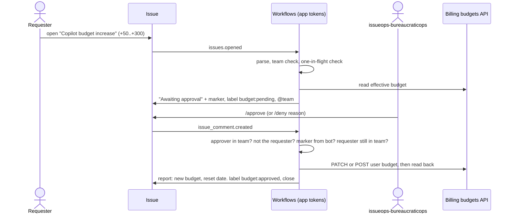

# issueops-copilot-budget

Approval-gated Copilot AI-credit budget increases for **CoolGitOrg** (enterprise **CoolGitEnterprise**),
driven by issues, executed by **issueops-autoadmin-app**. Bash, `gh api`, `jq`. Nothing else.

## Read this first: credits, dollars, and the number 50

The budgets API takes `budget_amount` in **whole US dollars**. One AI credit is $0.01. So "50 credits"
is $0.50, which the API cannot express, and "300 credits" is $3.

This package therefore counts in **units** and ships with `CENTS_PER_UNIT=100`: a unit is a dollar.
`+50` raises the budget by $50 (5,000 AI credits); the ceiling of 300 is $300 (30,000 AI credits).
Every comment and report prints both figures so nobody has to guess.

If you truly mean AI credits, set `CENTS_PER_UNIT=1`. The scripts then refuse any result that is
not a whole dollar, which leaves +100, +200, +300 as the only legal steps. That is the API's limit,
not this code's. Both modes are tested.

`MAX` caps the **resulting** budget, not the increase. A user at 250 may ask for +50 and no more.

## Files

| Path | Job |
|---|---|
| `config/budget.env` | Every knob: enterprise, org, teams, step, max, units, cycle day |
| `.github/ISSUE_TEMPLATE/copilot-budget-increase.yml` | The form. Requester is always the issue author |
| `.github/workflows/budget-request.yml` | `issues.opened` → `scripts/request.sh` |
| `.github/workflows/budget-decide.yml` | `/approve`, `/deny` → `scripts/decide.sh` |
| `scripts/budget.sh` | The only code that touches billing: `get`, `plan`, `apply`, `reset-date` |
| `scripts/request.sh`, `scripts/decide.sh` | The two halves of the flow |
| `scripts/parse-issue.sh`, `scripts/lib.sh` | Form parser; shared functions |
| `scripts/ent-token.sh` | Fallback: mint the enterprise token by hand |
| `tests/` | 40 offline tests; a fake `gh` serves fixtures and records writes |
| `terraform/main.tf` | Repo, labels, approver team, environment, variable, branch protection |
| `Makefile` | `make` lists targets |

The workflows are thin on purpose. Logic in YAML cannot be tested; logic in scripts can.

## Setup

1. **The app.** `issueops-autoadmin-app` needs two installations, because no single token spans both:

   | Installed on | Permissions | Used for |
   |---|---|---|
   | `CoolGitOrg` (this repo only) | Repository: Issues **RW**, Metadata R. Organization: Members **R** | comments, labels, team checks |
   | `CoolGitEnterprise` | Enterprise: Enterprise billing **RW** | budgets |

   Enterprise installation generally requires an enterprise-owned app. No webhook is needed; Actions delivers the events.
2. **Secrets.** `gh variable set ISSUEOPS_APP_CLIENT_ID`, `gh secret set ISSUEOPS_APP_PRIVATE_KEY < key.pem`.
3. **Scaffold.** `cd terraform && terraform apply`, or by hand: `make labels`, create team and the `copilot-budget` environment (deployment branches: protected only).
4. **Configure.** Edit `config/budget.env`: `ALLOWED_TEAMS`, and `ENTERPRISE` to the exact slug in your enterprise URL (slugs are usually lowercase).
5. **Prove it.** `make check lint test`. Then with a token that can read billing: `ENT_TOKEN=... make plan LOGIN=someone INC=50` — prints the write, sends nothing.

## What is checked, and why

| Check | Where | Guards against |
|---|---|---|
| Author is an active member of an allowed team | request **and** decide | outsiders; people who changed teams while queued |
| Approver is an active member of `issueops-bureaucraticops` | decide | anyone typing `/approve` |
| Approver ≠ requester | decide | an approver granting themselves money |
| Amount comes from the bot's comment, never the issue body | decide | editing +50 to +300 after validation (TOCTOU) |
| Marker must be authored by `issueops-autoadmin-app[bot]`, type `Bot` | decide | a user pasting a forged marker |
| Marker user = issue author, re-read from API | decide | marker transplanted between issues |
| Label `budget:pending` re-read from API; per-issue concurrency | decide | double `/approve`, replay after decision |
| One pending request per user | request | two approvals adding to the same stale figure |
| Budget recomputed at apply time | decide | budget changed between request and approval |
| Step, range, ceiling, whole-dollar | `budget.sh plan` | bad amounts; exit 3 = policy refusal, exit 1 = fault |
| Write is read back and compared | `budget.sh apply` | an API that says yes and does nothing |
| User text only via `env:`, never `${{ }}` in `run:` | workflows | script injection |
| Actions pinned to commit SHAs; `persist-credentials: false` | workflows | moved tags; token left in `.git/config` |
| `opened` only, not `reopened` | request | reviving a decided issue |

How the effective budget is found follows GitHub's precedence: individual user budget, else a
cost-center per-user budget that lists the user, else the universal per-user budget, else `BASELINE`.
This matters: creating an individual override *replaces* the others for that user, so starting from
the wrong figure could lower someone's budget while reporting success.

## The report

On approval the requester is @mentioned on the issue (GitHub notifies them) with: status, previous
budget, increase, **new budget in dollars and AI credits**, usage so far this cycle when the API
provides it, **the next reset date**, override expiry, budget ID, run link. The same text plus the
raw JSON goes to the run summary. The budget persists across cycles; only the meter resets.
`CYCLE_DAY` defaults to the 1st, UTC; change it if your billing cycle differs. Set
`OVERRIDE_EXPIRES=YYYY-MM-DD` to make overrides lapse on their own.

## Verified against the docs, and not

Verified (GHEC REST docs, API version `2026-03-10`): endpoints and verbs; `budget_scope: user`
requires a `user` field the schema omits; `BundlePricing` + `ai_credits`; `prevent_further_usage`
must be true and alerting off for user scope; whole-dollar `budget_amount`; `expires_at`;
`user-states` and its `target_amount` / `consumed_amount`; an enterprise-installed app with
Enterprise billing write may create and update any budget; `create-github-app-token@v3` takes
`enterprise:`.

Not verified, because it needs a live enterprise — check these on first run with `make get`:

- The name of the field carrying the login in **list** responses for user budgets. The code accepts `.user` or `.budget_entity_name`.
- That `user-states` answers for cost-center per-user budgets as it does for the universal one. If it does not, cost-center members fall through to the universal figure; `source` in the pending comment shows which was used, so an approver can see it.
- `actions/create-github-app-token#373`: some enterprises report "no enterprise installation found". If you hit it, replace the enterprise-token step with `run: echo "token=$(scripts/ent-token.sh)" >> "$GITHUB_OUTPUT"` and pass `APP_CLIENT_ID` / `APP_PRIVATE_KEY` in `env:`.
- Personal tokens for local `make get`/`plan`: billing endpoints have historically wanted a classic PAT with `manage_billing:enterprise`, not a fine-grained one. App tokens are the documented path.

## Operating notes

- A comment posted with an app token *does* trigger `issue_comment` workflows (unlike `GITHUB_TOKEN`). The bot's comments never start with `/`, so the job-level `if` drops them before a runner starts.
- `budget:failed` means approved but not applied. Fix the cause, put `budget:pending` back, `/approve` again. Nothing is half-written: the API call is one request.
- To lower or remove an override, use the billing UI or `gh api -X DELETE`. This tool only goes up. That is deliberate.
- For a second, GitHub-enforced lock, add required reviewers to the `copilot-budget` environment. Approval then needs `/approve` on the issue and a click in Actions.
