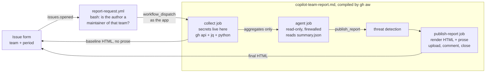

# issueops-copilot-team-report

A team maintainer opens an issue. A script gathers the team's Copilot data. An agent reads the
totals and writes what they mean. One self-contained HTML file comes back on the issue: charts,
tables, tiers, accept and not-accepted, agent use, cost, cost per merged PR, cost per production
deployment. It opens from disk with the network unplugged.

Org **CoolGitOrg**, enterprise **CoolGitEnterprise**, automation by **issueops-autoadmin-app**.
Open `sample/copilot-report-sample.html` to see the output (synthetic data).

## Where the agent is, and where it is not

The agent does one thing: turn a page of figures into a paragraph a team lead can act on. It does
no arithmetic, draws nothing, fetches nothing, and holds no token. Reasons:

- **Numbers from a model are guesses.** Every figure is computed once in `aggregate.py`. The agent
  is told to quote, and the renderer escapes whatever it says.
- **The agent never reads the issue.** The only request fields that travel are a team slug and a
  day count, both regex-checked at the front door, in the collector, and in the publish job. There
  is no free text for a prompt injection to ride in on.
- **Secrets stay out of the agent job.** gh-aw strict mode refuses `secrets.*` in agent-job steps.
  Collection runs in its own `jobs:` entry; publishing runs in a custom `safe-outputs.jobs` entry
  that only starts after threat detection passes.
- **The report does not depend on the agent.** The collect job posts a complete baseline HTML
  before the agent starts. If inference fails, the requester still has every table and chart.

## Files

| Path | Job |
|---|---|
| `config/report.env` | Every knob: teams, tiers, production pattern, money, retention |
| `.github/ISSUE_TEMPLATE/copilot-team-report.yml` | The form |
| `.github/workflows/report-request.yml` | Front door: `issues.opened` → `scripts/request.sh` → dispatch |
| `.github/workflows/copilot-team-report.md` | The agentic workflow source. **Edit this.** |
| `.github/workflows/copilot-team-report.lock.yml` | Compiled by `gh aw compile --strict` (v0.88.7). **Never edit.** |
| `scripts/request.sh` | Admission: maintainer check, team size, one run per team |
| `scripts/collect.sh` | All API reads. Filters the org-wide usage file to team members as it streams |
| `scripts/aggregate.py` | All arithmetic. Writes `report-data.json` and the agent's `summary.json` |
| `scripts/render.py` | HTML with inline CSS and server-drawn SVG. No JS needed; JS only sorts and exports CSV |
| `scripts/publish.sh` | Issue comments, labels, close |
| `tests/` | 42 offline tests: fake `gh`, synthetic data, `file://` report downloads, end to end |

Python is standard library only; there is nothing to install, with `uv` or otherwise.

## Setup

1. **App permissions** for `issueops-autoadmin-app`, installed on CoolGitOrg with access to this
   repo and to the repos teams work in:

   | Scope | Permission | Used for |
   |---|---|---|
   | Repository | Issues RW, Actions RW, Metadata R | comments, labels, dispatching the report workflow |
   | Repository | Contents R, Pull requests R, Deployments R | merged PRs, branch protection and rulesets, production deployments |
   | Organization | Members R | team lookups, maintainer check |
   | Organization | Copilot metrics R | the per-user usage report |
   | Organization | GitHub Copilot Business R | seat assignments (optional; the Seat column reads `?` without it) |

   No enterprise installation is needed; everything here is org-scoped.
2. `gh variable set ISSUEOPS_APP_CLIENT_ID`, `gh secret set ISSUEOPS_APP_PRIVATE_KEY < key.pem`.
3. Enable the **Copilot usage metrics** policy for the org. Allow `github/gh-aw@*` in the Actions policy.
4. `make labels`. Create team `copilot-admins` (or clear `REPORT_ADMINS_TEAM`). Edit `config/report.env`.
5. `make check lint test sample`, then `make compile` and commit the `.md` and `.lock.yml` together.
6. Inference uses `copilot-requests: write`, billed to the org. If the org lacks centralised Copilot
   billing, set that permission to `none` and add a `COPILOT_GITHUB_TOKEN` secret (fine-grained PAT,
   Copilot Requests: read).

### Security review note (the compiler asks for one)

`gh aw compile` flags `ISSUEOPS_APP_PRIVATE_KEY` as a new restricted secret and requires `--approve`.
It is referenced in two places, the `collect` job and the `publish-report` job, both outside the
agent job, both only as input to `actions/create-github-app-token` (SHA-pinned by the compiler).
The resulting token is revoked in each job's post step. The agent job references no secret.

## What the numbers mean

| Figure | Definition |
|---|---|
| Event | One user-initiated interaction or one code generation |
| Tier | Events per calendar day over the window: power ≥ 50, heavy ≥ 20, medium ≥ 5, light > 0, inactive 0. Fixed thresholds, so a quiet team has no power users. Tune `TIER_*` |
| Accepted | `code_acceptance_activity_count`, over suggest-then-accept features |
| Not accepted | Generations minus acceptances. **GitHub reports no reject signal.** Ignored and dismissed look the same |
| Agent | Any feature whose name contains `agent`. Agents edit files with no accept step, so their acceptance is null, not zero, and they are excluded from the team rate. Without this, heavy agent users look like they reject everything |
| Cost | `ai_credits_used` × $0.01. Consumption at list value, drawn first from the pool seats already fund. Not an invoice. `SEAT_USD_MONTH` shows seat cost beside it; the two overlap and are never summed |
| Merged PR | Written by a team member or the Copilot cloud agent, merged in the window into a base branch with classic protection **or** any ruleset, in a repo the team can reach |
| Production deployment | In those repos, environment matching `PROD_ENV_REGEX`, with at least one `success` status. Not filtered by creator, because the creator is usually a bot |
| Cost per … | Team cost over the count. All Copilot use is in the numerator. A trend measure |

## Privacy

This hands per-person usage and cost to team maintainers, who cannot otherwise see it. That is a
decision for the org, so the guards are explicit:

- Only a maintainer of the team, or a member of `REPORT_ADMINS_TEAM`, is admitted. Checked against the API, not the payload.
- Teams under `MIN_TEAM_SIZE` (5) are refused, matching GitHub's own threshold for team-level reports.
- The org-wide usage file is filtered in the pipe. Only team rows are written; only aggregates become an artifact (1 day). The HTML artifact lives `RETENTION_DAYS` (14) and needs repo read access.
- The agent is told low usage is not a verdict and may not recommend action against a named person.
- Make the repo private or internal, and keep its reader list short: anyone who can read the repo can download the artifacts.

## Verified, and not

**Verified here:** `gh aw compile --strict` passes with 0 warnings on gh-aw v0.88.7 (binary checksum
checked). In the lock: `agent` needs `[activation, collect]`; `publish_report` needs `[agent, detection]`
and gets `GH_AW_AGENT_OUTPUT` injected; pre-activation enforces `roles: admin` plus the app bot; all
actions are SHA-pinned. Usage fields (`ai_credits_used`, `totals_by_feature`, `used_*`) and the
repository report fields are from GitHub's published example schema. The report was rendered in
Chromium: light, dark, 390 px wide, sorting, no external requests.

**Not verifiable without a live org; check on first run:**

- `GET /orgs/{org}/copilot/metrics/reports/users-28-day/latest` is documented. The org-level
  `repos-1-day` path is inferred from the enterprise one; if it 404s the run continues and the report says so.
- That rows in the 28-day user report carry `day`. If they do not, the window cannot be cut below 28 days and the report says so.
- `actionlint` 1.7.7 rejects three compiler-generated constructs in the lock (`ubuntu-slim`, `copilot-requests`, `concurrency.queue`). They are newer than the linter. `make lint` checks only the hand-written workflow; the lock is the compiler's to validate.
- Team membership is today's. GitHub's docs warn against joining a 28-day window to a one-day membership snapshot; this does exactly that, knowingly, and prints the caveat in every report. The alternative is the daily `user-teams-1-day` join: 28× the calls.

## Operating notes

- `report:running` locks a team during collection only. The baseline step releases it, so a stalled agent cannot block the team.
- `report:collected` and still open means the agent did not publish. The baseline download on the issue is complete; rerun by opening a new issue.
- Humans can dispatch `copilot-team-report` directly only with repo admin. Everyone else goes through the form.
- Thresholds, production pattern, and bot logins are config. Change, `make test`, commit. Changing the `.md` needs `make compile`.
