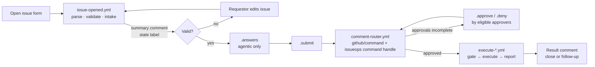
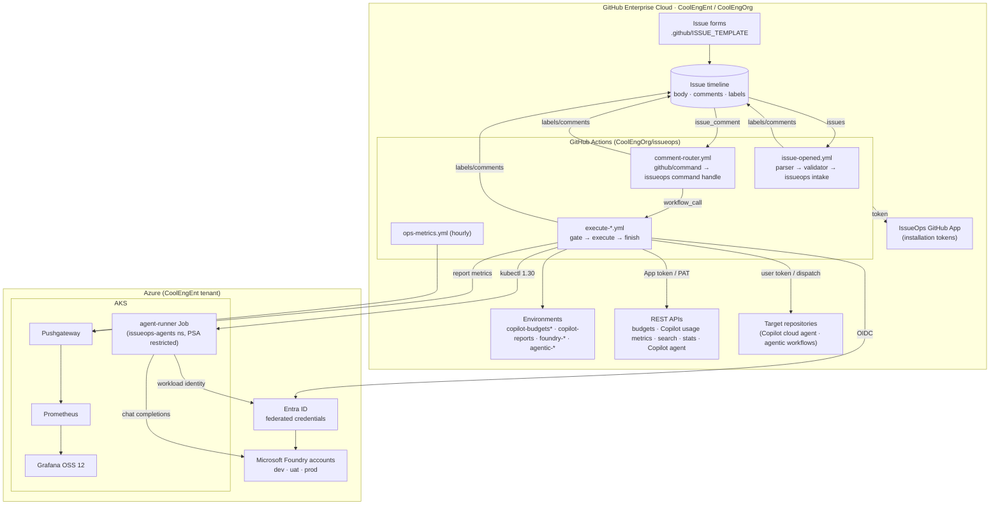
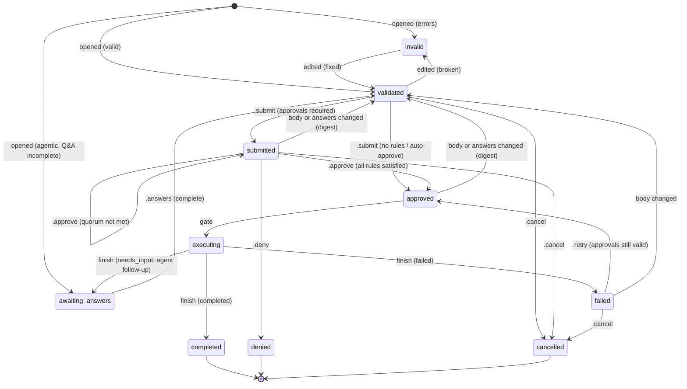
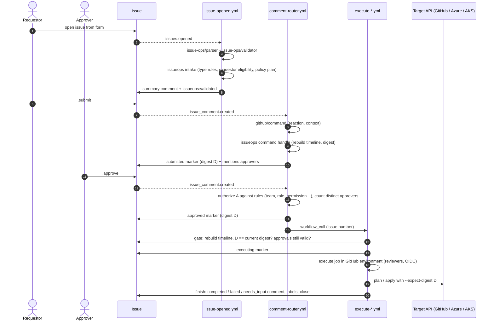

# IssueOps Self-Service Platform — Implementation Guide (CoolEngEnt / CoolEngOrg)

> Companion to *Building an IssueOps Self-Service Platform in GitHub Enterprise Cloud (CoolEngEnt / CoolEngOrg)*. Condensed from the repository docs: README, architecture, approval gating, setup guide and roadmap. The complete implementation (Go CLI, workflows, issue forms, deploy assets, examples, full docs) is the `CoolEngOrg-issueops.zip` repository bundle. Paths in backticks are repository paths.


---

## Overview

Self-service for **GitHub Copilot budgets and ROI reports**, **Microsoft Foundry model deployments** and **agentic tasks**. Everything happens in GitHub Issues in the `CoolEngOrg/issueops` repository of the **CoolEngEnt** enterprise (GitHub Enterprise Cloud). Approvals are gated by team, user, organization role, repository permission and requestor.

You open an issue from a form. The platform validates it, explains the approval policy that applies, collects `.approve` comments from eligible people and runs the change with short-lived credentials. The result is posted back on the issue. Every decision is rebuilt from the issue timeline, and every approval is bound to a SHA-256 digest of the exact request content. If the content changes, the approvals no longer count.

This repository implements the design in *Building an IssueOps Self-Service Platform in GitHub Enterprise Cloud (CoolEngEnt / CoolEngOrg)*. It is built on the documented IssueOps building blocks: [`issue-ops/parser`](https://github.com/issue-ops/parser), [`issue-ops/validator`](https://github.com/issue-ops/validator), [`issue-ops/labeler`](https://github.com/issue-ops/labeler) and [`github/command`](https://github.com/github/command). A Go 1.21 CLI makes the decisions. It uses the standard library only, plus `go-echarts` for charts.

### Request types

| Form | Label | What it does | Approval (default policy) | Runs in |
|---|---|---|---|---|
| **A. Copilot AI budget request (`.github/ISSUE_TEMPLATE/copilot-budget-request.yml`)** | `issueops:copilot-budget` | Creates or updates a Copilot AI-credit budget (organization, repository, user, all users, cost center) through the billing budgets REST API | `copilot-admins`. **Over $1,000/month:** plus `finops-approvers`. **User budgets:** plus the beneficiary confirms. **Cost centers:** enterprise billing owner | `copilot-budgets`, `copilot-budgets-high`, `copilot-budgets-enterprise` |
| **B. Copilot usage & ROI report (`.github/ISSUE_TEMPLATE/copilot-usage-report.yml`)** | `issueops:copilot-report` | Joins the Copilot usage-metrics NDJSON reports with merged PRs, reviews and AI-credit and seat cost at org, team or repository level. Produces an interactive go-echarts HTML report, CSV, JSON and Grafana metrics | Requestors are limited to `engineering-managers`, `copilot-admins` and `platform-admins`. **Per-user detail:** `copilot-admins`. Otherwise auto-approved | `copilot-reports` |
| **C. Foundry model deployment (`.github/ISSUE_TEMPLATE/foundry-model-deployment.yml`)** | `issueops:foundry-deploy` | Deploys an allow-listed model, version and SKU to an approved Foundry resource with Bicep through Azure OIDC. The `az` pre-flight checks availability, quota and name collisions | `platform-ai`. **Prod:** plus `ai-governance` or the `security_manager` role. **PTU:** plus `finops-approvers`. **Small dev deployments:** auto-approved | `foundry-dev`, `foundry-uat`, `foundry-prod` |
| **D. Agentic task request (`.github/ISSUE_TEMPLATE/agentic-task-request.yml`)** | `issueops:agentic-task` | Collects details through `.answers` comments, then runs the Copilot cloud agent, a catalog GitHub Agentic Workflow, or the AKS agent runner on a Foundry deployment | Requestor needs write on the target repository. Approver needs maintain or admin there. **AKS:** plus `platform-ai`. **Confidential:** plus `ai-governance` | `agentic-copilot`, `agentic-catalog`, `agentic-aks` |

Each type has a worked example. Every example is produced by the real engine and doubles as an end-to-end test:

| Example | Shows |
|---|---|
| copilot-budget-request (`examples/copilot-budget-request/`) | FinOps escalation, self-approval refused, update of an existing budget. Invalid → fixed, stale approvals after an edit, beneficiary confirmation |
| copilot-usage-report (`examples/copilot-usage-report/`) | Teams report with per-user escalation and the HTML report (`examples/copilot-usage-report/output/scenario/report/copilot-roi.html`). Auto-approved org report. Requestor gating |
| foundry-model-deployment (`examples/foundry-model-deployment/`) | Dev auto-approval. Prod PTU three-way approval, quota failure, `.retry` |
| agentic-task-request (`examples/agentic-task-request/`) | AKS runner with Q&A and an agent follow-up question. Copilot cloud agent. Catalog workflow |

### How a request flows



Read docs/architecture.md (`docs/architecture.md`) for the state machine, sequence diagrams and trust boundaries.

### Commands (comment on the issue)

| Command | Who | Effect |
|---|---|---|
| `.submit` | Requestor | Confirms the current content (digest) and asks for approval. Auto-approves when policy says so |
| `.approve [note]` | Eligible approver | Counts toward one approval rule. Each person counts once, and requestors can't approve their own request |
| `.deny <reason>` | Eligible approver | Denies and closes the request |
| `.answers` + `A1: …` lines | Requestor | Answers clarifying questions (agentic tasks) |
| `.retry [note]` | Eligible approver | Re-runs a failed execution of the same approved content |
| `.cancel [note]` | Requestor or repo maintainer | Cancels and closes the request |
| `.status` / `.help` | Anyone | Shows state and approval progress, or the command help |

### Repository layout

```
.github/
  ISSUE_TEMPLATE/            4 issue forms + config.yml
  workflows/                 intake, router, 4 execute workflows, CI, labels, ops metrics, runner image
  actions/                   composite actions: setup-issueops, apply-decision, gate, finish
  validator/                 issue-ops/validator custom validators (ESM, Node built-ins only) + tests
  CODEOWNERS  dependabot.yml
cmd/issueops/                Go CLI: intake, command handling, gate, finish, per-type executors, simulate, ops-metrics
cmd/agent-runner/            Go agent loop for the AKS backend (workload identity → Foundry)
internal/                    engine, state (event sourcing, digest), policy, authz, qa, per-type handlers,
                             GitHub REST client, Go templates (internal/tmpl/templates)
config/issueops.json         request-type registry: approval policy, allow-lists, settings
config/labels.json           label definitions
config/forms/*.json          issue forms as JSON (generated by scripts/forms-to-json.sh)
deploy/                      Bicep, Azure OIDC setup, AKS manifests, agent-runner Dockerfile, Grafana, Pushgateway
docs/                        architecture, setup, request types, approval gating, CLI, templates, security,
                             operations, reference, roadmap
examples/                    scenarios, fixtures and generated transcripts for every request type
```

### Quick start

```bash
# Go 1.21 toolchain (go.mod pins go 1.21)
make test            # unit tests + every example scenario end to end
make examples        # regenerate examples/*/output (issue bodies, comments, reports, manifests)
make build           # bin/issueops, bin/agent-runner
bin/issueops types   # request types from the registry
bin/issueops simulate --scenario examples/foundry-model-deployment/scenario.json --out /tmp/sim
```

To go live, follow docs/setup-guide.md (`docs/setup-guide.md`). It covers the GitHub App, teams and roles, environments, Azure OIDC, AKS workload identity, runners, the Pushgateway and Grafana OSS 12.

### Documentation

- Architecture (`docs/architecture.md`): components, state machine, sequence diagrams, trust boundaries
- Diagrams (`docs/diagrams.md`): workflow topology, digest binding, per-type flows, identities
- Setup guide (`docs/setup-guide.md`): step by step, with a go-live checklist
- Request types: budget (`docs/request-types/copilot-budget-request.md`), usage report (`docs/request-types/copilot-usage-report.md`), Foundry deployment (`docs/request-types/foundry-model-deployment.md`), agentic task (`docs/request-types/agentic-task-request.md`)
- Approval gating (`docs/approval-gating.md`): policy language for teams, users, roles, repository permissions, requestors, escalations and auto-approval
- Go CLI reference (`docs/go-cli.md`) and Go templates (`docs/templates.md`)
- Security and threat model (`docs/security.md`)
- Operations runbook (`docs/operations.md`)
- Reference (`docs/reference.md`): labels, markers, secrets and variables, App permissions, pinned actions, APIs
- Roadmap (`docs/roadmap.md`): future improvements and new IssueOps request types

### Constraints honoured

- Go 1.21, standard library only. The one external module is `github.com/go-echarts/go-echarts/v2`, and CI enforces this.
- Kubernetes on AKS with `kubectl` 1.30. Grafana OSS 12.
- Actions are pinned to full commit SHAs, and Dependabot keeps them current.


---

## Architecture

### Design principles

1. **The CLI decides, actions act.** Every decision is made by the `issueops` Go CLI: validity, phase, who may approve, whether to execute, and what to say. It writes the decision as step outputs and a rendered comment file. Workflows apply it with the documented IssueOps actions: `issue-ops/labeler` for labels, `peter-evans/find-comment` and `create-or-update-comment` for comments. The CLI never writes to GitHub itself, except to close issues and sync labels.
2. **Event sourcing, not labels.** The state of a request is rebuilt on every event from the issue timeline:
   - **bot markers:** the first line of comments authored by the IssueOps GitHub App bot only, e.g. `<!-- issueops:v1:approved {"digest":"sha256:…"} -->`
   - **human commands:** `.submit`, `.approve`, and the rest
   - **the current content digest**

   Labels are a projection for humans and filters. Changing labels by hand changes nothing.
3. **Approvals are bound to content.** `digest = sha256(type, normalized body, Q&A answers)`. `.submit` records the digest, and approvals only count after a matching submission. Editing the body, or answering differently, voids submission and approvals. The execution gate and every execution job re-check the digest.
4. **Execution is always gated.** Each execution workflow starts with a gate job. It re-verifies the approval from the timeline, recomputes approver eligibility and posts the `executing` marker. This holds whether the workflow was called by the router or dispatched by hand. Execution jobs then refuse to run unless the fetched content still hashes to the gate's digest.
5. **Short-lived, least-privilege credentials.** GitHub App installation tokens are minted per job and narrowed per step. Azure uses OIDC federated credentials, one Entra app per GitHub environment. AKS pods use Workload Identity. Only two long-lived secrets exist, both environment-scoped: the enterprise billing PAT (the enterprise budgets API rejects App tokens) and the Copilot agent machine-user token (assigning Copilot requires a user token).
6. **Untrusted text stays data.** Issue and comment text reaches actions only through `with:` and `env:`, never `${{ }}` inside `run:`. Comments neutralize HTML and @mentions. JSON and YAML are produced with `encoding/json` or JSON-quoted scalars. Agent prompts are built from validated fields and answers, never raw comments.

### Components



### Request lifecycle (state machine)

`internal/state` reconstructs the phase from markers. The projected label is `issueops:<phase>`. `issueops:escalated` is an extra flag when policy escalations apply.



Reopening a denied, cancelled or completed issue posts a `reset` marker, and the request starts over from `validated` or `invalid`.

### Sequence: approval-gated execution



### Trust boundaries

| Boundary | Untrusted input | Control |
|---|---|---|
| Issue body → workflow | form values, headings | Parsed by `issue-ops/parser` and the Go parser with known headings only. Validated by `issue-ops/validator` plus Go handlers. Passed through `with:`/`env:` only |
| Comments → state | anyone can comment | Only first-line `.command` tokens count. Bot markers are trusted only from the App bot. Edited decision comments are ignored. Bots can't vote. Eligibility is checked against policy |
| Approval → execution | content can change after approval | Digest-bound approvals. Re-checked by the gate and by every execution job (`--expect-digest`). Execution concurrency per issue |
| Workflow → GitHub | token scope | App installation token per job, narrowed per workflow. The default `GITHUB_TOKEN` is read-only |
| Workflow → Azure | cloud credentials | OIDC federated credential per GitHub environment. The role is scoped to one resource group. Prod environments require reviewers |
| Request → agent | prompt injection | The agent gets a spec of validated fields and answers only. The system prompt treats spec text as data. Secrets are refused in forms and answers. Deployments are allow-listed per data classification. The runner has no GitHub credentials. The agent's own questions go back through Q&A and re-approval |
| Agent → cluster | code running in AKS | PSA `restricted` namespace, non-root distroless image, read-only root filesystem, no service-account token, NetworkPolicy (DNS + 443 egress only), ResourceQuota, `activeDeadlineSeconds` |

### Code map

| Package | Responsibility |
|---|---|
| `internal/config` | Registry (`config/issueops.json`): request types, approval policy, settings, label resolution |
| `internal/issueform` | Issue-form JSON, parser (mirrors issue-ops/parser), renderer for examples, drift check |
| `internal/policy` | Condition evaluation (`eq`, `gt`, `in`, `matches`, …), escalations, auto-approval, environment placeholders |
| `internal/authz` | Selector evaluation: teams, users, org roles (owner and custom), repo permissions on IssueOps or target repo, field users, requestor. GitHub-backed and static directories |
| `internal/state` | Markers, commands, digest, timeline reconstruction, approval counting (distinct approvers via a small assignment search) |
| `internal/qa` | Clarifying-question parsing (`A1:` lines, multi-line, fenced), validation, defaults, dynamic follow-ups |
| `internal/engine` | Intake, Handle, Gate and Finish decisions; comment rendering |
| `internal/budget`, `copilot`, `foundry`, `agent` | Per-type validation, facts, summaries and executors |
| `internal/ghapi` | Minimal REST client (retries, pagination, API versions) |
| `internal/tmpl` | Embedded Go text/templates with safe helpers, and an override directory |
| `cmd/issueops` | CLI commands used by workflows, plus `simulate` and `ops-metrics` |
| `cmd/agent-runner` | AKS agent loop (workload identity → Foundry chat completions) |

### Why these choices

- **A Go CLI instead of `actions/github-script`.** Policy and state logic is testable, and the same code runs in workflows, locally and in `simulate`. The standard library keeps the supply chain small.
- **Reusable workflows called by the router, plus `workflow_dispatch`.** Execution happens in the same run as the approval that triggered it, which makes it easy to follow. Manual re-runs go through the same gate.
- **No concurrency group on the router.** Each handler rebuilds state from the full timeline, so the handler for the last approval always sees every vote. A queued-run cancellation could otherwise drop a command. Double execution is prevented by the per-issue concurrency group on gate jobs plus the `executing` marker.
- **The digest includes Q&A answers.** Agentic tasks are specified mostly in comments, so the answers are part of what approvers approve.


---

## Approval gating

Approval policy is **configuration, not code**. Each request type in config/issueops.json (`config/issueops.json`) declares:

- who may **request** it
- which **approval rules** apply
- which **escalations** add rules (and possibly a stricter GitHub environment) when conditions match
- when a request is **auto-approved**

The engine evaluates this on every event from the issue timeline.

### Building blocks

#### Selectors: who matches

A selector matches a user when **any** of its criteria matches.

| Criterion | Example | Matches when | API used |
|---|---|---|---|
| `teams` | `["copilot-admins", "OtherOrg/finops"]` | The user is an active member of the team (org defaults to CoolEngOrg) | `GET /orgs/{org}/teams/{slug}/memberships/{user}` |
| `users` | `["coolengent-billing-owner"]` | Login equals one of them | none |
| `org_roles` | `["owner"]`, `["security_manager"]` | `owner`: organization owner (`role=admin`). Otherwise holds the organization role, directly or through a team | `GET /orgs/{org}/memberships/{user}`, `/orgs/{org}/organization-roles/…` |
| `repo_permissions` | `["admin", "maintain"]` | Permission on the **IssueOps** repository | `GET /repos/{o}/{r}/collaborators/{user}/permission` |
| `target_repo_permissions` | `["maintain", "admin"]` | Permission on the request's **target** repository (from `target_repo_field`) | same, on the target repo |
| `field_users` | `["budget_target"]` | The login named in that form field (for example, the budget beneficiary) | none |
| `requestor` | `true` | The user opened the issue | none |

#### Rules: how many

```json
{ "name": "Copilot administrators", "min": 1, "any_of": { "teams": ["copilot-admins"] } }
```

All rules must be satisfied. With `distinct_approvers: true`, each person counts toward **at most one** rule. The engine searches for an assignment, so a person on two teams is placed where needed. With `allow_self_approval: false`, the requestor's vote counts only for rules that explicitly name them with `requestor: true` or `field_users`. Nothing else accepts a self-approval.

#### Conditions: when

```json
{ "all": [ { "field": "$environment", "op": "eq", "value": "dev" } ],
  "any": [ { "field": "foundry_sku", "op": "matches", "value": "ProvisionedManaged$" } ] }
```

A condition holds when **all** of `all` and **at least one** of `any` (if present) hold.

**Operators:** `eq`, `ne`, `gt`, `gte`, `lt`, `lte`, `in`, `not_in`, `contains`, `matches` (RE2), `empty`, `not_empty`.

- Numbers are compared numerically. `$` and `,` are ignored, so `"$2,500"` > 1000.
- Text that isn't a number never satisfies a numeric bound.

**Facts** come from two places:

- **Form fields**, keyed by element id. A single-select dropdown becomes a string; checkboxes become the list of selected labels.
- **Derived facts** prefixed with `$`, computed by the type handler:

| Type | Facts |
|---|---|
| all | `$requestor`, `$type` |
| copilot-budget-request | `$amount_usd`, `$api_scope`, `$owner_kind` |
| foundry-model-deployment | `$environment`, `$provisioned`, `$capacity` |
| agentic-task-request | `$backend`, `$backend_environment`, `$classification` |

#### Escalations, auto-approval and environments

```json
"escalations": [
  { "name": "FinOps sign-off above $1,000 per month",
    "when": { "any": [ { "field": "budget_amount", "op": "gt", "value": 1000 } ] },
    "rules": [ { "name": "FinOps approvers", "min": 1, "any_of": { "teams": ["finops-approvers"] } } ],
    "environment": "copilot-budgets-high" }
],
"auto_approve": { "all": [ … ] }
```

- Matching escalations **append** rules. The last matching escalation with an `environment` sets the execution environment. Environment names may use placeholders like `foundry-{environment}` or `{backend_environment}`.
- `auto_approve` applies only when **no escalation matched**. `.submit` then records an automatic approval and execution starts.
- A type with an empty `rules` list and no matching escalation is also auto-approved (Copilot aggregate reports).
- The GitHub **environment** can add a second, native gate: required reviewers who approve the deployment in the Actions UI. Use it for high-risk paths (`copilot-budgets-high`, `foundry-prod`, `agentic-aks`).

#### Requestor gating

```json
"requestors": { "any_of": { "teams": ["engineering-managers", "copilot-admins", "platform-admins"] } }
```

If the requestor doesn't match, intake marks the request **invalid** with an explanation, and `.submit` is refused. Requestor selectors use the same criteria as approvers. The agentic type requires `target_repo_permissions: [write, maintain, admin]` on the target repository.

### Gating recipes

| Requirement | Configuration |
|---|---|
| Any member of a team approves | `{"min": 1, "any_of": {"teams": ["copilot-admins"]}}` |
| Two different people from a team | `{"min": 2, "any_of": {"teams": ["platform-ai"]}}` |
| A named person (break-glass or enterprise owner) | `{"any_of": {"users": ["coolengent-billing-owner"]}}` |
| Organization owners only | `{"any_of": {"org_roles": ["owner"]}}` |
| Holders of a custom org role | `{"any_of": {"org_roles": ["security_manager"]}}`. Team-granted roles count |
| Maintainers of the affected repository | `"target_repo_field": "agent_target_repository"` + `{"any_of": {"target_repo_permissions": ["maintain","admin"]}}` |
| The person named in the form confirms | `{"any_of": {"field_users": ["budget_target"], "requestor": true}}` |
| Requestor may self-approve low-risk requests | `"allow_self_approval": true`, or an `auto_approve` condition |
| Only some people may request | `"requestors": {"any_of": {...}}` |
| Stricter path above a threshold | an escalation with `gt` plus an `environment` that has required reviewers |
| Prod needs security or governance | an escalation on `$environment == prod` with `teams` **or** `org_roles` |

### How votes are counted

- A vote is the **latest** `.approve` or `.deny` from each person, cast **after** the most recent submission for the current digest. Votes cast before `.submit`, or before a content change, don't count.
- Edited comments are ignored for `.approve`, `.deny` and `.retry`. The comment must not have been edited more than 5 seconds after creation.
- Comments by bots never count. Bot markers are trusted only from the IssueOps App bot and only on the first line.
- An eligible `.deny` denies immediately. Ineligible votes are listed under "Votes that did not count" with the reason.
- Eligibility is **recomputed at the execution gate**, so an approver removed from the team before execution no longer counts.

### Testing a policy change

1. Change `config/issueops.json`. If you changed field references, run `scripts/forms-to-json.sh`.
2. `make check-forms`: every referenced field must exist in the issue form.
3. Add or adjust a scenario under `examples/<type>/` with `expect` blocks (for example, the expected `environment`, `escalated`, or which `.approve` is rejected). Then run `make test`.
4. The PR needs an approval from each of platform-admins, AI governance and FinOps. CODEOWNERS requests them; the ruleset's required-reviewers rule on `config/issueops.json` enforces all three (see setup-guide.md (`setup-guide.md`)).


---

## Setup guide

This guide sets up the platform in the `CoolEngOrg` organization of the `CoolEngEnt` enterprise. Allow about half a day for GitHub, plus Azure and AKS time.

**Prerequisites:** organization owner on CoolEngOrg; enterprise owner or billing manager (only for enterprise cost-center budgets); Owner or User Access Administrator on the Azure subscriptions and resource groups involved; `az` CLI 2.60 or later; `kubectl` 1.30; Helm 3; Go 1.21.

### 1. Repository

1. Create `CoolEngOrg/issueops` with **internal** visibility, so every CoolEngEnt member can open requests. Push this code to `main`.
2. Add a ruleset on `main`:
   - require a pull request with **Code owners** review (CODEOWNERS (`.github/CODEOWNERS`))
   - for `config/issueops.json`, add a **required reviewers** rule for each of `platform-admins`, `ai-governance` and `finops-approvers`. CODEOWNERS only *requests* all three; one code owner's approval satisfies CODEOWNERS on its own
   - require status checks `Go build, vet, test`, `Custom validators (node --test)` and `actionlint`
   - block force pushes
3. Settings → Actions → General:
   - **Workflow permissions:** read repository contents only. Each workflow elevates per job.
   - **Allow actions:** only the actions and reusable workflows listed in reference.md (`reference.md`), pinned by SHA.
   - Fork pull-request workflows: require approval for all outside collaborators.
4. Keep write access to this repository to `platform-admins`. Anyone with write access can read repository-level secrets, which is one reason sensitive secrets are environment-scoped.

### 2. Teams and roles

Create the teams (or map the names in `config/issueops.json` to existing ones):

| Team | Purpose |
|---|---|
| `copilot-admins` | Approve Copilot budgets and per-user report detail |
| `finops-approvers` | Approve budgets over $1,000/month and PTU deployments |
| `engineering-managers` | May request Copilot usage reports |
| `platform-admins` | Own the platform and may request reports |
| `platform-ai` | Approve Foundry deployments and AKS agent runs |
| `ai-governance` | Approve production Foundry deployments and confidential agent tasks |

The `security_manager` organization role also satisfies the AI-governance rule. Assign it under Organization settings → Roles. To use another built-in or custom role, change `org_roles` in the registry.

### 3. GitHub App

Create an organization-owned GitHub App, **CoolEngOrg IssueOps**. Turn off the webhook: workflows drive everything. Grant:

| Scope | Permission | Used for |
|---|---|---|
| Repository | Issues: **Read & write** | Comments, labels, closing (IssueOps repo) |
| Repository | Contents: Read | Search, commit counts and code statistics for reports |
| Repository | Pull requests: Read | Merged-PR search for reports |
| Repository | Actions: **Read & write** | `workflow_dispatch` of catalog agentic workflows in target repos |
| Repository | Metadata: Read | Mandatory; repository and collaborator permission lookups |
| Organization | Members: Read | Team and org membership (approval gating) |
| Organization | Custom organization roles: Read | `org_roles` selectors |
| Organization | Administration: **Read & write** | Organization billing budgets API |
| Organization | Copilot metrics: Read | Copilot usage-metrics reports |
| Organization | GitHub Copilot Business: Read | Seat count for seat cost |

Install the App on **All repositories** of CoolEngOrg. Agentic tasks and reports read permissions and data on target repositories. Workflows narrow each token to what the job needs.

Store these on the `issueops` repository:

| Name | Kind | Value |
|---|---|---|
| `ISSUEOPS_APP_CLIENT_ID` | Variable | The App's client ID. Not sensitive; used by `actions/create-github-app-token` v3 |
| `ISSUEOPS_APP_PRIVATE_KEY` | Secret | A generated private key. Rotate every 90 days (operations.md (`operations.md`)) |

Put the App's bot login (`<app-slug>[bot]`) in the Copilot and metrics runbooks. Workflows derive it automatically.

### 4. Organization and enterprise settings for Copilot

- Enterprise → Policies → Copilot: set **Copilot usage metrics** to *Enabled everywhere*. The usage-metrics report endpoints require it.
- Budgets are managed over the REST API (`/organizations/{org}/settings/billing/budgets`). For **cost-center** budgets, set `enterprise_scopes_enabled: true` in the registry. Then store a classic PAT of an enterprise billing manager as the environment secret `ENTERPRISE_BILLING_PAT` on `copilot-budgets-enterprise`. The enterprise budgets endpoints do not accept App or fine-grained tokens. Use a dedicated machine account.

### 5. Environments

Create these environments. Set a deployment branch policy of `main` only, required reviewers where shown, and prevent self-review.

| Environment | Required reviewers (suggested) | Variables | Secrets |
|---|---|---|---|
| `copilot-budgets` | none (comment approval is enough) | | |
| `copilot-budgets-high` | `finops-approvers` | | |
| `copilot-budgets-enterprise` | enterprise billing owner | | `ENTERPRISE_BILLING_PAT` |
| `copilot-reports` | none | | |
| `foundry-dev` | none | `AZURE_CLIENT_ID` | |
| `foundry-uat` | none | `AZURE_CLIENT_ID` | |
| `foundry-prod` | `platform-ai` | `AZURE_CLIENT_ID` | |
| `agentic-copilot` | none | | `COPILOT_AGENT_TOKEN` |
| `agentic-catalog` | none | | |
| `agentic-aks` | `platform-ai` | `AZURE_CLIENT_ID`, `AKS_RESOURCE_GROUP`, `AKS_CLUSTER_NAME` | |
| `acr-push` | none | `AZURE_CLIENT_ID`, `ACR_NAME` | |

Repository variables: `AZURE_TENANT_ID`, `AZURE_SUBSCRIPTION_ID`, `PUSHGATEWAY_URL`, `ISSUEOPS_RUNS_ON` and `ISSUEOPS_AKS_RUNS_ON` (see step 9).

Repository secret: `PUSHGATEWAY_AUTH` (`user:password` for the Pushgateway ingress). Both the report workflow and the hourly ops-metrics workflow use it; ops-metrics runs outside any environment.

`COPILOT_AGENT_TOKEN` is a fine-grained PAT of a **Copilot-licensed machine user**. Give it Issues, Pull requests and Contents read and write on the target repositories. Assigning Copilot requires a user token; installation tokens are rejected.

### 6. Labels

Run **Actions → IssueOps · sync labels → Run workflow**. It creates the type, state and escalation labels from config/labels.json (`config/labels.json`).

### 7. Azure

```bash
export SUBSCRIPTION_ID=<subscription>
# Optional overrides: FOUNDRY_RG_DEV|UAT|PROD, PROD_ACCOUNT, AKS_RG, AKS_NAME, ACR_NAME, ACR_RG, MI_RG,
# OIDC_ISSUER (for a customized enterprise OIDC issuer).
deploy/azure/setup-oidc.sh
```

The script creates:

- One Entra app per GitHub environment. Each has a federated credential for `repo:CoolEngOrg/issueops:environment:<env>` and roles scoped to one resource group (or namespace or registry).
- A custom **IssueOps Foundry Quota Reader** role for `az cognitiveservices usage list`.
- The `id-issueops-agent-runner` managed identity. It is federated to `system:serviceaccount:issueops-agents:issueops-agent-runner` and holds **Cognitive Services OpenAI User** on the production Foundry account.

Copy the printed client IDs into the environments from step 5.

The Foundry accounts themselves (network isolation, private endpoints, CMK, diagnostics) remain landing-zone infrastructure. Self-service creates **deployments** on them only. Allow-list the accounts, models, versions, SKUs and capacity limits in `config/issueops.json` after confirming each with `az cognitiveservices account list-models`.

### 8. AKS (agent runner)

```bash
az aks update -g rg-cooleng-aks-prod -n aks-cooleng-prod-eus2 --enable-oidc-issuer --enable-workload-identity
# Set the managed identity client ID (script output) in deploy/aks/serviceaccount.yaml,
# and the deployer service principal object ID in deploy/aks/rbac.yaml. Then:
kubectl apply -k deploy/aks
kubectl get ns issueops-agents --show-labels   # pod-security.kubernetes.io/enforce=restricted
```

Build and push the runner image with **Actions → IssueOps · build agent runner** (version `1.0.0`). Then set `settings.backends.aks-foundry-agent.image` in the registry, preferably by digest. Set `foundry_endpoint` and `allowed_deployments` to the production Foundry account and its agent deployments. Create those deployments with a foundry-model-deployment request.

### 9. Runners

GitHub-hosted `ubuntu-latest` works for intake, commands, budgets and Foundry deployments. Use **self-hosted Ubuntu runners in the AKS virtual network** for:

- the AKS agent job, which needs the API server (private clusters)
- pushing metrics to the internal Pushgateway (reports and ops metrics)

Register them in a runner group restricted to `CoolEngOrg/issueops`, labeled `issueops`. The runner must be 2.327.1 or later, because the pinned actions use Node 24. Install Go 1.21 and the `az` CLI, or rely on `setup-go`. Then set:

```text
ISSUEOPS_RUNS_ON      = ["ubuntu-latest"]                       # or ["self-hosted","linux","issueops"]
ISSUEOPS_AKS_RUNS_ON  = ["self-hosted","linux","issueops","aks"]
```

### 10. Metrics and Grafana OSS 12

```bash
helm repo add prometheus-community https://prometheus-community.github.io/helm-charts
helm upgrade --install pushgateway prometheus-community/prometheus-pushgateway \
  -n monitoring --create-namespace -f deploy/pushgateway/values.yaml --version 3.9.0

helm repo add grafana-community https://grafana-community.github.io/helm-charts
helm repo update
kubectl -n grafana create configmap issueops-dashboards --from-file=deploy/grafana/dashboards/ \
  --dry-run=client -o yaml | kubectl apply -f -
helm upgrade --install grafana grafana-community/grafana -n grafana \
  -f gold-graf-values.yaml -f deploy/grafana/values-issueops.yaml --version 13.2.6
```

`gold-graf-values.yaml` stands for your existing base values (admin credentials, persistence, ingress, plugins). Omit it for a fresh install. The classic `grafana/grafana` chart is deprecated; the chart continues as `grafana-community/grafana`. The overlay pins the image to `grafana/grafana-oss:12.4.11`. It adds the `IssueOps Prometheus` data source and provisions two dashboards into an **IssueOps** folder: *Copilot ROI* and *Platform operations*. Set `PUSHGATEWAY_URL` to the internal ingress URL.

### 11. Tailor the registry

Edit config/issueops.json (`config/issueops.json`). See approval-gating.md (`approval-gating.md`) for the policy language. Then:

```bash
scripts/forms-to-json.sh   # after any issue-form change
make test check-forms      # unit + end-to-end scenarios, form/registry drift
```

CODEOWNERS requests review from platform-admins, AI governance and FinOps. The ruleset from step 1 requires an approval from each.

### 12. Smoke tests (in dev)

1. **Budget:** open a repository budget request for a sandbox repository at $50. Check the summary, then `.submit` and approve as a copilot-admin. The budget should appear under Billing → Budgets.
2. **Report:** request a 7-day organization report without per-user detail. It auto-approves on `.submit`. Download the artifact and open `copilot-roi.html`.
3. **Foundry:** request `gpt-4.1-mini` GlobalStandard with capacity 1 on the dev account. It auto-approves. Check the endpoint in the completion comment.
4. **Agentic:** in a sandbox repository, run the catalog `docs-refresh` flow, then the AKS runner with a `design-doc` deliverable on a dev deployment.
5. **Negative tests:**
   - approve your own request (rejected)
   - edit the body after approval (gate refuses; `.submit` again)
   - `.approve` from someone outside the rules (rejected with the eligible approvers listed)

### Go-live checklist

- [ ] Ruleset on `main` with CODEOWNERS review and required checks
- [ ] Default `GITHUB_TOKEN` is read-only; the allowed-actions list is restricted
- [ ] App installed with the permissions above; private key stored as a secret; rotation reminder scheduled
- [ ] Environments created with reviewers and `main`-only deployment branches
- [ ] Federated credentials verified: each environment logs in and nothing else can
- [ ] Registry reviewed by FinOps (amounts, thresholds) and AI governance (models, classifications, backends)
- [ ] Labels synced; issue forms visible in *New issue*
- [ ] The Pushgateway is not publicly reachable; Grafana dashboards load
- [ ] Runbook owners named in operations.md (`operations.md`)
- [ ] Announcement posted with the link to this repository's *New issue* page


---

## Roadmap

### Where we are (release 1.0)

Delivered in this repository:

- Four request types, end to end:
  - Copilot AI budgets (organization, repository, user, all users, cost center)
  - Copilot usage and ROI reports (organization, teams, repositories; HTML, CSV, JSON, Grafana)
  - Foundry model deployments (Bicep through OIDC, `az` pre-flight)
  - Agentic tasks with comment Q&A on three backends (Copilot cloud agent, catalog agentic workflows, AKS runner on Foundry)
- Approval gating by team, user, organization role (owner and custom), repository permission (IssueOps or target repo), named form field and requestor. Escalations, auto-approval, distinct approvers, no self-approval, and GitHub environments as a second gate.
- Event-sourced state, digest-bound approvals, gated execution, least-privilege tokens.
- Go templates for every comment, prompt and manifest, overridable without a rebuild.
- An offline simulator; ten example scenarios run as e2e tests; ops metrics; Grafana OSS 12 dashboards.

### Phase 1: harden and adopt (0–3 months)

| # | Improvement | Why | Notes |
|---|---|---|---|
| 1.1 | **zizmor + CodeQL for Actions** in CI | Catch workflow injection and permission regressions | Add to `ci.yml`, SARIF to code scanning |
| 1.2 | **Split the GitHub App** into an *intake* App (issues, members read) and an *executor* App (billing admin, actions write) | A compromised intake path can't change billing | Two key pairs; `setup-issueops` gets an `app` input |
| 1.3 | **Approval reminders and SLAs** | Requests stall in `submitted` | Scheduled workflow: re-mention approvers after N hours, escalate to a backup team, auto-close stale `invalid` requests after 14 days |
| 1.4 | **Delegation and out-of-office** | Single-person rules block work | Registry `delegates: {user: [backup], until: date}` evaluated by `authz` |
| 1.5 | **Budget reconciliation** | ROI uses the configured credit price | Use `…/billing/ai_credit/usage` `pricePerUnit` and net amounts in the report; flag drift |
| 1.6 | **Self-service portal** | Discoverability | GitHub Pages catalog generated from `config/issueops.json` (like `issue-ops/self-service`), linking to the forms |
| 1.7 | **Project board** | Queue visibility for approvers | Add issues to an org Project with Phase, Type and Escalated fields, driven by the same decision outputs |
| 1.8 | **Chat notifications** | Approvers live in chat | Teams or Slack webhook step in `apply-decision` for `submitted`, `approved` and `failed` |
| 1.9 | **Issue-form schema check** | Catch form errors before merge | Validate `.github/ISSUE_TEMPLATE/*.yml` against the published schema in CI |
| 1.10 | **Vendored Go modules** | Air-gapped self-hosted runners | `go mod vendor` plus `-mod=vendor` in `setup-issueops` |

### Phase 2: scale (3–6 months)

| # | Improvement | Why |
|---|---|---|
| 2.1 | **Enterprise scope**: requests that target any CoolEngEnt organization, enterprise-level Copilot metrics and budgets | Multi-org rollout |
| 2.2 | **Policy impact preview on PRs**: a job that re-evaluates recent requests under the proposed registry and comments "12 requests would change approvers" | Safe policy changes |
| 2.3 | **Scheduled ROI**: recurring reports per team with trend lines and anomaly findings (spend up, output flat), sent to FinOps | Continuous ROI instead of ad hoc |
| 2.4 | **Foundry lifecycle**: watch model retirement dates and deprecations; open pre-filled upgrade requests for affected deployments | Avoid surprise retirements |
| 2.5 | **Drift detection**: compare live deployments and budgets with the last approved request; open a finding issue on drift | Approved state stays true |
| 2.6 | **Agent runner v2**: read-only repository retrieval tool, Foundry Agent Service backend, OpenTelemetry traces and token metrics to Grafana, per-run AI-credit ceiling | Better deliverables, observability |
| 2.7 | **Webhook service option**: a small Go (stdlib) service on AKS receiving App webhooks for sub-second command responses; Actions remain the execution plane | Latency at high volume |
| 2.8 | **GraphQL timeline reads** | Fewer API calls on long issues |

### Phase 3: optimize (6–12 months)

- **Budget recommendations:** from ROI trends, open pre-filled budget requests ("payments-api trending to $2,300; current budget $2,500 → keep", or "raise to $3,000").
- **Seat optimization:** reclaim idle seats with notice, reassign on request, and report on the savings.
- **Request from anywhere:** a Copilot extension, Teams or Slack command that creates the issue with the form filled in; approvals still happen on the issue.
- **Policy analytics:** approval latency and denial reasons per rule to tune thresholds.

### New IssueOps request types

Candidates, ranked by value and effort. Each reuses the engine; a new type needs a form, a registry entry, a `request.Handler`, templates, an execute workflow and a scenario (see the recipe below).

| Request type | What it does | Key APIs | Default gating | Value | Effort |
|---|---|---|---|---|---|
| **copilot-seat-request** | Grant or remove a Copilot seat for a user or team, optionally time-boxed | `POST/DELETE /orgs/{org}/copilot/billing/selected_users` / `selected_teams` | Manager (`field_users`) + auto for listed teams | High | S |
| **copilot-seat-reclaim** (scheduled + appeal) | Notify idle seat holders, reclaim after the grace period, appeal through the issue | usage-metrics users report + seat APIs | copilot-admins | High | M |
| **budget-renewal** | Renew or extend an expiring user budget from its original request | budgets API | Same as the original, auto if unchanged | Medium | S |
| **copilot-report-subscription** | Weekly or monthly scheduled ROI report for a team, delivered to a discussion or issue | as report | engineering-managers | High | S |
| **mcp-server-allowlist** | Add an MCP server to the org's Copilot MCP allow-list or registry | PR to policy repo | security + platform-ai | High | M |
| **copilot-custom-agent-publish** | Publish a custom agent or org instructions to the `.github-private` repo | PR through the Contents API | platform-ai + CODEOWNERS | Medium | S |
| **agentic-catalog-onboarding** | Propose a new `gh aw` workflow for the catalog (security review of permissions and safe outputs) | PR + review | security + platform-ai | Medium | M |
| **foundry-quota-increase** | Request regional TPM or PTU quota for a model | `Microsoft.Quota` (`az quota`), support ticket fallback | platform-ai + FinOps (PTU) | High | M |
| **foundry-deployment-retire** | Delete or resize a deployment after notifying consumers listed in the original request | Bicep / `az … deployment delete` | platform-ai | Medium | S |
| **foundry-agent-provision** | Create a Foundry Agent Service agent (instructions, tools, deployment) from a spec | Foundry Agent Service REST | platform-ai + ai-governance | High | M |
| **foundry-content-filter** | Custom RAI (content filter) policy for a deployment | `raiPolicies` resource (Bicep) | ai-governance | Medium | M |
| **model-evaluation** | Run an evaluation Job on AKS comparing deployments on a dataset; post a scorecard | AKS Job + Foundry | platform-ai | Medium | M |
| **aks-namespace-request** | Namespace with quota, LimitRange, NetworkPolicy, RBAC and PSA (Go templates, kubectl 1.30) | Kubernetes API | platform-admins | High | S |
| **grafana-access** | Grafana team or folder permissions for a squad (Grafana OSS 12 HTTP API) | Grafana API | platform-admins | Medium | S |
| **team-membership** | Join a GitHub team with maintainer approval | Teams API | team maintainers (`field_users`) | Medium | S |
| **repository-create** | Repository with rulesets, CODEOWNERS and Copilot settings baked in | Repos, rulesets | platform-admins | High | M |
| **runner-group-access** | Give a repository access to a self-hosted runner group | Actions runner-groups API | platform-admins | Low | S |
| **push-protection-bypass-review** | Structured review of secret-scanning bypass requests | Secret-scanning API | security | Medium | M |

**Suggested order:** seat request → report subscription → budget renewal → Foundry quota increase → AKS namespace → MCP allow-list → Foundry agent provision. Early items reuse existing handlers and APIs and pay back quickly; later ones widen platform coverage.

### Recipe: add a request type

1. **Form:** `.github/ISSUE_TEMPLATE/<type>.yml` with labels `issueops` and `issueops:<short>`. Prefix field ids with the type (e.g. `seat_`). Run `scripts/forms-to-json.sh`.
2. **Registry:** add a `request_types[]` entry with label, template, execute workflow and environment, requestors, approval rules, escalations, auto-approve, settings. Add the label to `config/labels.json`.
3. **Handler:** a package under `internal/<type>` implementing `request.Handler` (`Facts`, `Validate`, `Summary`, `Subject`), plus a plan and apply function. Register it in `engine.DefaultHandlers`.
4. **CLI:** an `issueops <type> plan|apply` subcommand using `verified()` (digest enforcement). Write an `outcome.json`, and add a case to `loadResult`.
5. **Templates:** `comment.completed.<type>.md.tmpl` (use `safe`, `cell` and `code`).
6. **Workflow:** copy an `execute-*.yml`: gate → execute (environment, narrowed token) → report. Add a caller job in `comment-router.yml`.
7. **Validators:** field-level custom validators in `.github/validator/config.yml`, if useful.
8. **Scenario:** `examples/<type>/scenario.json` with `expect` blocks and fixtures. Run `make test examples`.
9. **Docs:** `docs/request-types/<type>.md`, plus rows in the README and reference.
