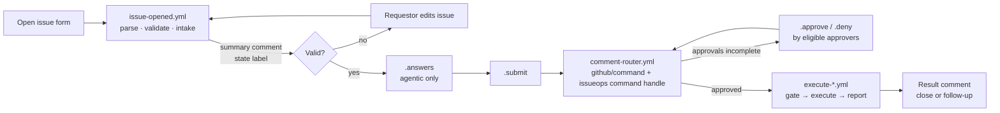

# CoolEngOrg IssueOps self-service platform

Self-service for **GitHub Copilot budgets and ROI reports**, **Microsoft Foundry model deployments** and **agentic tasks**. Everything happens in GitHub Issues in the `CoolEngOrg/issueops` repository of the **CoolEngEnt** enterprise (GitHub Enterprise Cloud). Approvals are gated by team, user, organization role, repository permission and requestor.

You open an issue from a form. The platform validates it, explains the approval policy that applies, collects `.approve` comments from eligible people and runs the change with short-lived credentials. The result is posted back on the issue. Every decision is rebuilt from the issue timeline, and every approval is bound to a SHA-256 digest of the exact request content. If the content changes, the approvals no longer count.

This repository implements the design in *Building an IssueOps Self-Service Platform in GitHub Enterprise Cloud (CoolEngEnt / CoolEngOrg)*. It is built on the documented IssueOps building blocks: [`issue-ops/parser`](https://github.com/issue-ops/parser), [`issue-ops/validator`](https://github.com/issue-ops/validator), [`issue-ops/labeler`](https://github.com/issue-ops/labeler) and [`github/command`](https://github.com/github/command). A Go 1.21 CLI makes the decisions. It uses the standard library only, plus `go-echarts` for charts.

## Request types

| Form | Label | What it does | Approval (default policy) | Runs in |
|---|---|---|---|---|
| **A. [Copilot AI budget request](.github/ISSUE_TEMPLATE/copilot-budget-request.yml)** | `issueops:copilot-budget` | Creates or updates a Copilot AI-credit budget (organization, repository, user, all users, cost center) through the billing budgets REST API | `copilot-admins`. **Over $1,000/month:** plus `finops-approvers`. **User budgets:** plus the beneficiary confirms. **Cost centers:** enterprise billing owner | `copilot-budgets`, `copilot-budgets-high`, `copilot-budgets-enterprise` |
| **B. [Copilot usage & ROI report](.github/ISSUE_TEMPLATE/copilot-usage-report.yml)** | `issueops:copilot-report` | Joins the Copilot usage-metrics NDJSON reports with merged PRs, reviews and AI-credit and seat cost at org, team or repository level. Produces an interactive go-echarts HTML report, CSV, JSON and Grafana metrics | Requestors are limited to `engineering-managers`, `copilot-admins` and `platform-admins`. **Per-user detail:** `copilot-admins`. Otherwise auto-approved | `copilot-reports` |
| **C. [Foundry model deployment](.github/ISSUE_TEMPLATE/foundry-model-deployment.yml)** | `issueops:foundry-deploy` | Deploys an allow-listed model, version and SKU to an approved Foundry resource with Bicep through Azure OIDC. The `az` pre-flight checks availability, quota and name collisions | `platform-ai`. **Prod:** plus `ai-governance` or the `security_manager` role. **PTU:** plus `finops-approvers`. **Small dev deployments:** auto-approved | `foundry-dev`, `foundry-uat`, `foundry-prod` |
| **D. [Agentic task request](.github/ISSUE_TEMPLATE/agentic-task-request.yml)** | `issueops:agentic-task` | Collects details through `.answers` comments, then runs the Copilot cloud agent, a catalog GitHub Agentic Workflow, or the AKS agent runner on a Foundry deployment | Requestor needs write on the target repository. Approver needs maintain or admin there. **AKS:** plus `platform-ai`. **Confidential:** plus `ai-governance` | `agentic-copilot`, `agentic-catalog`, `agentic-aks` |

Each type has a worked example. Every example is produced by the real engine and doubles as an end-to-end test:

| Example | Shows |
|---|---|
| [copilot-budget-request](examples/copilot-budget-request/) | FinOps escalation, self-approval refused, update of an existing budget. Invalid → fixed, stale approvals after an edit, beneficiary confirmation |
| [copilot-usage-report](examples/copilot-usage-report/) | Teams report with per-user escalation and the [HTML report](examples/copilot-usage-report/output/scenario/report/copilot-roi.html). Auto-approved org report. Requestor gating |
| [foundry-model-deployment](examples/foundry-model-deployment/) | Dev auto-approval. Prod PTU three-way approval, quota failure, `.retry` |
| [agentic-task-request](examples/agentic-task-request/) | AKS runner with Q&A and an agent follow-up question. Copilot cloud agent. Catalog workflow |

## How a request flows



Read [docs/architecture.md](docs/architecture.md) for the state machine, sequence diagrams and trust boundaries.

## Commands (comment on the issue)

| Command | Who | Effect |
|---|---|---|
| `.submit` | Requestor | Confirms the current content (digest) and asks for approval. Auto-approves when policy says so |
| `.approve [note]` | Eligible approver | Counts toward one approval rule. Each person counts once, and requestors can't approve their own request |
| `.deny <reason>` | Eligible approver | Denies and closes the request |
| `.answers` + `A1: …` lines | Requestor | Answers clarifying questions (agentic tasks) |
| `.retry [note]` | Eligible approver | Re-runs a failed execution of the same approved content |
| `.cancel [note]` | Requestor or repo maintainer | Cancels and closes the request |
| `.status` / `.help` | Anyone | Shows state and approval progress, or the command help |

## Repository layout

```
.github/
  ISSUE_TEMPLATE/            4 issue forms + config.yml
  workflows/                 intake, router, 4 execute workflows, CI, labels, ops metrics, runner image
  actions/                   composite actions: setup-issueops, apply-decision, gate, finish
  validator/                 issue-ops/validator custom validators (ESM, Node built-ins only) + tests
  CODEOWNERS  dependabot.yml
cmd/issueops/                Go CLI: intake, command handling, gate, finish, per-type executors, simulate, ops-metrics
cmd/agent-runner/            Go agent loop for the AKS backend (workload identity → Foundry)
internal/                    engine, state (event sourcing, digest), policy, authz, qa, per-type handlers,
                             GitHub REST client, Go templates (internal/tmpl/templates)
config/issueops.json         request-type registry: approval policy, allow-lists, settings
config/labels.json           label definitions
config/forms/*.json          issue forms as JSON (generated by scripts/forms-to-json.sh)
deploy/                      Bicep, Azure OIDC setup, AKS manifests, agent-runner Dockerfile, Grafana, Pushgateway
docs/                        architecture, setup, request types, approval gating, CLI, templates, security,
                             operations, reference, roadmap
examples/                    scenarios, fixtures and generated transcripts for every request type
```

## Quick start

```bash
# Go 1.21 toolchain (go.mod pins go 1.21)
make test            # unit tests + every example scenario end to end
make examples        # regenerate examples/*/output (issue bodies, comments, reports, manifests)
make build           # bin/issueops, bin/agent-runner
bin/issueops types   # request types from the registry
bin/issueops simulate --scenario examples/foundry-model-deployment/scenario.json --out /tmp/sim
```

To go live, follow [docs/setup-guide.md](docs/setup-guide.md). It covers the GitHub App, teams and roles, environments, Azure OIDC, AKS workload identity, runners, the Pushgateway and Grafana OSS 12.

## Documentation

- [Architecture](docs/architecture.md): components, state machine, sequence diagrams, trust boundaries
- [Diagrams](docs/diagrams.md): workflow topology, digest binding, per-type flows, identities
- [Setup guide](docs/setup-guide.md): step by step, with a go-live checklist
- Request types: [budget](docs/request-types/copilot-budget-request.md), [usage report](docs/request-types/copilot-usage-report.md), [Foundry deployment](docs/request-types/foundry-model-deployment.md), [agentic task](docs/request-types/agentic-task-request.md)
- [Approval gating](docs/approval-gating.md): policy language for teams, users, roles, repository permissions, requestors, escalations and auto-approval
- [Go CLI reference](docs/go-cli.md) and [Go templates](docs/templates.md)
- [Security and threat model](docs/security.md)
- [Operations runbook](docs/operations.md)
- [Reference](docs/reference.md): labels, markers, secrets and variables, App permissions, pinned actions, APIs
- [Roadmap](docs/roadmap.md): future improvements and new IssueOps request types

## Constraints honoured

- Go 1.21, standard library only. The one external module is `github.com/go-echarts/go-echarts/v2`, and CI enforces this.
- Kubernetes on AKS with `kubectl` 1.30. Grafana OSS 12.
- Actions are pinned to full commit SHAs, and Dependabot keeps them current.
