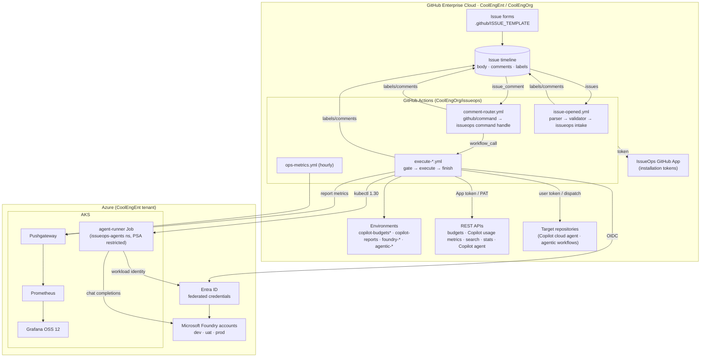
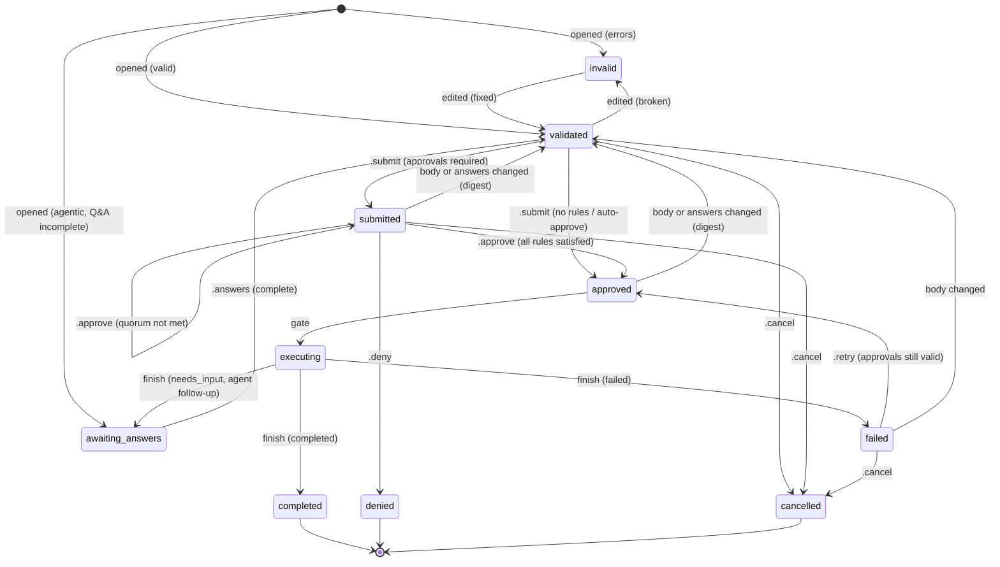
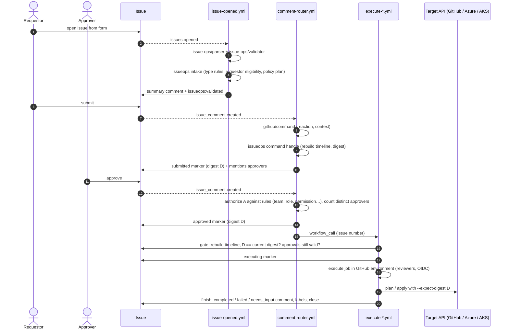

# Architecture

## Design principles

1. **The CLI decides, actions act.** Every decision is made by the `issueops` Go CLI: validity, phase, who may approve, whether to execute, and what to say. It writes the decision as step outputs and a rendered comment file. Workflows apply it with the documented IssueOps actions: `issue-ops/labeler` for labels, `peter-evans/find-comment` and `create-or-update-comment` for comments. The CLI never writes to GitHub itself, except to close issues and sync labels.
2. **Event sourcing, not labels.** The state of a request is rebuilt on every event from the issue timeline:
   - **bot markers:** the first line of comments authored by the IssueOps GitHub App bot only, e.g. `<!-- issueops:v1:approved {"digest":"sha256:…"} -->`
   - **human commands:** `.submit`, `.approve`, and the rest
   - **the current content digest**

   Labels are a projection for humans and filters. Changing labels by hand changes nothing.
3. **Approvals are bound to content.** `digest = sha256(type, normalized body, Q&A answers)`. `.submit` records the digest, and approvals only count after a matching submission. Editing the body, or answering differently, voids submission and approvals. The execution gate and every execution job re-check the digest.
4. **Execution is always gated.** Each execution workflow starts with a gate job. It re-verifies the approval from the timeline, recomputes approver eligibility and posts the `executing` marker. This holds whether the workflow was called by the router or dispatched by hand. Execution jobs then refuse to run unless the fetched content still hashes to the gate's digest.
5. **Short-lived, least-privilege credentials.** GitHub App installation tokens are minted per job and narrowed per step. Azure uses OIDC federated credentials, one Entra app per GitHub environment. AKS pods use Workload Identity. Only two long-lived secrets exist, both environment-scoped: the enterprise billing PAT (the enterprise budgets API rejects App tokens) and the Copilot agent machine-user token (assigning Copilot requires a user token).
6. **Untrusted text stays data.** Issue and comment text reaches actions only through `with:` and `env:`, never `${{ }}` inside `run:`. Comments neutralize HTML and @mentions. JSON and YAML are produced with `encoding/json` or JSON-quoted scalars. Agent prompts are built from validated fields and answers, never raw comments.

## Components

## Request lifecycle (state machine)

`internal/state` reconstructs the phase from markers. The projected label is `issueops:<phase>`. `issueops:escalated` is an extra flag when policy escalations apply.

Reopening a denied, cancelled or completed issue posts a `reset` marker, and the request starts over from `validated` or `invalid`.

## Sequence: approval-gated execution

## Trust boundaries

| Boundary | Untrusted input | Control |
|---|---|---|
| Issue body → workflow | form values, headings | Parsed by `issue-ops/parser` and the Go parser with known headings only. Validated by `issue-ops/validator` plus Go handlers. Passed through `with:`/`env:` only |
| Comments → state | anyone can comment | Only first-line `.command` tokens count. Bot markers are trusted only from the App bot. Edited decision comments are ignored. Bots can't vote. Eligibility is checked against policy |
| Approval → execution | content can change after approval | Digest-bound approvals. Re-checked by the gate and by every execution job (`--expect-digest`). Execution concurrency per issue |
| Workflow → GitHub | token scope | App installation token per job, narrowed per workflow. The default `GITHUB_TOKEN` is read-only |
| Workflow → Azure | cloud credentials | OIDC federated credential per GitHub environment. The role is scoped to one resource group. Prod environments require reviewers |
| Request → agent | prompt injection | The agent gets a spec of validated fields and answers only. The system prompt treats spec text as data. Secrets are refused in forms and answers. Deployments are allow-listed per data classification. The runner has no GitHub credentials. The agent's own questions go back through Q&A and re-approval |
| Agent → cluster | code running in AKS | PSA `restricted` namespace, non-root distroless image, read-only root filesystem, no service-account token, NetworkPolicy (DNS + 443 egress only), ResourceQuota, `activeDeadlineSeconds` |

## Code map

| Package | Responsibility |
|---|---|
| `internal/config` | Registry (`config/issueops.json`): request types, approval policy, settings, label resolution |
| `internal/issueform` | Issue-form JSON, parser (mirrors issue-ops/parser), renderer for examples, drift check |
| `internal/policy` | Condition evaluation (`eq`, `gt`, `in`, `matches`, …), escalations, auto-approval, environment placeholders |
| `internal/authz` | Selector evaluation: teams, users, org roles (owner and custom), repo permissions on IssueOps or target repo, field users, requestor. GitHub-backed and static directories |
| `internal/state` | Markers, commands, digest, timeline reconstruction, approval counting (distinct approvers via a small assignment search) |
| `internal/qa` | Clarifying-question parsing (`A1:` lines, multi-line, fenced), validation, defaults, dynamic follow-ups |
| `internal/engine` | Intake, Handle, Gate and Finish decisions; comment rendering |
| `internal/budget`, `copilot`, `foundry`, `agent` | Per-type validation, facts, summaries and executors |
| `internal/ghapi` | Minimal REST client (retries, pagination, API versions) |
| `internal/tmpl` | Embedded Go text/templates with safe helpers, and an override directory |
| `cmd/issueops` | CLI commands used by workflows, plus `simulate` and `ops-metrics` |
| `cmd/agent-runner` | AKS agent loop (workload identity → Foundry chat completions) |

## Why these choices

- **A Go CLI instead of `actions/github-script`.** Policy and state logic is testable, and the same code runs in workflows, locally and in `simulate`. The standard library keeps the supply chain small.
- **Reusable workflows called by the router, plus `workflow_dispatch`.** Execution happens in the same run as the approval that triggered it, which makes it easy to follow. Manual re-runs go through the same gate.
- **No concurrency group on the router.** Each handler rebuilds state from the full timeline, so the handler for the last approval always sees every vote. A queued-run cancellation could otherwise drop a command. Double execution is prevented by the per-issue concurrency group on gate jobs plus the `executing` marker.
- **The digest includes Q&A answers.** Agentic tasks are specified mostly in comments, so the answers are part of what approvers approve.
