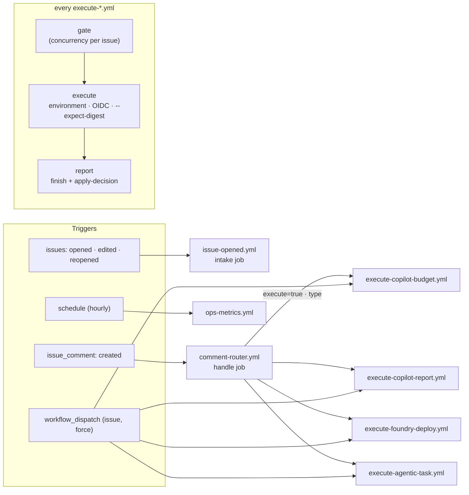
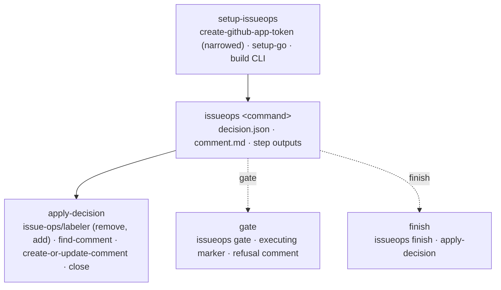
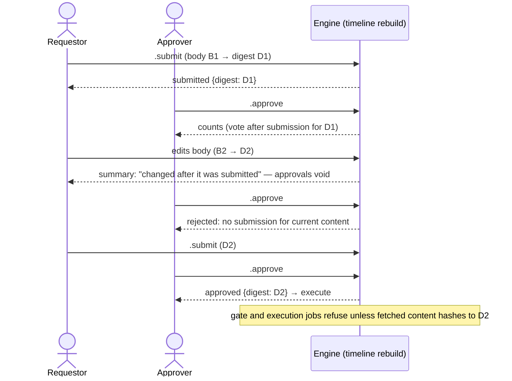
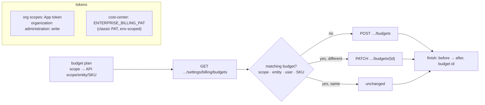
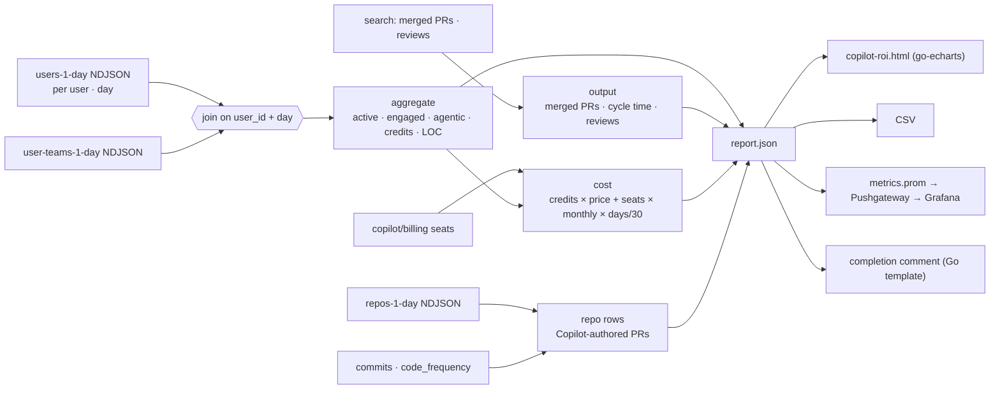
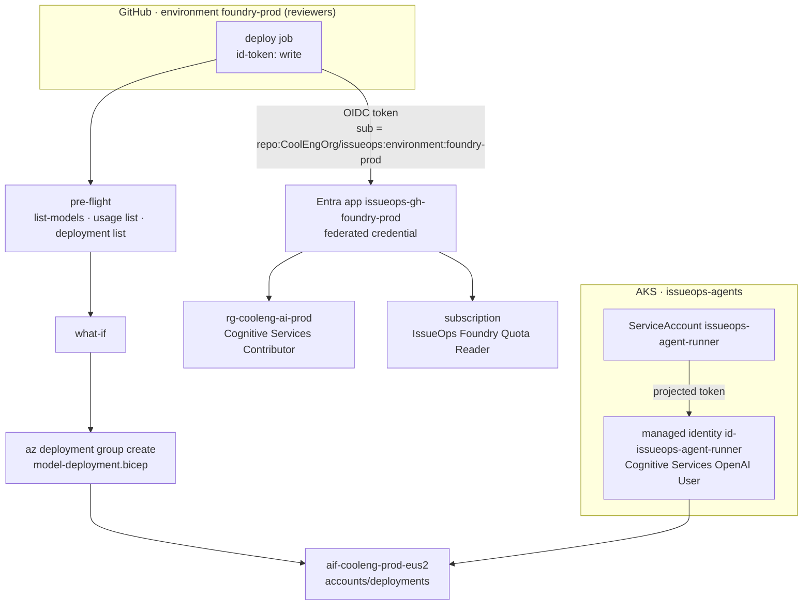
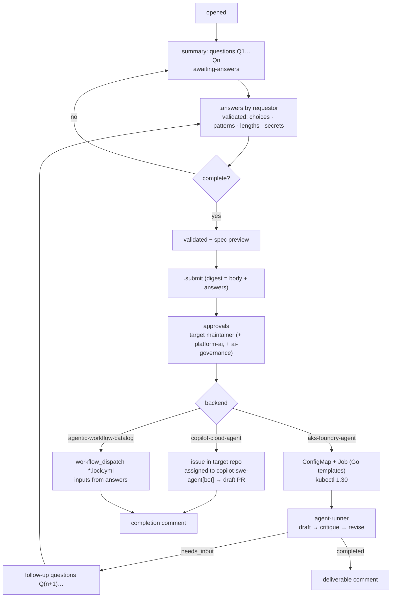

# Diagrams

GitHub renders these Mermaid diagrams inline. The platform-wide component, state-machine and sequence diagrams are in [architecture.md](architecture.md).

## Workflow and job topology

## Composite actions used by every job

## Digest binding

## Copilot budget execution

## Copilot ROI report data join

## Foundry deployment and identities

## Agentic task: Q&A loop and backends

