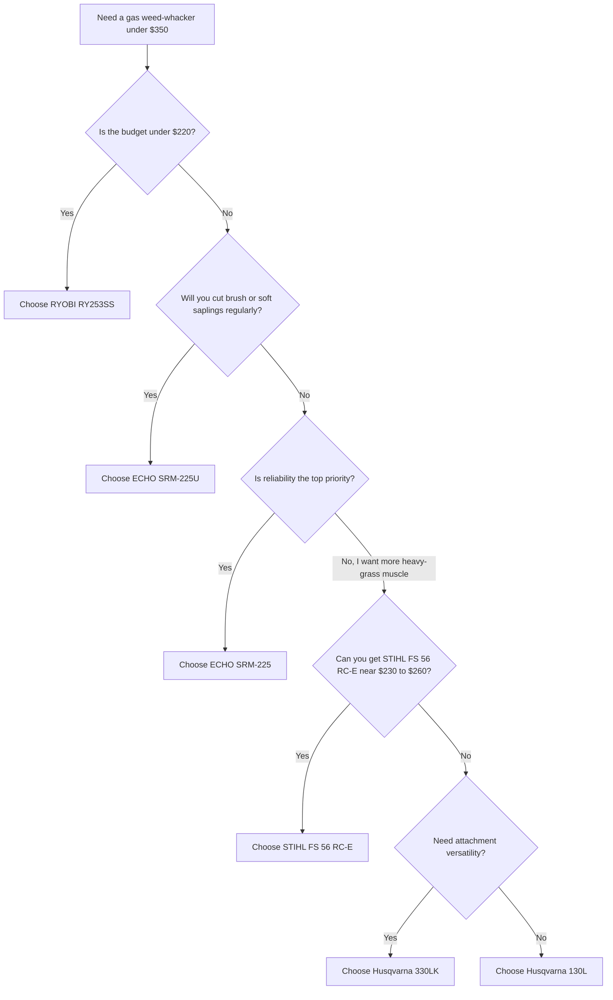

# Reliability-First Analysis of Gasoline-Powered Edge Trimmers Under $350

## Executive summary

For a buyer who wants the **most reliable gas weed-whacker at the lowest realistic price**, the strongest value in the current U.S. sub-$350 field is the **ECHO SRM-225**. It is not the cheapest unit here, but it combines a pro-grade 21.2 cc engine, a long-running five-year consumer / two-year commercial warranty, a widely praised Speed-Feed head, vibration isolation, tool-less air-filter access, and unusually strong long-run user sentiment for this class: **4.6/5 from 13,000+ Home Depot reviews with 92% recommendation**. In other words, it is the best blend of purchase price, durability reputation, and support depth among the models I could verify. citeturn40search5turn41view0turn17search0

If the budget is absolutely constrained, the **RYOBI RY253SS** remains the cheapest credible straight-shaft option I found at **$189**, and it does offer some meaningful durability features for the money, notably a **full crankshaft engine**, 18-inch swath, attachment capability, and a three-year warranty. The tradeoff is that the public evidence base points to more owner friction around starting, carb/idle tuning, and homeowner-grade longevity than the ECHO or STIHL alternatives. It is the lowest-cost acceptable buy, not the lowest-risk buy. citeturn19view0turn18search0turn21view0turn21view2

For heavier grass and “prosumer” cleanup, the **STIHL FS 56 RC-E** is the standout around the low-to-mid-$200s if you can find it at the current Ace sale price of **$229.99** rather than the higher in-store regular pricing I also observed. STIHL lists a **27.2 cc engine and 1.1 bhp**, and Bob Vila’s field test called it the best heavy-duty string trimmer in its roundup. STIHL’s own documentation also shows robust design details such as a **steel-on-steel clutch**, easy-access air filter cover, fully lined drive shaft, and Easy2Start. The main limitation is that STIHL classifies this model in its **occasional-use** homeowner tier rather than as a true commercial trimmer. citeturn11view4turn11view5turn25search4turn36search4

For actual brush and woody undergrowth, the one model in this price band that meaningfully separates itself is the **ECHO SRM-225U** brushcutter at **$329.99**. It includes a **U-handle, harness, and 8-inch 8-tooth blade**, is explicitly marketed for thick grass and brush, and carries the same **five-year consumer / two-year commercial warranty** structure as the SRM-225. If you expect any recurring work in cane, bramble, reeds, volunteer saplings, or woody overgrowth, this is the best sub-$350 gas option I found. citeturn42search0turn41view0turn24search0

The two Husqvarna models split into distinct roles. The **130L** is the better reliability candidate: it publishes **1 hp**, **28 cc**, **LowVib** figures, and gets generally positive owner feedback for power and starting, though some owners report bogging, line-head issues, and occasional premature failures. The **330LK** is more versatile because it is attachment-capable and has a wider **20-inch swath**, but its recent review pattern shows notably more quality-control scatter, including shaft disconnect complaints and more negative durability reports than the 130L or the ECHO SRM-225. citeturn15search0turn15search1turn30view2turn29search3turn30view1turn29reddit53

The bottom line is straightforward. If you want the **best reliability per dollar**, buy the **ECHO SRM-225**. If you want the **cheapest acceptable option**, buy the **RYOBI RY253SS**. If your work regularly crosses into **heavy grass and semi-neglected lots**, the **STIHL FS 56 RC-E** is the strongest mid-price alternative. If you need to cut **brush and small woody growth**, jump directly to the **ECHO SRM-225U**. citeturn40search5turn19view0turn25search4turn42search0

## Scope, sources, and assumptions

This report screened current U.S.-available **gasoline-powered string trimmers / brushcutters under $350** and prioritized: official manufacturer specs and manuals first, then professional test reviews, then high-volume retailer review aggregates and user reports. The core primary sources were official product pages and manuals from **ECHO**, **STIHL**, **Husqvarna**, and **RYOBI**; professional secondary sources included **Bob Vila** and **Pro Tool Reviews**; retailer review aggregates came primarily from **Home Depot**, **Lowe’s**, **Ace**, and **Tractor Supply**. citeturn40search5turn42search0turn10view0turn26view0turn15search0turn29search3turn19view0turn18search0turn25search4turn18search2

Prices in this category are materially variable by dealer, region, and promotion. In June 2026 snapshots, for example, I saw the **STIHL FS 56 RC-E** at both **$229.99 sale** and **$259.99 regular / higher-store pricing**, while ECHO publishes MSRP on its own site and Husqvarna pricing depended on retailer listings. I therefore treat pricing as **current observed price / MSRP**, not a guaranteed national shelf price. citeturn36search4turn36search3turn40search5turn42search0turn16search2turn13search1turn19view0

Power is not consistently published in this market. **STIHL** and **Husqvarna** publish bhp/hp on some relevant pages, but **ECHO** and **RYOBI** do not consistently publish an engine horsepower figure on the public product pages I reviewed. In the comparison tables below, horsepower is listed where published and marked **NR** where I could not verify a current public figure. For the chart, I therefore use **engine displacement** rather than horsepower as the cleanest across-brand proxy. citeturn11view4turn15search0turn29search3turn40search5turn42search0turn19view0

For **maximum woody stem / sapling diameter**, manufacturers generally do **not** publish a trunk-diameter limit. Where a maker explicitly says woody cutting is not recommended, I keep the official recommendation as the controlling judgment. Where no numeric limit exists, I provide a **conservative practical estimate** based on the included or approved cutting system, engine class, and professional/user evidence, and I label it as an inference rather than a manufacturer rating. citeturn28view0turn42search0turn24search0turn25search4

Because official horsepower is inconsistent across the current public pages, the visual below compares **current price versus official engine displacement** for the six-model shortlist. Prices come from Home Depot, Ace, Tractor Supply, and ECHO’s own MSRP pages; displacement comes from current manufacturer specs or the retailer’s technical listing. citeturn19view0turn36search4turn16search2turn40search5turn42search0turn13search1turn11view4turn15search0turn29search3

## Verified shortlist and technical comparison

The six models below are the strongest reliability-first shortlist I could verify under the $350 ceiling.

| Model | Current observed price | Engine displacement | Published power | Shaft | Cutting head / blade | Recommended cutting swath | Fuel mix | Weight | Vibration | Starting system | Durability features | Warranty | User reliability signal |
|---|---:|---:|---:|---|---|---:|---|---:|---|---|---|---|---|
| **RYOBI RY253SS** | **$189.00** | 25 cc | **NR** | Straight | Reel-Easy bump head; dual .095 line | 18 in | 50:1 | 12.2 lb | NR | Manual start with Zip Start carburetor | Full crank engine; attachment-capable powerhead | 3-year limited | Large owner base; budget-friendly, but public Q&A and troubleshooting pattern show more starting/idle issues than the ECHO/STIHL leaders. citeturn19view0turn21view0turn21view2 |
| **STIHL FS 56 RC-E** | **$229.99 sale to $259.99+ observed** | 27.2 cc | 1.1 bhp | Straight | AutoCut C EasySpool | 16.5 in | 50:1 | 10.6 lb | Qualitative low-vibration; no public numeric value retrieved | Easy2Start | Air-filter quick access, protected spark plug/choke, steel-on-steel clutch, fully lined drive shaft, polymer housing | STIHL limited warranty applies; public model page/manual reviewed did not state the base non-emissions term, but emissions coverage is 2 years | Strong dealer-market reputation; Bob Vila rated it best heavy-duty. Public Ace snapshot showed 2,200+ reviews, though I could not verify an average star score from the scrape I retrieved. citeturn11view4turn11view5turn26view0turn27view0turn25search4turn25search0turn34view1 |
| **Husqvarna 130L** | **$279.99** | 28 cc | 1 hp | Straight | RapidReplace bump head | 18 in | 50:1 | 12.2 lb | 5.66 m/s² front; 8.93 m/s² rear | Smart Start / digital ignition | LowVib, high-torque trimmer head, published gear ratio | 2-year limited; up to 5 years with qualifying fuel purchase | 4.2/5, 550 Lowe’s reviews, 82% recommend; generally positive, but bogging, line-head, and occasional durability complaints recur. citeturn16search2turn15search0turn15search1turn30view2 |
| **ECHO SRM-225** | **$279.99 MSRP** | 21.2 cc | **NR** | Straight | Speed-Feed 400 nylon line head | 17 in | 50:1 | 11.5 lb with head; 11.2 lb dry without head | Vibration-isolated engine mount; no public numeric value retrieved | i-30 starter | Tool-less air filtration, engine-vibration reduction, 4-layer cable driveshaft, broad parts/accessory ecosystem | 5 year consumer / 2 year commercial | 4.6/5, 13,474+ Home Depot reviews, 92% recommend; strongest mass-market reliability signal in the field. citeturn40search5turn42search2turn41view0turn17search0 |
| **ECHO SRM-225U** | **$329.99 MSRP** | 21.2 cc | **NR** | Straight with U-handle | Speed-Feed 400 plus included 8 in 8-tooth blade | 17 in | 50:1 | 13.6 lb with head; 12.7 lb dry without head | Engine-vibration reduction; no public numeric value retrieved | i-30 starter | Tool-less air filtration, U-handle, harness included, metal-shield setup, blade-ready from factory | 5 year consumer / 2 year commercial | 4.6/5, 104+ Home Depot reviews, 84% recommend; small but favorable sample. citeturn42search0turn23search0turn41view0turn24search0 |
| **Husqvarna 330LK** | **$329.99** | 28 cc | 1 hp | Straight, attachment-capable | RapidReplace bump head | 20 in | 50:1 | 12.85 lb | 5.97 m/s² front; 6.12 m/s² rear | Start system not separately named in the current snippet; marketed as easy-start / low-fatigue design | LowVib, wide swath, detachable shaft, published gear ratio, attachment ecosystem | 2-year limited; up to 5 years with qualifying fuel purchase | 4.0/5, 684 Lowe’s reviews, 77% recommend; stronger performance than reliability pattern. citeturn13search1turn29search3turn30view1 |

A few technical conclusions matter more than the raw spec sheet. First, **the lowest price does not map cleanly to the best reliability**. The Ryobi is clearly cheaper, but the ECHO SRM-225’s commercial warranty term, parts ecosystem, and review history are materially stronger. Second, **28 cc homeowner machines are not automatically better buys than 21.2 cc ECHO units**; the ECHO’s reputation and warranty support offset its smaller displacement for most residential edging and thick-grass work. Third, the **only truly brush-focused machine in the shortlist is the SRM-225U**; the others remain fundamentally line trimmers even when they are powerful. citeturn19view0turn40search5turn41view0turn15search0turn29search3turn42search0

## Comparison by task and price tier

The following task matrix is the best way to separate “cheap and adequate” from “reliable and well matched.”

| Model | Light lawn edging | Thick grass | Dense underbrush | Sapling / woody undergrowth | Prolonged commercial-like use | Conservative woody stem limit |
|---|---|---|---|---|---|---|
| **RYOBI RY253SS** | Good: straight shaft, 18 in swath, cheap to run | Fair to good | Fair | Poor | Poor | **Officially unrated**; as-sold string-trimmer setup should be treated as **not a woody cutter**. Conservative practical limit: only very soft green volunteers around **0.25 in or less**, unofficial. citeturn19view0turn21view0 |
| **STIHL FS 56 RC-E** | Excellent: light for class, strong power, easy starting | Very good | Good for weeds/vines | Poor officially | Fair to good for heavy homeowner use | STIHL explicitly says the **grass cutting blade is not for woody materials**. Official recommendation for woody stems is therefore **none**. citeturn11view4turn11view5turn28view0turn25search4 |
| **Husqvarna 130L** | Very good | Very good | Fair to good | Poor | Fair | No official woody rating and no blade-focused positioning in the current public specs. Treat as **not recommended for woody stems** beyond incidental soft shoots. Conservative unofficial limit: **~0.25 in** green volunteers. citeturn15search0turn15search1turn30view2 |
| **ECHO SRM-225** | Excellent | Very good | Good | Poor as sold | Good | In stock line-trimmer form, treat as **non-woody**. Conservative unofficial limit: **~0.25 in** soft green shoots only. Its real strength is repeated grass/weed use, not brush-blade work. citeturn40search5turn42search2turn17search0 |
| **ECHO SRM-225U** | Good, but more machine than needed for simple edging | Very good | Excellent | Best in class under $350 | Best in class under $350 | **No manufacturer diameter rating published.** With the included 8-tooth blade, keep use to heavy grass, reeds, briars, and brushy stems; conservative practical limit is about **0.5 in** green stems. With the optional 22-tooth brush blade listed by ECHO, a careful user can reasonably expect about **0.75 in** green saplings, but that is an inference, not an official rating. citeturn42search0turn24search0 |
| **Husqvarna 330LK** | Very good | Excellent | Very good with line / attachments | Poor officially | Fair | No official woody diameter rating in the public pages reviewed; as sold, this is still a trimmer powerhead rather than a true brushcutter. Conservative unofficial limit: **~0.25 in** soft volunteers only. citeturn29search3turn30view1 |

The big dividing line is **woody work**. Among these models, only the **ECHO SRM-225U** is clearly built, equipped, and marketed to cross into brushcutter territory at this price. The other five models are best understood as lawn and lot trimmers that can handle thicker grass and weedy overgrowth but should not be treated as routine sapling cutters. That is not just a performance issue; it is also a gearbox, clutch, and safety issue. STIHL is especially explicit that its grass cutting blade is **not** intended for woody material. citeturn42search0turn24search0turn28view0turn27view3

The price-tier view tells a slightly different story:

| Price tier | Models | Best value in tier | Why it wins |
|---|---|---|---|
| **Under $220** | RYOBI RY253SS | **RYOBI RY253SS** | It is the only serious straight-shaft gas contender I verified this low. Full crank engine, 18-inch swath, attachment capability, and a three-year warranty make it the price-floor recommendation, even though reliability evidence is weaker than ECHO/STIHL. citeturn19view0turn18search0 |
| **$220 to $290** | STIHL FS 56 RC-E; Husqvarna 130L; ECHO SRM-225 | **ECHO SRM-225** overall; **STIHL FS 56 RC-E** if thick grass matters more than warranty; **Husqvarna 130L** if you want the biggest engine in the tier | ECHO wins on long-run reliability evidence and warranty; STIHL wins on heavy-duty homeowner feel and published power; Husqvarna 130L wins on displacement but not on trust signal. citeturn40search5turn41view0turn17search0turn25search4turn11view4turn15search0turn30view2 |
| **$290 to $350** | ECHO SRM-225U; Husqvarna 330LK | **ECHO SRM-225U** | The 330LK is versatile and powerful, but the SRM-225U is the better special-purpose reliability buy because it is brush-ready from the factory and backed by a stronger warranty structure and cleaner review pattern. citeturn42search0turn41view0turn30view1turn29reddit53 |

## Reliability, failure modes, and maintenance burden

Across the whole group, the **ECHO SRM-225** has the strongest reliability record. The strongest evidence is not just its large review count, but the combination of **massive review volume**, a very high **92% recommendation rate**, pro-review praise, and a warranty structure that still includes **two-year commercial coverage**. That does not mean it is failure-proof; owner complaints do recur around **exhaust/oil leakage**, occasional **ignition-coil issues**, and some dissatisfaction with modern Speed-Feed behavior. But compared with the rest of the shortlist, the positive-to-negative ratio is best sustained over the largest sample. citeturn17search0turn24search4turn18search2turn41view0

The **STIHL FS 56 RC-E** looks better in professional testing than in easily scraped public review metrics. STIHL’s own page emphasizes easier starting, cleaner running, and its anti-vibration / drivetrain details, while Bob Vila’s testing found it impressively capable in thick vegetation and invasive cleanup. The maintenance burden is standard two-stroke care: correct **50:1 fuel**, spark-plug checks, air-filter cleaning, and periodic storage/fuel management. One important manual warning is that **overlong line loads the engine and can overheat and damage the clutch and polymer components**. Anecdotally, some recent owner discussions also mention **clutch-drum bushing rattle** or **tank-vent/fuel-leak issues**, but those reports are not strong enough to outweigh the model’s generally solid field reputation. citeturn27view0turn11view5turn25search4turn27view3turn25reddit48turn25reddit50

The **Husqvarna 130L** is a sound heavy-homeowner machine, but not a slam-dunk reliability leader. Its published vibration figures are respectable, and owner summaries frequently praise **easy starting**, usable power, and strong cutting ability. At the same time, the recent review pattern includes repeated complaints about **bogging**, **stalling**, **line-head behavior**, and some isolated but meaningful early failures. In other words, the 130L is a good performer, but the public record does not make it safer than the ECHO SRM-225 as a reliability-first choice. citeturn15search1turn16search8turn30view2turn16search7

The **Husqvarna 330LK** has the most obvious **performance-versus-reliability tension** in this shortlist. On paper it is attractive: **28 cc**, **1 hp**, **20-inch swath**, LowVib, and attachment capability. Users often praise its ability to handle thick weeds and larger properties. But recent retailer and forum evidence also shows a higher-than-comfortable rate of complaints about **overheating**, **starting issues**, **head problems**, **pull-cord problems**, and especially **detachable-shaft engagement issues**. For a buyer prioritizing reliability above all else, that pattern pushes it below the ECHO SRM-225 and below the STIHL FS 56 RC-E despite its better nominal capability. citeturn29search3turn30view1turn13search2turn29reddit53

The **RYOBI RY253SS** carries the lowest purchase risk only in dollar terms. Its manual and Q&A record show the expected maintenance/owner burden of a budget two-stroke: correct **50:1 fuel**, regular **air-filter cleaning**, fuel-system checks, annual **spark plug replacement**, and idle-speed adjustment when the engine will not idle cleanly. The product page and manual also make clear that improper filter seating can accelerate engine wear. That is not unusual, but it does mean the Ryobi is more dependent on careful owner maintenance than the ECHO and STIHL options most buyers cross-shop against it. citeturn19view0turn21view0turn21view2

The **ECHO SRM-225U** adds some weight and complexity, but in exchange it is the only machine here that is truly plausible for repeated brush work. ECHO’s general trimmer/brushcutter maintenance schedule is explicit: inspect/clean the air filter before use, replace air and fuel filters periodically, inspect spark plug and spark arrestor, and grease the drive shaft and gear housing at the prescribed intervals. That matters because brush work loads shafts, gearcases, and shields harder than normal edging does. The modest but favorable user review base suggests the machine is doing what buyers expect it to do, and I did not see a recurring mechanical failure pattern as strong as the one visible on the 330LK. citeturn42search0turn37search3turn24search0turn24search2

A practical maintenance ranking, from **lowest owner hassle to highest**, is roughly: **ECHO SRM-225**, **STIHL FS 56 RC-E**, **ECHO SRM-225U**, **Husqvarna 130L**, **Husqvarna 330LK**, **RYOBI RY253SS**. That ranking is an inference from warranty terms, public failure patterns, and maintenance requirements, not a direct manufacturer claim. citeturn41view0turn17search0turn25search4turn30view2turn30view1turn19view0

## Decision guide and final recommendations

If the buying decision is framed the way working homeowners usually frame it — “what is the cheapest gas trimmer I can buy **without regretting it**?” — the answer is usually **not** the absolute cheapest machine. It is the **ECHO SRM-225**. At roughly **$90 more than the Ryobi**, it buys you a much stronger warranty structure, stronger long-run user sentiment, and better evidence of surviving repeated use. That is why it is the report’s primary recommendation. citeturn19view0turn40search5turn41view0turn17search0

If your real use case is an ordinary suburban yard, fence lines, sidewalks, bed edges, and occasional tall grass, choose in this order: **ECHO SRM-225**, **STIHL FS 56 RC-E**, then **Husqvarna 130L**. If your real use case is a neglected property edge, larger lot, or rough mixed vegetation that stops short of true woody brush, choose **STIHL FS 56 RC-E** if found near **$229.99** or **ECHO SRM-225** if you prefer lower risk over extra displacement. If your property includes regular **brush, briars, reeds, canes, or volunteer saplings**, skip the standard trimmer class and buy the **ECHO SRM-225U**. citeturn36search4turn40search5turn25search4turn15search0turn42search0

For clarity, my final model-by-model recommendations are:

| Model | Pros | Cons | Best-use recommendation |
|---|---|---|---|
| **ECHO SRM-225** | Best reliability evidence; strong warranty; easy line reloads; light enough for long sessions; very large owner base | Smaller engine than the 27–28 cc machines; some owner complaints about muffler oiling and newer-unit coil/head issues | **Best overall buy** for most homeowners and light commercial-like solo use. citeturn40search5turn41view0turn17search0turn24search4 |
| **RYOBI RY253SS** | Lowest price; full crank engine; 18-inch swath; attachment capable; 3-year warranty | More homeowner-grade; higher starting/idle-maintenance burden; weaker reliability signal | **Best strict-budget choice** if you want a gas straight-shaft trimmer under $200 and can tolerate more tinkering. citeturn19view0turn21view0turn21view2 |
| **STIHL FS 56 RC-E** | Strong power-to-weight; Easy2Start; excellent heavy-homeowner performance; robust driveline features | Officially positioned as occasional-use; public non-emissions warranty term not clearly visible in the model pages reviewed; not a woody cutter | **Best mid-price heavy-homeowner trimmer** for thick grass, overgrown fence lines, and frequent residential use. citeturn11view4turn11view5turn25search4turn34view0 |
| **Husqvarna 130L** | 28 cc / 1 hp; LowVib figures published; good straight-shaft geometry | Mixed owner record; some bogging, stalling, and head-vibration complaints | **Best if you want a simple 28 cc lawn/weed trimmer**, but not my first pick for reliability-first buying. citeturn15search0turn15search1turn30view2turn16search7 |
| **ECHO SRM-225U** | Brush-ready from factory; harness and blade included; strongest sub-$350 brush option; same strong ECHO warranty | Heavier; overkill for simple edging; smaller review sample | **Best for brush and light woody growth** under $350. Buy this instead of pretending a lawn trimmer is a brushcutter. citeturn42search0turn24search0turn41view0 |
| **Husqvarna 330LK** | Powerful on paper; very wide 20-inch swath; attachment ecosystem; lower rear-handle vibration than 130L | Reliability/QC pattern is too uneven for a reliability-first ranking; shaft disconnect issues are a specific concern | **Best only if attachment versatility matters more than reliability certainty.** citeturn29search3turn30view1turn29reddit53 |

A simple decision path is below.

On a pure **reliability-per-dollar** basis, my ranking is:

**ECHO SRM-225** → **STIHL FS 56 RC-E** → **ECHO SRM-225U** → **Husqvarna 130L** → **RYOBI RY253SS** → **Husqvarna 330LK**. That ranking synthesizes official specs, warranty strength, test results, maintenance burden, and recent review patterns rather than any one metric alone. citeturn40search5turn41view0turn25search4turn42search0turn15search0turn30view2turn19view0turn30view1